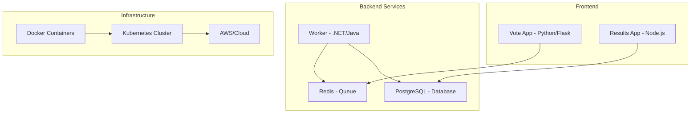

# 🚀 90 Días de DevOps con Roxs


> **Transformá tu carrera tech en 90 días** 🔥  
> El programa más completo e intensivo de DevOps en español, diseñado para llevarte desde cero hasta profesional.

[](https://github.com/roxsross/90daysdevopsbyroxs/stargazers)
[](https://github.com/roxsross/90daysdevopsbyroxs/network)
[](https://github.com/roxsross/90daysdevopsbyroxs/issues)
[](https://opensource.org/licenses/MIT)


---

## 📋 Tabla de Contenidos

- [Sobre el Proyecto](#-sobre-el-proyecto)
- [¿Qué Vas a Aprender?](#-qué-vas-a-aprender)
- [Estructura del Programa](#-estructura-del-programa)
- [Prerequisitos](#-prerequisitos)
- [Instalación y Setup](#️-instalación-y-setup)
- [Cómo Usar Este Repositorio](#-cómo-usar-este-repositorio)
- [Cronograma de 13 Semanas](#-cronograma-de-13-semanas)
- [Proyecto Principal](#-proyecto-principal-roxs-voting-app)
- [Tecnologías y Herramientas](#-tecnologías-y-herramientas)
- [Comunidad](#-comunidad)
- [Contribuir](#-contribuir)
- [Reconocimientos](#-reconocimientos)
- [Licencia](#-licencia)
- [Contacto](#-contacto)

---

## 🎯 Sobre el Proyecto

**90 Días de DevOps con Roxs** es un programa intensivo y **100% práctico** que te lleva desde los fundamentos hasta implementaciones avanzadas de DevOps. No es solo teoría - construirás proyectos reales, automatizarás procesos completos y desarrollarás las habilidades que demandan las empresas tech.

### 🔥 ¿Por qué este programa es diferente?

- **📚 Aprende Haciendo**: Cada día incluye ejercicios prácticos y proyectos reales
- **🌍 Código Abierto**: Todo el contenido es gratuito y colaborativo
- **🎖️ Metodología Probada**: Basado en experiencias reales de la industria
- **🤝 Comunidad Activa**: Soporte continuo de instructores y peers
- **💼 Portfolio Ready**: Termina con proyectos listos para mostrar a empleadores

---

## 🎓 ¿Qué Vas a Aprender?

### 🛠️ Habilidades Técnicas

- **Containerización** con Docker y orquestación con Kubernetes
- **Infrastructure as Code** con Terraform y Ansible
- **CI/CD Pipelines** con GitHub Actions, Jenkins y GitLab
- **Cloud Computing** en AWS, Azure y Google Cloud
- **Monitoring y Observabilidad** con Prometheus, Grafana y ELK Stack
- **Security** integrada en el ciclo DevOps (DevSecOps)

### 💡 Habilidades Blandas

- **Mentalidad DevOps**: Colaboración entre Dev y Ops
- **Problem Solving**: Debugging y troubleshooting avanzado
- **Automatización**: Identificar y automatizar procesos manuales
- **Mejora Continua**: Optimización constante de workflows

---

## 🏗️ Estructura del Programa

```
📦 90-dias-devops/
├── 📁 semana-01-fundamentos/          # Linux, Git, Networking
├── 📁 semana-02-programacion/         # Python, Go, scripting
├── 📁 semana-03-control-versiones/    # Git avanzado, workflows
├── 📁 semana-04-docker-compose/       # Containerización básica
├── 📁 semana-05-terraform-docker/     # Infrastructure as Code
├── 📁 semana-06-kubernetes/           # Orquestación de containers
├── 📁 semana-07-kubernetes-avanzado/  # Deployments, services, ingress
├── 📁 semana-08-cicd/                 # Pipelines automatizados
├── 📁 semana-09-gitops-argocd/        # GitOps y ArgoCD
├── 📁 semana-10-monitoring/           # Observabilidad
├── 📁 semana-11-cloud-aws/            # Amazon Web Services
├── 📁 semana-12-devsecops/            # Security integration
└── 📁 semana-13-proyecto-final/       # Capstone project
```

---

## ✅ Prerequisitos

### 🖥️ Hardware Mínimo
- **RAM**: 8GB (recomendado 16GB)
- **Almacenamiento**: 50GB libres
- **Procesador**: Dual core (recomendado Quad core)

### 💻 Software Requerido
- **Sistema Operativo**: Linux, macOS, o Windows con WSL2
- **Navegador**: Chrome/Firefox actualizado
- **Editor**: VSCode (recomendado) o tu editor preferido

### 🧠 Conocimientos Previos
- **Básicos de línea de comandos** (bash/terminal)
- **Conceptos básicos de redes** (IP, puertos, HTTP)
- **Experiencia con cualquier lenguaje de programación** (helpful but not required)

---

## ⚙️ Instalación y Setup

### 1. 🔄 Clonar el Repositorio

```bash
git clone https://github.com/roxsross/bootcamp-devops-2023.git
cd bootcamp-devops-2023
```

### 2. 🐳 Instalar Docker

#### Linux (Ubuntu/Debian)
```bash
curl -fsSL https://get.docker.com -o get-docker.sh
sudo sh get-docker.sh
sudo usermod -aG docker $USER
```

#### macOS
```bash
brew install --cask docker
```

#### Windows
Descargar [Docker Desktop](https://www.docker.com/products/docker-desktop)

### 3. 🔧 Verificar Instalación

```bash
# Verificar Docker
docker --version
docker run hello-world

# Verificar Git
git --version

# Verificar que tienes acceso a internet
curl -I https://github.com
```

### 4. 🚀 Setup Inicial

```bash
# Crear tu branch de trabajo
git checkout -b mi-progreso-devops

# Instalar herramientas adicionales
./scripts/setup-environment.sh

# Verificar que todo funciona
./scripts/verify-setup.sh
```

---

## 📖 Cómo Usar Este Repositorio

### 🗓️ Progresión Semanal

1. **📚 Lee la documentación** de la semana en `/semana-XX/README.md`
2. **🎯 Completa los ejercicios** paso a paso
3. **💾 Documenta tu progreso** en tu branch personal
4. **🔄 Comparte en la comunidad** tus resultados y dudas
5. **🎉 Celebra** cada milestone completado

### 📁 Estructura de Cada Semana

```
semana-XX/
├── README.md              # Objetivos y teoría
├── ejercicios/            # Prácticas hands-on
│   ├── ejercicio-01/
│   ├── ejercicio-02/
│   └── proyecto-semanal/
├── recursos/              # Scripts, configs, ejemplos
├── solucion/              # Soluciones de referencia
└── extra/                 # Material adicional
```

### 🏷️ Convenciones de Commits

```bash
# Formato recomendado
git commit -m "feat(semana-04): completar ejercicio Docker Compose"
git commit -m "docs(semana-07): agregar notas sobre Kubernetes"
git commit -m "fix(semana-10): corregir configuración Prometheus"
```

---

## 📅 Cronograma de 13 Semanas

| Semana | Tema | Proyecto | Duración |
|--------|------|----------|----------|
| **1** | 🐧 **Fundamentos Linux** | Automatización con scripts | 7 días |
| **2** | 🐍 **Lenguajes DevOps** | CLI tool en Python/Go | 7 días |
| **3** | 🌿 **Git Avanzado** | Workflow colaborativo | 7 días |
| **4** | 🐳 **Docker & Compose** | Multi-container app | 7 días |
| **5** | 🏗️ **Terraform + Docker** | Infrastructure as Code | 7 días |
| **6** | ☸️ **Kubernetes Basics** | Cluster setup y pods | 7 días |
| **7** | 🚀 **Kubernetes Pro** | Voting app en K8s | 7 días |
| **8** | 🔄 **CI/CD Pipelines** | Automated deployments | 7 días |
| **9** | 🎯 **GitOps & ArgoCD** | GitOps workflow | 7 días |
| **10** | 📊 **Monitoring** | Observabilidad completa | 7 días |
| **11** | ☁️ **Cloud AWS** | Infraestructura cloud | 7 días |
| **12** | 🔒 **DevSecOps** | Security integration | 7 días |
| **13** | 🎖️ **Proyecto Final** | Portfolio capstone | 7 días |

---

## 🗳️ Proyecto Principal: Roxs Voting App

A lo largo del programa, construirás y evolucionarás una **aplicación de votación completa** que incluye:

### 🏗️ Arquitectura



### 🚀 Evolución del Proyecto

- **Semana 4**: Docker Compose básico
- **Semana 5**: Terraform para infrastructure
- **Semana 7**: Migración a Kubernetes
- **Semana 8**: CI/CD automatizado
- **Semana 9**: GitOps deployment
- **Semana 10**: Monitoring completo
- **Semana 11**: Cloud deployment
- **Semana 12**: Security hardening
- **Semana 13**: Production ready

---

## 🛠️ Tecnologías y Herramientas

### 🏗️ Infrastructure & Containers


### ☁️ Cloud Providers


### 🔄 CI/CD & GitOps


### 📊 Monitoring & Observability


### 💻 Programming & Scripting


---

## 🌟 Comunidad

### 💬 Únete a Nuestra Comunidad

- **🎮 Discord**: [DevOps Bootcamp](https://discord.com/invite/RWQjCRaVJ3) - Chat en tiempo real
- **💼 LinkedIn**: [Grupo DevOps Hispano](https://linkedin.com/groups/devops-hispano) - Networking profesional
- **🐦 Twitter**: [@DevOpsConRoxs](https://twitter.com/DevOpsConRoxs) - Updates y tips
- **📺 YouTube**: [Roxs DevOps Channel](https://youtube.com/c/roxsdevops) - Tutoriales y lives

### 📅 Eventos Semanales

- **🗓️ Lunes**: Planning semanal y Q&A
- **🗓️ Miércoles**: Live coding sessions
- **🗓️ Viernes**: Demo day y networking
- **🗓️ Sábados**: Office hours para dudas

### 🏆 Leaderboard y Reconocimientos

Seguimos el progreso de la comunidad y reconocemos a los top contributors:

- **🥇 DevOps Champion**: Top performer mensual
- **🤝 Community Helper**: Quien más ayuda a otros
- **🔧 Tool Master**: Experto en herramientas específicas
- **📝 Content Creator**: Mejores blogs/tutoriales

---

## 🤝 Contribuir

¡Tu contribución hace que este programa sea mejor para todos! 

### 🚀 Formas de Contribuir

#### 📝 **Contenido**
- Nuevos ejercicios y proyectos
- Mejoras en documentación
- Casos de estudio reales
- Traducciones

#### 🐛 **Código**
- Corrección de bugs
- Scripts de automatización
- Mejoras en templates
- Testing y validación

#### 🎨 **Diseño y UX**
- Diagramas y visualizaciones
- Mejoras en la navegación
- Templates y layouts
- Iconografía

### 📋 Proceso de Contribución

1. **🍴 Fork** este repositorio
2. **🌿 Crear branch** para tu feature (`git checkout -b feature/AmazingFeature`)
3. **💾 Commit** tus cambios (`git commit -m 'Add some AmazingFeature'`)
4. **⬆️ Push** a la branch (`git push origin feature/AmazingFeature`)
5. **🔄 Abrir Pull Request**

### 📜 Guidelines para Contributors

- **📖 Lee nuestro [Contributing Guide](CONTRIBUTING.md)**
- **🎯 Sigue nuestro [Code of Conduct](CODE_OF_CONDUCT.md)**
- **✅ Ejecuta tests** antes de enviar PR
- **📝 Documenta** nuevas features

---

## 🏆 Reconocimientos

### 👥 Top Contributors

<!-- prettier-ignore-start -->
<!-- markdownlint-disable -->
<table>
  <tr>
    <td align="center"><a href="https://github.com/roxsross"><br /><sub><b>Rossana Suarez</b></sub></a><br />🎯 Project Lead</td>
    <td align="center"><a href="https://github.com/contributor1"><br /><sub><b>Contributor 1</b></sub></a><br />💻 Code</td>
    <td align="center"><a href="https://github.com/contributor2"><br /><sub><b>Contributor 2</b></sub></a><br />📖 Docs</td>
  </tr>
</table>
<!-- markdownlint-restore -->
<!-- prettier-ignore-end -->

### 🙏 Agradecimientos Especiales

- **DevOps Community** por su feedback constante
- **Open Source Maintainers** de las herramientas que usamos
- **Students** que han completado el programa y compartido mejoras
- **Industry Partners** que proporcionan casos de uso reales

---

## 📊 Estadísticas del Proyecto


---

## 📄 Licencia

Este proyecto está bajo la Licencia MIT - ver el archivo [LICENSE](LICENSE) para detalles.

### 🤝 ¿Qué significa esto?

- ✅ **Uso comercial** permitido
- ✅ **Modificación** permitida  
- ✅ **Distribución** permitida
- ✅ **Uso privado** permitido
- ❗ **Incluir licencia** en distribuciones

---

## 📞 Contacto

### 👩‍💻 Rossana Suarez (Roxs)

- **🌐 Website**: [roxs.dev](https://roxs.dev)
- **📧 Email**: roxs@devops-bootcamp.com
- **💼 LinkedIn**: [/in/roxsross](https://linkedin.com/in/roxsross)
- **🐦 Twitter**: [@roxsross](https://twitter.com/roxsross)
- **📺 YouTube**: [Roxs DevOps](https://youtube.com/c/roxsdevops)

### 📬 Para el Proyecto

- **🐛 Issues**: [GitHub Issues](https://github.com/roxsross/90daysdevopsbyroxs/issues)
- **💡 Feature Requests**: [GitHub Discussions](https://github.com/roxsross/90daysdevopsbyroxs/discussions)
- **❓ Q&A**: [Discord #general](https://discord.com/invite/RWQjCRaVJ3)
- **📧 Email**: support@devops-bootcamp.com

---

## 🎯 ¿Listo para Comenzar?

### 🚀 Next Steps

1. **⭐ Star** este repositorio para mantenerte actualizado
2. **🍴 Fork** para empezar tu journey personal
3. **💬 Únete** a nuestra comunidad en Discord
4. **📖 Lee** la documentación de la Semana 1
5. **🔥 ¡Comienza a construir!**

---

<div align="center">

## 💪 ¡Tu Futuro DevOps Comienza AQUÍ!

**"La mejor manera de predecir el futuro es construirlo"**

[🚀 Comenzar Ahora](./semana-01-fundamentos/README.md) | [💬 Unirse a la Comunidad](https://discord.com/invite/RWQjCRaVJ3) | [📺 Ver Videos](https://youtube.com/c/roxsdevops)

---

### ⭐ Si este proyecto te ayuda, ¡dale una estrella!

[](https://github.com/roxsross/90daysdevopsbyroxs/stargazers)

---

**Hecho con ❤️ por la comunidad DevOps hispana**

</div>