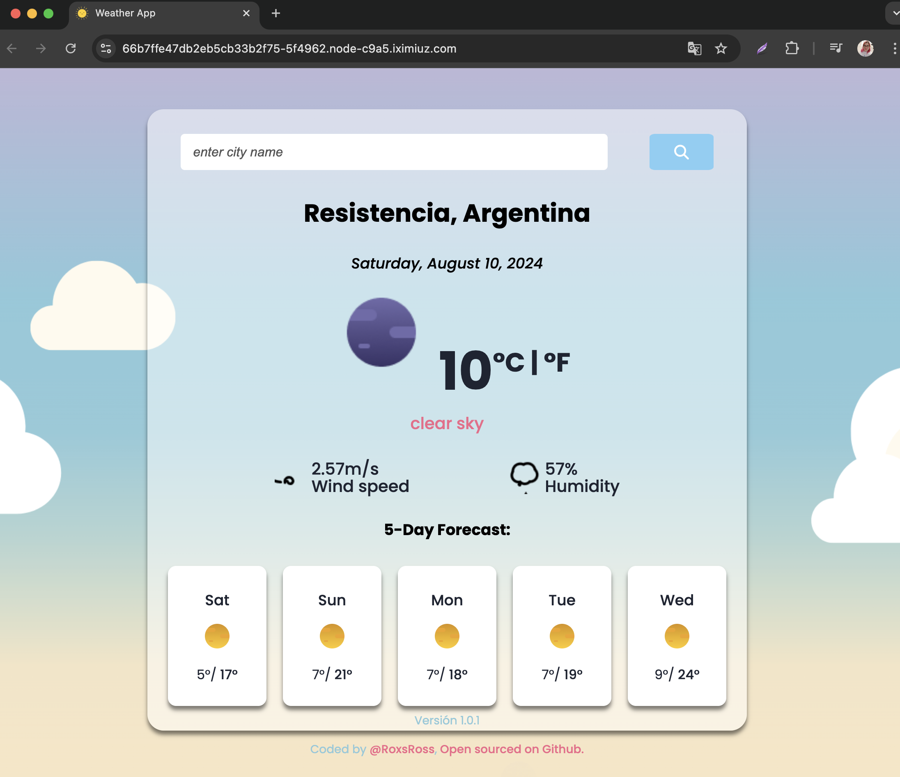

## Cómo Desplegar una Aplicación del Clima en React con PM2 

Aprenderás a desplegar una aplicación React usando PM2 para gestionar el proceso. Este enfoque te permitirá mantener tu aplicación en funcionamiento y facilitar su gestión.

## 1. Actualiza tu Sistema

Antes de comenzar, asegúrate de que tu sistema esté actualizado. Ejecuta los siguientes comandos para actualizar los paquetes de tu sistema:

```bash
sudo apt update
```

## 2. Instala Node.js y npm Usando NVM

Node Version Manager (NVM) facilita la gestión de múltiples versiones de Node.js. Sigue estos pasos para instalar NVM y configurar Node.js:

1. **Instalar NVM:**

   Descarga e instala NVM con el siguiente comando:

   ```bash
   curl -o- https://raw.githubusercontent.com/nvm-sh/nvm/v0.39.3/install.sh | bash
   source ~/.bashrc
   ```

2. **Verificar la Instalación y Listar Versiones Disponibles:**

   Asegúrate de que NVM esté instalado correctamente y consulta las versiones disponibles de Node.js:

   ```bash
   nvm help
   nvm list-remote
   ```

3. **Instalar la Versión Requerida de Node.js:**

   Instala la versión específica de Node.js que necesitas:

   ```bash
   nvm install v20.16.0
   ```

4. **Seleccionar la Versión de Node.js a Utilizar:**

   Selecciona la versión de Node.js que acabas de instalar:

   ```bash
   nvm use v20.16.0
   ```

5. **Verificar la Versión Instalada:**

   Verifica que Node.js y npm estén disponibles:

   ```bash
   nvm current
   ```

## 3. Clona tu Proyecto

Con Node.js y npm listos, es momento de clonar y configurar tu proyecto.

**Aplicación `weather-app` (Puerto 3000):**

```bash
git clone -b devops-weather-app https://github.com/roxsross/devops-static-web.git
cd devops-static-web
npm install
```

> Puedes repetir este proceso para desplegar más aplicaciones según sea necesario.

## 4. Configura PM2

PM2 es un administrador de procesos para aplicaciones Node.js que facilita el mantenimiento de las aplicaciones en segundo plano y su reinicio automático en caso de fallo.

**Instalar PM2:**

```bash
npm install pm2@latest -g
```

**Verificar Instalación de PM2:**

Asegúrate de que PM2 esté instalado correctamente:

```bash
pm2 list
```

**Iniciar la Aplicación en el Puerto 3000:**

Inicia la aplicación `weather-app` y asegúrate de que se reinicie automáticamente si se detiene:

```bash
pm2 start --name "weather-app" npm -- start --watch -- --port 3000
```

El comando anterior debería generar una salida similar a esta:

```bash
root@ubuntu-01:~/devops-static-web# pm2 start --name "weather-app" npm -- start --watch -- --port 3000
[PM2] Starting /root/.nvm/versions/node/v20.16.0/bin/npm in fork_mode (1 instance)
[PM2] Done.
┌────┬────────────────┬─────────────┬─────────┬─────────┬──────────┬────────┬──────┬───────────┬──────────┬──────────┬──────────┬──────────┐
│ id │ name           │ namespace   │ version │ mode    │ pid      │ uptime │ ↺    │ status    │ cpu      │ mem      │ user     │ watching │
├────┼────────────────┼─────────────┼─────────┼─────────┼──────────┼────────┼──────┼───────────┼──────────┼──────────┼──────────┼──────────┤
│ 0  │ weather-app    │ default     │ 0.39.3  │ fork    │ 2327     │ 0s     │ 0    │ online    │ 0%       │ 46.1mb   │ root     │ enabled  │
└────┴────────────────┴─────────────┴─────────┴─────────┴──────────┴────────┴──────┴───────────┴──────────┴──────────┴──────────┴──────────┘
```

PM2 garantizará que tu aplicación siga ejecutándose incluso si cierras la sesión del terminal, y el flag `--watch` permitirá a PM2 vigilar los archivos para detectar cambios.

## 5. Accede a la Aplicación

Una vez que hayas configurado PM2, puedes acceder a tu aplicación en el navegador web. Visita `http://your_server_ip:3000 || http://localhost:3000` para ver tu aplicación en funcionamiento.




