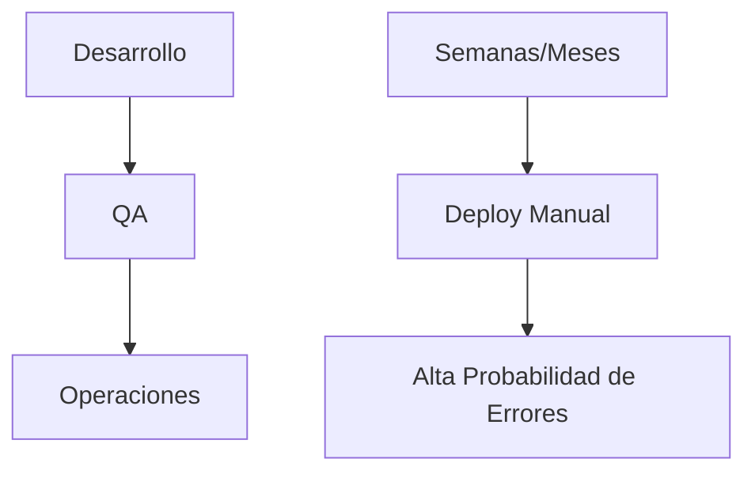
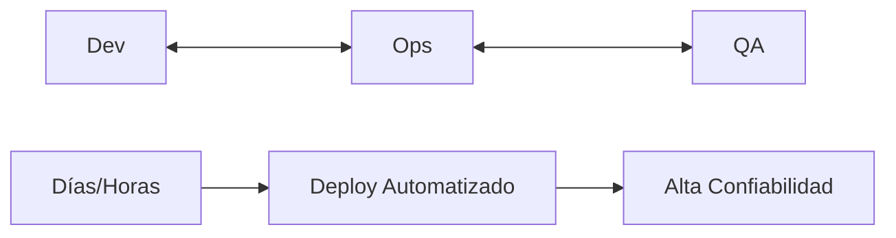
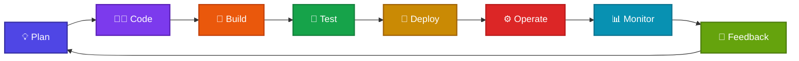

# 🚀 DevOps: La Aceleración del Desarrollo de Software

  

:::tip ¿Qué Aprenderás?
Esta guía te llevará desde los conceptos básicos hasta las prácticas avanzadas de DevOps, con ejemplos reales y casos de éxito de empresas líderes mundiales.
:::

DevOps es **más que una metodología** - es una **transformación cultural** que integra el desarrollo de software (Development) y las operaciones de TI (Operations) para acortar el ciclo de vida del desarrollo, aumentar la calidad del software y entregar valor continuo al cliente.

## 🎯 ¿Qué es DevOps?

### 💡 Definición Moderna

DevOps representa un cambio fundamental en cómo las organizaciones crean y entregan software, eliminando los silos tradicionales y promoviendo:

**🚀 Velocidad**
- Entregas más rápidas
- Time-to-market reducido
- Respuesta ágil al mercado

**🔒 Calidad**
- Testing automatizado
- Menos errores en producción
- Código más confiable

**🤝 Colaboración**
- Equipos unificados
- Comunicación fluida
- Objetivos compartidos

**📊 Visibilidad**
- Métricas en tiempo real
- Observabilidad completa
- Decisiones basadas en datos

### 📈 La Transformación Digital

#### 🏢 Modelo Tradicional

**Características:**
- ⏳ Ciclos largos de desarrollo
- 🚫 Silos entre equipos
- 📋 Procesos manuales
- 😰 Deployments arriesgados

#### 🚀 Modelo DevOps

**Beneficios:**
- ⚡ Entregas rápidas y frecuentes
- 🤝 Colaboración continua
- 🤖 Automatización integral
- ✅ Deployments seguros

---

## � Los Pilares Fundamentales de DevOps

### 🤝 Cultura de Colaboración

**Transformación Organizacional:**
- Equipos cross-funcionales
- Responsabilidad compartida
- Comunicación transparente
- Blameless postmortems

**Prácticas Clave:**
- Knowledge sharing sessions
- Cross-training programs
- Shared ownership model
- Continuous feedback loops

### 🤖 Automatización Integral

**Áreas de Automatización:**
- Build y Testing
- Deployment y Rollback
- Infrastructure provisioning
- Monitoring y Alerting

**Beneficios Clave:**
- Consistencia total
- Velocidad aumentada
- Reducción de errores
- Escalabilidad mejorada

### 📊 Monitorización Continua

**Los Tres Pilares:**
- **Métricas**: Performance cuantitativo
- **Logs**: Eventos detallados
- **Trazas**: Seguimiento de requests

**Niveles de Observabilidad:**
- Infraestructura (CPU, RAM, Network)
- Aplicación (Latencia, Errores)
- Negocio (KPIs, Revenue)

### 🏗️ Infrastructure as Code

**Principios Fundamentales:**
- Versionado en Git
- Declarativo vs Imperativo
- Inmutable infrastructure
- Environment parity

**Herramientas Populares:**
- Terraform (Multi-cloud)
- Ansible (Configuration)
- CloudFormation (AWS)
- Pulumi (Programming languages)

---

## ♾️ El Pipeline DevOps: De la Idea a Producción

### 🔄 Fases del Ciclo de Vida DevOps

#### 💡 **1. Planificación (Plan)**
**Herramientas:** Jira, Azure DevOps, GitHub Projects

**Actividades Clave:**
- 📝 User stories y acceptance criteria
- 📅 Sprint planning y retrospectivas  
- 🗺️ Product roadmap y priorización
- 📊 Requirement analysis

#### 👨‍💻 **2. Codificación (Code)**
**Herramientas:** Git, GitHub, GitLab, VS Code

**Mejores Prácticas:**
- 🌿 Branching strategies (GitFlow)
- 👥 Code reviews y pair programming
- 📏 Coding standards y linting
- 📚 Documentation as code

#### 🔨 **3. Construcción (Build)**
**Herramientas:** Jenkins, GitHub Actions, GitLab CI

**Proceso Automatizado:**
- ⚡ Automated builds
- 📦 Dependency management
- 🎯 Artifact generation
- 🚀 Build optimization

#### 🧪 **4. Pruebas (Test)**
**Herramientas:** Jest, Selenium, pytest, SonarQube

**Pirámide de Testing:**
- 🔬 Unit tests (70%)
- 🔗 Integration tests (20%)
- 🎭 End-to-end tests (10%)
- 🔒 Security & Performance tests

#### 🚀 **5. Despliegue (Deploy)**
**Herramientas:** Kubernetes, Docker, Terraform

**Estrategias de Deploy:**
- 🔵🟢 Blue-Green deployment
- 🐤 Canary releases
- 🔄 Rolling updates
- 🚩 Feature flags

#### ⚙️ **6. Operación (Operate)**
**Herramientas:** Kubernetes, Docker Swarm

**Gestión en Producción:**
- 🎼 Container orchestration
- 🕸️ Service mesh
- ⚖️ Load balancing
- 📈 Auto-scaling

#### 📊 **7. Monitorización (Monitor)**
**Herramientas:** Prometheus, Grafana, ELK Stack

**Métricas DORA:**
- ⏱️ MTTR (Mean Time To Recovery)
- 🛡️ MTBF (Mean Time Between Failures)
- 📈 Deployment frequency
- 🚀 Lead time for changes

#### 🔄 **8. Retroalimentación (Feedback)**
**Herramientas:** Slack, PagerDuty, Datadog

**Mejora Continua:**
- 🚨 Incident response
- 📝 Postmortem analysis  
- 🔄 Continuous improvement
- 👥 Customer feedback integration

---

## 📊 Métricas DORA: El Estándar de Oro

:::info ¿Qué son las métricas DORA?
Las métricas DORA (DevOps Research and Assessment) son el estándar de la industria para medir el rendimiento de DevOps, basadas en investigación científica de Google y el Estado de DevOps.
:::

### 📈 **Deployment Frequency**
*¿Con qué frecuencia desplegamos?*

🚀

**Niveles de Performance:**
- 🏆 **Elite**: Múltiples veces al día
- 🥈 **High**: Diario a semanal
- 🥉 **Medium**: Semanal a mensual
- 📉 **Low**: Menos de 1 vez/mes

### ⏱️ **Lead Time for Changes**
*¿Cuánto tardamos desde commit hasta producción?*

⚡

**Niveles de Performance:**
- 🏆 **Elite**: Menos de 1 hora
- 🥈 **High**: 1 hora a 1 día
- 🥉 **Medium**: 1 día a 1 semana
- 📉 **Low**: Más de 1 semana

### 🛡️ **Change Failure Rate**
*¿Qué porcentaje de cambios causan fallos?*

🎯

**Niveles de Performance:**
- 🏆 **Elite**: 0-15%
- 🥈 **High**: 16-30%
- 🥉 **Medium**: 31-45%
- 📉 **Low**: 46-60%

### 🔧 **Time to Restore Service**
*¿Cuánto tardamos en recuperarnos de fallos?*

🚑

**Niveles de Performance:**
- 🏆 **Elite**: Menos de 1 hora
- 🥈 **High**: Menos de 1 día
- 🥉 **Medium**: 1 día a 1 semana
- 📉 **Low**: Más de 1 semana

### 📈 Impacto de las Métricas DORA

**🏆 Organizaciones Elite Performance vs Low Performance:**

| Métrica | Elite | Low | Mejora |
|---------|-------|-----|---------|
| **Deploy Frequency** | On-demand | Menos de 1 vez/mes | **46x más frecuente** |
| **Lead Time** | < 1 hora | > 1 semana | **2,555x más rápido** |
| **MTTR** | < 1 hora | > 1 semana | **2,604x más rápido** |
| **Change Failure Rate** | 0-15% | 46-60% | **7x menor tasa de fallos** |

---

## 🛠️ Ecosistema de Herramientas DevOps

:::tip Recomendación
No existe una "pila perfecta" de herramientas. La elección depende de tu contexto, equipo y objetivos. Comienza con herramientas simples y evoluciona gradualmente.
:::

### 🔧 Herramientas por Categoría

#### 📚 **Control de Versiones**

| Herramienta | Uso | Popularidad |
|-------------|-----|-------------|
| **Git** 🥇 | Universal | 95% |
| **GitHub** | Colaboración | 85% |
| **GitLab** | All-in-one | 25% |
| **Bitbucket** | Atlassian | 15% |

**💡 Recomendación:** Git + GitHub para la mayoría de proyectos

#### 🔄 **CI/CD Pipelines**

| Herramienta | Complejidad | Mejor Para |
|-------------|-------------|------------|
| **GitHub Actions** 🥇 | Baja | Proyectos GitHub |
| **GitLab CI/CD** | Media | DevOps completo |
| **Jenkins** | Alta | Personalización |
| **Azure DevOps** | Media | Microsoft Stack |

**💡 Recomendación:** GitHub Actions para comenzar

#### 🐳 **Containerización**

| Herramienta | Propósito | Curva Aprendizaje |
|-------------|-----------|-------------------|
| **Docker** 🥇 | Containers | Baja |
| **Kubernetes** | Orquestación | Alta |
| **Docker Compose** | Local dev | Muy Baja |
| **Podman** | Alternativa Docker | Baja |

**💡 Recomendación:** Docker → Docker Compose → Kubernetes

#### 🏗️ **Infrastructure as Code**

| Herramientas | Enfoque | Mejor Para |
|-------------|---------|------------|
| **Terraform** 🥇 | Multi-cloud | Infraestructura |
| **Ansible** | Configuración | Automatización |
| **Pulumi** | Código nativo | Developers |
| **CloudFormation** | AWS nativo | Solo AWS |

**💡 Recomendación:** Terraform + Ansible

#### 📊 **Monitorización**

| Herramienta | Tipo | Fortaleza |
|-------------|------|-----------|
| **Prometheus** 🥇 | Métricas | Time series |
| **Grafana** | Visualización | Dashboards |
| **ELK Stack** | Logs | Búsqueda |
| **Datadog** | APM | All-in-one |

**💡 Recomendación:** Prometheus + Grafana

#### ☁️ **Cloud Providers**

| Provider | Fortaleza | Market Share |
|----------|-----------|--------------|
| **AWS** 🥇 | Servicios completos | 32% |
| **Azure** | Microsoft integration | 20% |
| **GCP** | AI/ML, Kubernetes | 9% |
| **DigitalOcean** | Simplicidad | 4% |

**💡 Recomendación:** AWS para comenzar, multi-cloud para escalar

### 🎯 Stack Recomendado por Nivel

### 🌱 **Principiante**

**Stack Mínimo Viable:**
- 📝 Git + GitHub
- 🔄 GitHub Actions
- 🐳 Docker + Docker Compose
- ☁️ Heroku o Netlify
- 📊 Logging básico

**Tiempo de setup:** 1-2 semanas

### 🚀 **Intermedio**

**Stack Profesional:**
- 📝 Git + GitHub/GitLab
- 🔄 GitHub Actions + Jenkins
- 🐳 Docker + Kubernetes
- 🏗️ Terraform + Ansible
- 📊 Prometheus + Grafana
- ☁️ AWS/Azure

**Tiempo de setup:** 1-2 meses

### 🏆 **Avanzado**

**Stack Enterprise:**
- 📝 GitOps workflow
- 🔄 Multi-pipeline strategy
- 🐳 Service mesh (Istio)
- 🏗️ Multi-cloud IaC
- 📊 Observabilidad completa
- 🔒 Security as Code
- 🤖 AIOps integration

**Tiempo de setup:** 3-6 meses

---

## 📈 Beneficios Cuantificables de DevOps

### Impacto en el Negocio

#### Velocidad de Entrega
- **46x** más deployments frecuentes
- **440x** menor lead time
- **96x** menor tiempo de recuperación
- **5x** menor tasa de fallos

#### Calidad y Confiabilidad
- **50%** menos tiempo gastado en retrabajos
- **22%** menos tiempo en trabajo no planificado
- **29%** más tiempo en nuevo trabajo
- **24%** mayor satisfacción del empleado

#### Eficiencia Operacional
- **50%** reducción en costos de TI
- **60%** mejora en time-to-market
- **200%** aumento en productividad del equipo
- **30%** reducción en incidentes de producción

### ROI de DevOps

#### Inversión Típica
- Herramientas y plataformas: 20%
- Training y certificaciones: 30%
- Personal y consultores: 50%

#### Retorno Esperado
- **Año 1**: 150-200% ROI
- **Año 2**: 300-400% ROI
- **Año 3+**: 500%+ ROI

---

## 🏢 Casos de Éxito: Gigantes Tecnológicos

:::info Aprender de los Mejores
Estos casos de éxito demuestran cómo DevOps puede transformar organizaciones de cualquier tamaño, desde startups hasta corporaciones globales.
:::

### 🎬 **Netflix: El Rey del Streaming**

📺

**🎯 Desafío:** Escalar de DVD por correo a 200M+ usuarios globales

**🚀 Solución DevOps:**
- **Migración completa a AWS** (toda la infraestructura)
- **Arquitectura de microservicios** (1000+ servicios)
- **Chaos Engineering** (Chaos Monkey y herramientas)
- **Deployment continuo** sin ventanas de mantenimiento

**📊 Resultados Increíbles:**
- ⚡ **1,000+ deployments/día**
- 🛡️ **99.99% disponibilidad**
- 🌍 **Presencia en 190+ países**
- 💰 **$29B+ revenue anual**

*"Si no estás preparado para fallar, no estás preparado para innovar"* - Netflix

### 🛒 **Amazon: Comercio a Escala Planetaria**

📦

**🎯 Desafío:** Manejar Black Friday y Prime Day sin caídas

**🚀 Solución DevOps:**
- **"Two-pizza teams"** (equipos pequeños, autónomos)
- **API-first approach** (todo es una API)
- **Infraestructura automatizada** (AWS nació aquí)
- **Culture of ownership** (quien lo construye, lo opera)

**📊 Resultados Asombrosos:**
- ⚡ **Deployment cada 11.7 segundos**
- 🚀 **Zero downtime deployments**
- 📈 **Auto-scaling dinámico**
- 🏆 **$469B revenue (2021)**

*"Failure and invention are inseparable twins"* - Jeff Bezos

### 🎵 **Spotify: Agilidad Musical**

🎶

**🎯 Desafío:** Competir con Apple Music y YouTube Music

**🚀 Solución DevOps:**
- **Modelo Spotify** (Squads, Tribes, Chapters, Guilds)
- **Continuous delivery** con feature flags
- **Microservicios** en contenedores
- **Data-driven decisions** con A/B testing

**📊 Resultados Musicales:**
- ⚡ **4,000+ deployments/semana**
- 🧪 **1,000+ experiments/año**
- 🚀 **Autonomous teams**
- 🎯 **406M usuarios activos**

*"Agile at scale is not about scaling agile, it's about being agile at scale"* - Spotify

### 🛍️ **Etsy: Artesanos Digitales**

🎨

**🎯 Desafío:** Transformar cultura de miedo a los cambios

**🚀 Solución DevOps:**
- **Blameless postmortems** (cultura sin culpa)
- **Continuous deployment** con confianza
- **Feature flags** para rollouts seguros
- **Learning culture** con experimentos

**📊 Resultados Artesanales:**
- ⚡ **De 2 deployments/semana a 50+/día**
- 📉 **60% reducción en incidentes**
- 🤝 **Cultura de confianza y colaboración**
- 💡 **Experimentación segura y rápida**

*"Code as if the person who ends up maintaining your code will be a violent psychopath who knows where you live"* - Etsy Engineering

### 📈 Patrones Comunes de Éxito

**🏆 Factores Críticos que Todas Comparten:**

1. **🎯 Liderazgo Comprometido** - Apoyo desde la cúpula ejecutiva
2. **🤝 Cultura Primero** - Transformación cultural antes que herramientas
3. **📊 Métricas Obsesivas** - Medir todo lo que importa
4. **🔄 Iteración Rápida** - Fallar rápido, aprender rápido
5. **🛡️ Automatización Total** - Humanos para estrategia, máquinas para ejecución
6. **🎓 Aprendizaje Continuo** - Inversión constante en desarrollo de equipo

---

## 🚀 Comenzando tu Viaje DevOps

:::tip Tu Hoja de Ruta Personal
DevOps es un viaje, no un destino. Cada organización tiene su propio camino, pero estos pasos te ayudarán a comenzar de manera efectiva.
:::

### 🎯 **Fase 1: Fundamentos (Mes 1-2)**

**🎓 Aprende los Conceptos:**
- Principios y cultura DevOps
- Git y control de versiones
- Conceptos de CI/CD
- Introducción a containers

**🛠️ Herramientas Básicas:**
- Git + GitHub
- Docker + Docker Compose
- Un lenguaje de scripting (Bash/Python)
- VS Code con extensiones DevOps

**📚 Recursos Recomendados:**
- 📖 "The Phoenix Project"
- 🎥 Cursos online gratuitos
- 🏋️ Labs prácticos
- 👥 Comunidades DevOps

### 🔧 **Fase 2: Práctica (Mes 3-4)**

**🏗️ Construye tu Pipeline:**
- Setup de CI/CD con GitHub Actions
- Containeriza una aplicación simple
- Deploy automatizado a cloud
- Monitorización básica

**☁️ Experiencia Cloud:**
- Cuenta gratuita AWS/Azure/GCP
- Deploy en cloud provider
- Infraestructura básica como código
- Configuración de alertas

**📊 Primeras Métricas:**
- Tiempo de build
- Frequency de deployments
- Success rate
- Basic monitoring

### 🚀 **Fase 3: Avanzado (Mes 5-6)**

**🎼 Orquestación:**
- Kubernetes básico
- Service mesh introduction
- Multi-environment strategy
- Database migrations

**🔒 Security & Compliance:**
- Vulnerability scanning
- Secrets management
- Policy as code
- Audit trails

**📈 Optimización:**
- Performance tuning
- Cost optimization
- Advanced monitoring
- Incident response

### 🏆 **Fase 4: Maestría (Mes 7+)**

**🎨 Platform Engineering:**
- Internal developer platforms
- Self-service infrastructure
- Golden path templates
- Developer experience optimization

**🤖 Inteligencia Artificial:**
- AIOps implementation
- Predictive analytics
- Automated remediation
- Smart resource allocation

**👥 Liderazgo:**
- DevOps evangelism
- Team transformation
- Mentoring otros
- Speaking & writing

### 🎓 Certificaciones Recomendadas

#### ☁️ **Cloud Fundamentals**
- **AWS**: Solutions Architect Associate
- **Azure**: Fundamentals + Associate
- **GCP**: Associate Cloud Engineer
- **Multi-cloud**: Terraform Associate

**⏱ Tiempo estimado:** 3-4 meses c/u

#### 🐳 **Container & Orchestration**
- **Docker**: Docker Certified Associate
- **Kubernetes**: CKA, CKAD, CKS
- **OpenShift**: Red Hat certifications
- **Service Mesh**: Istio Certified

**⏱ Tiempo estimado:** 4-6 meses

#### 🔄 **DevOps & SRE**
- **DevOps**: AWS DevOps Engineer
- **SRE**: Google Cloud Professional
- **Agile**: Certified ScrumMaster
- **ITIL**: Service Management

**⏱ Tiempo estimado:** 2-3 meses c/u

---

## 🔮 El Futuro de DevOps

### 🌟 Tendencias Emergentes 2025+

#### 🤖 **AIOps Evolution**
- Detección automática de anomalías
- Predicción de fallos con ML
- Auto-remediation inteligente
- Optimización de recursos con AI

#### 🔄 **GitOps Mainstream**
- Git como única fuente de verdad
- Declarative everything
- Automated synchronization
- Complete audit trail

#### 🏗️ **Platform Engineering**
- Internal developer platforms
- Self-service infrastructure
- Golden path provision
- Developer experience focus

#### 🔒 **DevSecOps Native**
- Shift-left security por defecto
- Policy as code estándar
- Zero-trust architecture
- Compliance automation

#### 🌍 **Green DevOps**
- Carbon footprint optimization
- Sustainable architecture
- Green computing practices
- Energy-efficient deployments

#### 🎯 **Edge Computing**
- Edge-native applications
- Distributed DevOps pipelines
- IoT integration
- Real-time processing

---

## 🎯 Conclusión: Tu Próximo Paso

### 🚀 **DevOps es más que herramientas - es transformación**

DevOps no es solo un conjunto de herramientas o procesos - es una **revolución cultural** que transforma cómo construimos, desplegamos y operamos software. Es la diferencia entre organizaciones que simplemente sobreviven y aquellas que **lideran el futuro digital**.

**🎯 Enfoque**
Cultura > Herramientas

**⚡ Velocidad**  
Sin sacrificar calidad

**🤝 Colaboración**
Equipos > Silos

**📊 Datos**
Decisiones basadas en métricas

### 💪 **¿Listo para transformar tu carrera?**

**🎯 Comienza HOY con:**
1. **Crea** tu primer pipeline CI/CD
2. **Containeriza** una aplicación  
3. **Despliega** en la nube
4. **Mide** todo lo que importa
5. **Itera** y mejora continuamente

:::tip Recuerda
*"The best time to plant a tree was 20 years ago. The second best time is now."*

**Tu viaje DevOps comienza con el primer paso. ¡Da ese paso hoy!** 🌱
:::

---

### 📚 **Continúa Aprendiendo en nuestro Programa**

🎓 **[90 Días de DevOps](/plan-de-estudio)** - Programa completo de transformación  
📅 **[Calendario de Eventos](/calendario)** - Workshops y sesiones en vivo  
🛠️ **[Herramientas y Labs](/DevOps-Tools/tools)** - Práctica hands-on  
📖 **[Libros Recomendados](/Libros/libros-devops-1)** - Recursos de aprendizaje  

**¡Únete a nuestra comunidad y acelera tu aprendizaje!** 🚀

import PreFooter from '@site/src/components/PreFooter';

<PreFooter />
