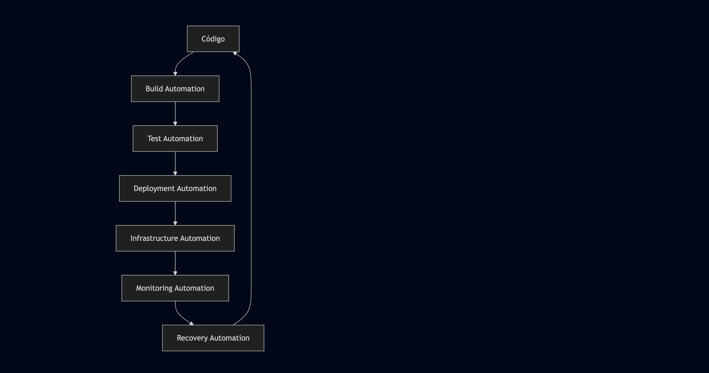

## Sobre DevOps


DevOps es una metodología que integra el desarrollo de software (Development) y las operaciones de TI (Operations) con el objetivo de acortar el ciclo de vida del desarrollo, aumentar la calidad del software y entregar valor continuo al cliente. DevOps promueve la colaboración, la automatización y la monitorización continua en todas las etapas del desarrollo y la entrega de software.

---

## 🎯 ¿Qué es DevOps Realmente?

### Definición Ampliada

DevOps es **más que una metodología** - es una **transformación cultural** que rompe los silos tradicionales entre equipos de desarrollo y operaciones. Representa un cambio fundamental en cómo las organizaciones entregan valor de software, enfocándose en:

- **Velocidad sin sacrificar calidad**
- **Colaboración sobre procesos individuales**
- **Automatización sobre tareas manuales**
- **Retroalimentación rápida sobre entregas lentas**
- **Mejora continua sobre estabilidad estática**

### Evolución Histórica

#### Era Pre-DevOps (Modelo Tradicional)
```
Desarrollo → QA → Operaciones
    ↓         ↓         ↓
  Aislado   Aislado   Aislado
    ↓         ↓         ↓
 Releases  Testing   Deploy
 Largos    Extenso   Manual
```

**Problemas:**
- Comunicación limitada entre equipos
- Ciclos de desarrollo largos (meses/años)
- Deployments arriesgados y poco frecuentes
- Culpabilización entre equipos
- Resistencia al cambio

#### Era DevOps (Modelo Integrado)
```
    Dev ←→ Ops ←→ QA
         ↓
    Colaboración
         ↓
    Automatización
         ↓
   Entrega Continua
```

**Beneficios:**
- Equipos cross-funcionales
- Ciclos de desarrollo cortos (días/semanas)
- Deployments frecuentes y seguros
- Responsabilidad compartida
- Cultura de experimentación

---

## 🏗️ Principios Fundamentales de DevOps

### 1. **Cultura de Colaboración**

#### Antes vs Después
| Aspecto | Tradicional | DevOps |
|---------|-------------|--------|
| **Comunicación** | Formal, limitada | Continua, transparente |
| **Responsabilidad** | Separada por función | Compartida end-to-end |
| **Objetivos** | Individuales por equipo | Alineados al negocio |
| **Resolución de problemas** | Culpabilización | Colaboración |

#### Prácticas Culturales
- **Blameless Postmortems**: Análisis de incidentes sin culpabilizar
- **Shared Ownership**: Todos son responsables del éxito del producto
- **Knowledge Sharing**: Documentación y transferencia de conocimiento
- **Cross-training**: Desarrollo de habilidades multidisciplinarias

### 2. **Automatización Integral**

#### Áreas de Automatización



#### Beneficios de la Automatización
- **Consistencia**: Elimina errores humanos
- **Velocidad**: Procesos más rápidos
- **Escalabilidad**: Manejo de mayor volumen
- **Trazabilidad**: Registro automático de cambios
- **Confiabilidad**: Procesos repetibles

### 3. **Monitorización y Observabilidad**

#### Los Tres Pilares
1. **Métricas**: Datos cuantitativos sobre performance
2. **Logs**: Registros detallados de eventos
3. **Trazas**: Seguimiento de requests a través del sistema

#### Niveles de Monitorización
- **Infraestructura**: CPU, memoria, disco, red
- **Aplicación**: Latencia, throughput, errores
- **Negocio**: Conversiones, ingresos, satisfacción

### 4. **Infraestructura como Código (IaC)**

#### Principios de IaC
- **Versionado**: Infraestructura en control de versiones
- **Reproducible**: Ambientes idénticos en cualquier momento
- **Declarativa**: Describe el estado deseado
- **Inmutable**: Reemplazar en lugar de modificar

#### Beneficios
- Ambientes consistentes
- Deployment rápido
- Disaster recovery eficiente
- Documentación automática

---

## 🔄 El Ciclo de Vida DevOps Detallado

### 1. **Planificación (Plan)**
- **Herramientas**: Jira, Azure DevOps, GitHub Projects
- **Prácticas**: 
  - User stories y acceptance criteria
  - Sprint planning y retrospectivas
  - Roadmap y priorización
  - Análisis de requisitos

### 2. **Codificación (Code)**
- **Herramientas**: Git, GitHub, GitLab, Bitbucket
- **Prácticas**:
  - Branching strategies (GitFlow, GitHub Flow)
  - Code reviews y pair programming
  - Coding standards y linting
  - Documentation as code

### 3. **Construcción (Build)**
- **Herramientas**: Jenkins, GitHub Actions, GitLab CI, Azure DevOps
- **Prácticas**:
  - Automated builds
  - Dependency management
  - Artifact generation
  - Build optimization

### 4. **Pruebas (Test)**
- **Herramientas**: Jest, Selenium, JUnit, pytest, SonarQube
- **Tipos de Testing**:
  - Unit tests (70%)
  - Integration tests (20%)
  - End-to-end tests (10%)
  - Security tests
  - Performance tests

### 5. **Despliegue (Deploy)**
- **Herramientas**: Kubernetes, Docker, Terraform, Ansible
- **Estrategias**:
  - Blue-Green deployment
  - Canary releases
  - Rolling updates
  - Feature flags

### 6. **Operación (Operate)**
- **Herramientas**: Kubernetes, Docker Swarm, OpenShift
- **Prácticas**:
  - Container orchestration
  - Service mesh
  - Load balancing
  - Auto-scaling

### 7. **Monitorización (Monitor)**
- **Herramientas**: Prometheus, Grafana, ELK Stack, Datadog
- **Métricas Clave**:
  - MTTR (Mean Time To Recovery)
  - MTBF (Mean Time Between Failures)
  - Deployment frequency
  - Lead time for changes

### 8. **Retroalimentación (Feedback)**
- **Herramientas**: Slack, Microsoft Teams, PagerDuty
- **Prácticas**:
  - Incident response
  - Postmortem analysis
  - Continuous improvement
  - Customer feedback integration

---

## 🎖️ Métricas DORA: Midiendo el Éxito de DevOps

### Las Cuatro Métricas Clave

#### 1. **Deployment Frequency (Frecuencia de Despliegue)**
- **Elite**: Múltiples veces al día
- **High**: Entre una vez por día y una vez por semana
- **Medium**: Entre una vez por semana y una vez por mes
- **Low**: Menos de una vez por mes

#### 2. **Lead Time for Changes (Tiempo de Entrega)**
- **Elite**: Menos de una hora
- **High**: Entre una hora y un día
- **Medium**: Entre un día y una semana
- **Low**: Más de una semana

#### 3. **Change Failure Rate (Tasa de Fallos)**
- **Elite**: 0-15%
- **High**: 16-30%
- **Medium**: 31-45%
- **Low**: 46-60%

#### 4. **Time to Restore Service (Tiempo de Recuperación)**
- **Elite**: Menos de una hora
- **High**: Menos de un día
- **Medium**: Entre un día y una semana
- **Low**: Más de una semana

---

## 🛠️ Herramientas del Ecosistema DevOps

### Control de Versiones
| Herramienta | Tipo | Casos de Uso | Ventajas |
|-------------|------|--------------|----------|
| **Git** | Distribuido | Universal | Flexibilidad, performance |
| **GitHub** | Plataforma | Colaboración | Integración, comunidad |
| **GitLab** | All-in-one | CI/CD integrado | Completitud |
| **Bitbucket** | Atlassian | Equipos Jira | Integración Atlassian |

### CI/CD
| Herramienta | Complejidad | Mejor Para | Características |
|-------------|-------------|------------|-----------------|
| **GitHub Actions** | Baja | Proyectos GitHub | Simplicidad, integración |
| **GitLab CI/CD** | Media | DevOps completo | All-in-one |
| **Jenkins** | Alta | Personalización | Flexibilidad, plugins |
| **Azure DevOps** | Media | Ecosistema Microsoft | Integración enterprise |

### Containerización
| Herramienta | Propósito | Complejidad | Escalabilidad |
|-------------|-----------|-------------|---------------|
| **Docker** | Containerización | Baja | Media |
| **Kubernetes** | Orquestación | Alta | Muy Alta |
| **Docker Swarm** | Orquestación simple | Baja | Media |
| **OpenShift** | Plataforma enterprise | Alta | Muy Alta |

### Infrastructure as Code
| Herramienta | Enfoque | Mejor Para | Curva de Aprendizaje |
|-------------|---------|------------|---------------------|
| **Terraform** | Multi-cloud | Infraestructura | Media |
| **Ansible** | Configuración | Automatización | Baja |
| **CloudFormation** | AWS nativo | Solo AWS | Media |
| **Pulumi** | Lenguajes de programación | Desarrolladores | Alta |

### Monitorización
| Herramienta | Tipo | Fortaleza | Ecosistema |
|-------------|------|-----------|------------|
| **Prometheus** | Métricas | Time series | Kubernetes |
| **Grafana** | Visualización | Dashboards | Universal |
| **ELK Stack** | Logs | Búsqueda | Elasticsearch |
| **Datadog** | APM | All-in-one | SaaS |

---

## 📈 Beneficios Cuantificables de DevOps

### Impacto en el Negocio

#### Velocidad de Entrega
- **46x** más deployments frecuentes
- **440x** menor lead time
- **96x** menor tiempo de recuperación
- **5x** menor tasa de fallos

#### Calidad y Confiabilidad
- **50%** menos tiempo gastado en retrabajos
- **22%** menos tiempo en trabajo no planificado
- **29%** más tiempo en nuevo trabajo
- **24%** mayor satisfacción del empleado

#### Eficiencia Operacional
- **50%** reducción en costos de TI
- **60%** mejora en time-to-market
- **200%** aumento en productividad del equipo
- **30%** reducción en incidentes de producción

### ROI de DevOps

#### Inversión Típica
- Herramientas y plataformas: 20%
- Training y certificaciones: 30%
- Personal y consultores: 50%

#### Retorno Esperado
- **Año 1**: 150-200% ROI
- **Año 2**: 300-400% ROI
- **Año 3+**: 500%+ ROI

---

## 🏢 Casos de Éxito Empresariales

### Netflix: El Pionero del Microservicios
**Desafío**: Escalar desde DVD por correo a streaming global

**Solución DevOps**:
- Migración completa a AWS
- Arquitectura de microservicios
- Chaos Engineering (Chaos Monkey)
- Deployment continuo

**Resultados**:
- Miles de deployments por día
- 99.99% de disponibilidad
- Escalabilidad global
- Innovación continua

### Amazon: Retail a Escala Planetaria
**Desafío**: Manejar Black Friday y escala global

**Solución DevOps**:
- "Two-pizza teams"
- API-first approach
- Infraestructura automatizada
- Cultura de ownership

**Resultados**:
- Deployment cada 11.7 segundos
- Zero downtime deployments
- Auto-scaling dinámico
- Experiencia de cliente optimizada

### Spotify: Agilidad Musical
**Desafío**: Competir con gigantes tecnológicos

**Solución DevOps**:
- Squads, Tribes, Chapters, Guilds
- Continuous delivery
- Feature flags
- Data-driven decisions

**Resultados**:
- 100+ deployments por día
- Experimentación rápida
- Cultura de autonomía
- Innovación constante

### Etsy: Artesanos Digitales
**Desafío**: Transformar cultura de miedo a cambios

**Solución DevOps**:
- Blameless postmortems
- Continuous deployment
- Feature flags
- Learning culture

**Resultados**:
- De 2 deployments/semana a 60/día
- Reducción 60% en incidentes
- Cultura de confianza
- Experimentación segura

---

### Certificaciones Valiosas

#### Cloud Providers
- **AWS**: Solutions Architect, DevOps Engineer
- **Azure**: DevOps Engineer, Solutions Architect
- **GCP**: Professional Cloud Architect, Professional Cloud DevOps Engineer

#### Herramientas
- **Kubernetes**: CKA, CKAD, CKS
- **Terraform**: HashiCorp Certified: Terraform Associate

#### Metodologías
- **ITIL**: IT Service Management
- **SRE**: Google Cloud Professional SRE
- **Agile**: Certified ScrumMaster, SAFe

---

## 📚 Recursos de Aprendizaje

### Libros Fundamentales

#### **The Phoenix Project**
> Gene Kim, Kevin Behr, George Spafford
- Novela sobre transformación DevOps
- Principios fundamentales
- Casos de estudio realistas

#### **The DevOps Handbook**
> Gene Kim, Jez Humble, Patrick Debois, John Willis
- Guía práctica de implementación
- Estudios de caso detallados
- Estrategias probadas

#### **Accelerate**
> Nicole Forsgren, Jez Humble, Gene Kim
- Investigación científica sobre DevOps
- Métricas DORA
- Data-driven insights

#### **Site Reliability Engineering**
> Google SRE Team
- Prácticas de Google
- SLI/SLO/Error budgets
- Incident management

---

## 🔮 El Futuro de DevOps

### Tendencias Emergentes

#### 1. **AIOps (Artificial Intelligence for IT Operations)**
- Detección automática de anomalías
- Predicción de fallos
- Auto-remediation
- Optimización de recursos

#### 2. **GitOps**
- Git como fuente de verdad
- Declarative infrastructure
- Automated synchronization
- Audit trail completo

#### 3. **Platform Engineering**
- Internal developer platforms
- Self-service infrastructure
- Developer experience focus
- Golden path provision

#### 4. **Security as Code (DevSecOps)**
- Shift-left security
- Automated compliance
- Vulnerability scanning
- Policy as code

#### 5. **Observability Evolution**
- OpenTelemetry standard
- Service mesh integration
- Business metrics correlation
- Predictive analytics

### Desafíos del Futuro

#### Complejidad Creciente
- Multi-cloud strategies
- Edge computing
- Microservices sprawl
- Regulatory compliance

#### Skills Gap
- Shortage de talento DevOps
- Necesidad de upskilling
- Cultural transformation
- Technology evolution speed

#### Sostenibilidad
- Green computing practices
- Carbon footprint optimization
- Resource efficiency
- Sustainable architecture

---

## 📊 DevOps vs Metodologías Tradicionales

### Comparación Detallada

| Aspecto | Waterfall | Agile | DevOps |
|---------|-----------|-------|--------|
| **Ciclo de Release** | 6-12 meses | 2-4 semanas | Continuo |
| **Team Structure** | Silos funcionales | Cross-functional | Cross-functional + Ops |
| **Testing** | Al final | Cada sprint | Automatizado continuo |
| **Deployment** | Manual, arriesgado | Manual, frecuente | Automatizado, seguro |
| **Feedback** | Post-release | Sprint review | Tiempo real |
| **Documentation** | Extensiva | Mínima viable | As-code |
| **Change Management** | Formal, lento | Adaptativo | Continuous |
| **Risk Management** | Avoid | Accept | Embrace & Mitigate |

### Evolución de la Entrega de Software

```
Waterfall (1970s-1990s)
    ↓
Agile (2000s-2010s)
    ↓
DevOps (2010s-Present)
    ↓
DevSecOps + Platform Engineering (Future)
```

---

## 🎯 Conclusión

DevOps no es solo un conjunto de herramientas, sino una **transformación cultural fundamental** que permite a las organizaciones responder rápidamente a las necesidades del mercado y mejorar continuamente sus productos y servicios.

### Elementos Clave para el Éxito

1. **Liderazgo Comprometido**: Apoyo ejecutivo para la transformación
2. **Cultura de Colaboración**: Romper silos y fomentar trabajo conjunto
3. **Automatización Inteligente**: Automatizar para liberar talento humano
4. **Medición Continua**: Métricas para guiar mejoras
5. **Aprendizaje Constante**: Adaptación a nuevas tecnologías y prácticas

### El Impacto Real

Las organizaciones que adoptan DevOps exitosamente no solo mejoran sus métricas técnicas, sino que transforman fundamentalmente su capacidad para:

- **Innovar** más rápido que la competencia
- **Responder** ágilmente a cambios del mercado
- **Entregar** valor continuo a los clientes
- **Retener** talento a través de mejores prácticas de trabajo
- **Escalar** operaciones de manera sostenible

DevOps representa la evolución natural de cómo construimos y operamos software en la era digital, donde la velocidad, calidad y confiabilidad no son mutuamente excluyentes, sino que se refuerzan mutuamente através de la colaboración, automatización y mejora continua.
