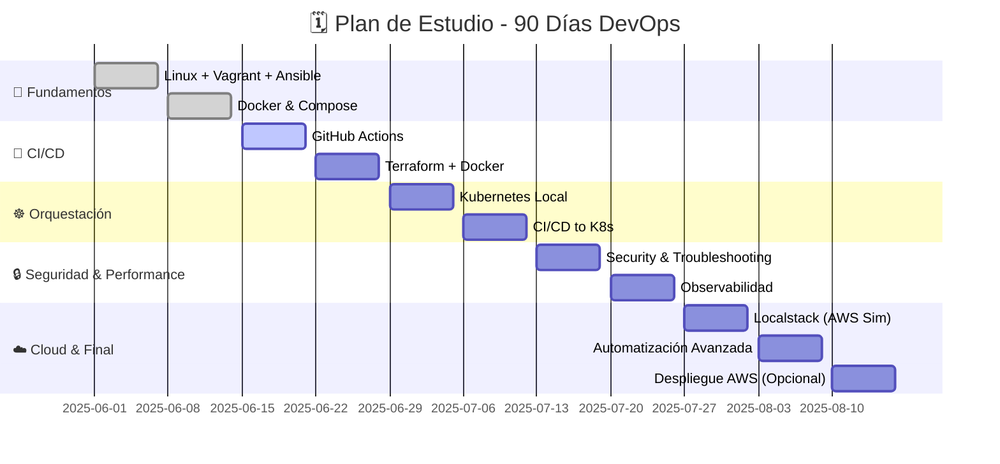

  

  

    <h1 style={{ fontSize: '2.5rem', margin: '0 0 1rem 0', textShadow: '2px 2px 4px rgba(0,0,0,0.3)' }}>
      📍 Tu Plan de Estudio DevOps
    </h1>
    

      <strong>90 días. 11 semanas. 1 objetivo:</strong> 
      Convertirte en un DevOps Engineer con experiencia real y un portfolio que impresione a cualquier empresa.
    

    

      

        ⏱️ <strong>15-20h</strong> por semana
      

      

        🛠️ <strong>100%</strong> Hands-on
      

      

        🎯 <strong>1 proyecto</strong> completo
      

    

  

## 🚀 Tu Transformación DevOps: El Journey Completo

### 📈 Roadmap Visual de Aprendizaje

### 🎯 Tu Evolución Profesional

  

    

      🌱
    

    <h4 style={{ color: 'var(--ifm-color-primary)', marginBottom: '0.5rem' }}>Semanas 1-2: Principiante</h4>
    

      Fundamentos sólidos con Linux, Docker y automatización básica
    

  

  
  

    

      🔥
    

    <h4 style={{ color: 'var(--ifm-color-warning)', marginBottom: '0.5rem' }}>Semanas 3-6: Intermedio</h4>
    

      CI/CD, IaC con Terraform y orquestación con Kubernetes
    

  

  
  

    

      ⚡
    

    <h4 style={{ color: 'var(--ifm-color-success)', marginBottom: '0.5rem' }}>Semanas 7-9: Avanzado</h4>
    

      Seguridad, observabilidad y simulación de infraestructura cloud
    

  

  
  

    

      🏆
    

    <h4 style={{ color: '#ee5a24', marginBottom: '0.5rem' }}>Semanas 10-11: Expert</h4>
    

      Automatización enterprise y despliegue en cloud real
    

  

## 🗓️ **Programa Semana a Semana**
| **Semana** | **Tema Clave**                             | **Proyecto a construir**                     |
| ---------- | ------------------------------------------ | -------------------------------------------- |
| 1          | Linux + Vagrant + Ansible                  | Levantar app sin Docker usando Vagrant       |
| 2          | Docker y Docker Compose                    | Crear los Dockerfiles y `docker-compose.yml` |
| 3          | GitHub Actions CI/CD                       | Automatizar builds con self-hosted runner    |
| 4          | Terraform + Proveedor Docker               | Provisionar y gestionar contenedores con Terraform usando el provider Docker |
| 5          | Kubernetes local con Minikube/Kind              | Desplegar app dockerizada en clúster local   |
| 6          | Despliegue con CI/CD a Kubernetes          | Automatizar despliegues en Kubernetes        |
| 7          | Seguridad en Contenedores, Troubleshooting + Performance                   | Integrar herramientas de vulnerabilidades    |
| 8          | Observabilidad y Monitoreo              | Integrar Prometheus y Grafana                   |
| 9         | Localstack y Simulación de AWS              | Simular servicios de AWS en local con Localstack y preparar tu app para la nube |
| 10         | Automatización avanzada y cierre           | Mejorar pipelines y documentar el proyecto   |
| 11         | Despliegue en la Nube (EC2/EKS - Opcional) | Llevar tu app a AWS     

---

### **Descripción Semana a Semana:**

---

#### **Semana 1: Linux + Vagrant + Ansible**

**Objetivo:** Aprender los conceptos fundamentales de **Linux**, **Vagrant** para crear entornos locales y **Ansible** para automatizar la configuración.

**Contenido:**

* **Linux:** Comandos básicos y navegación, introducción a scripting en **Bash**.
* **Vagrant:** Crear máquinas virtuales con **Vagrant** y **VirtualBox**.
* **Ansible:** Automatizar la configuración del entorno con **Ansible** (instalación de dependencias y configuración de red).

**Proyecto:** Levantar una **aplicación local** (sin Docker) en una **máquina virtual con Vagrant**, automatizando la instalación y configuración con **Ansible**.

**Herramientas:** 🐧 **Linux**, 🔧 **Ansible**, 📦 **Vagrant**

---

#### **Semana 2: Docker y Docker Compose**

**Objetivo:** Aprender a dockerizar aplicaciones y gestionar múltiples contenedores con **Docker Compose**.

**Contenido:**

* **Docker:** Instalación, configuración y creación de **Dockerfiles**.
* **Docker Compose:** Gestión de múltiples servicios (base de datos, backend, frontend).

**Proyecto:** Dockerizar una **aplicación web** y configurar una **red Docker personalizada** usando **Docker Compose**.

**Herramientas:** 🐳 **Docker**, 🧩 **Docker Compose**

---

#### **Semana 3: GitHub Actions CI/CD**

**Objetivo:** Aprender a automatizar el ciclo de vida de desarrollo (CI/CD) con **GitHub Actions** y usar un **self-hosted runner**.

**Contenido:**

* **GitHub Actions:** Introducción a los pipelines de CI/CD con **GitHub Actions**.
* **Self-hosted runner:** Cómo configurar un **self-hosted runner** en tu máquina local para ejecutar los workflows de CI/CD.

**Proyecto:** Crear un **pipeline CI/CD** en **GitHub Actions** que automatice la construcción y el despliegue de la aplicación usando un **self-hosted runner**.

**Herramientas:** 🧪 **GitHub Actions**, ⚙️ **Self-hosted runner**

---

#### **Semana 4: Terraform + Provider Docker**

**Objetivo:** Aprender **Terraform** para gestionar infraestructura como código (IaC), comenzando con la infraestructura local.

**Contenido:**

* **Terraform:** Instalación y fundamentos de **Terraform**.
* **Provider Docker:** Uso del **provider local, ramdon, Docker** para crear y gestionar contenedores e infraestructura como código.

**Proyecto:** Usar **Terraform** para crear infraestructura local (archivos, directorios, servicios Docker) utilizando el **provider Docker**.

**Herramientas:** 🌍 **Terraform**, 🐳 **Provider Docker**

---

#### **Semana 5: Kubernetes Local**

**Objetivo:** Configurar y gestionar un clúster de **Kubernetes** localmente con **Kind** o **Minikube**.

**Contenido:**

* Instalación de **Kubernetes** en local con **Kind** o **Minikube**.
* Conceptos fundamentales de **Kubernetes**: Pods, Deployments, Services.

**Proyecto:** Desplegar una **aplicación** en un clúster local de **Kubernetes** usando **Kind** o **Minikube**.

**Herramientas:** ☸️ **Kubernetes**, **Kind/Minikube**

---

#### **Semana 6: CI/CD a Kubernetes**

**Objetivo:** Integrar un pipeline CI/CD para automatizar despliegues en **Kubernetes**.

**Contenido:**

* **CI/CD a Kubernetes:** Configuración de **GitHub Actions** para despliegues automáticos en un clúster de **Kubernetes**.
* Uso de **Helm** para gestionar despliegues en **Kubernetes**.

**Proyecto:** Automatizar el despliegue de una aplicación en **Kubernetes** usando **GitHub Actions**.

**Herramientas:** 🚀 **GitHub Actions**, ☸️ **K8s**

---

#### **Semana 7: Seguridad en Contenedores**

**Objetivo:** Aprender a aplicar prácticas de seguridad en contenedores con **Trivy** y Diagnosticar y mejorar el rendimiento en aplicaciones **Kubernetes** y **Docker**.

**Contenido:**

* **Trivy:** Escaneo de imágenes Docker para vulnerabilidades.
* **Buenas prácticas de seguridad** en contenedores: configuración de redes, control de acceso, etc.
* **Logs y métricas:** Diagnóstico de fallos en contenedores y clústeres Kubernetes.

**Proyecto:** Usar **Trivy** para escanear imágenes Docker y aplicar prácticas de seguridad en contenedores.

**Herramientas:** 🔐 **Trivy**, **Best Practices**

---

#### **Semana 8: Observabilidad y Monitoreo**

**Objetivo:** Implementar monitoreo y observabilidad con **Prometheus** y **Grafana**.

**Contenido:**

* Instalación y configuración de **Prometheus** y **Grafana**.
* Recolección de métricas y creación de dashboards de monitoreo.

**Proyecto:** Implementar **Prometheus** y **Grafana** para monitorear el rendimiento de la aplicación y el clúster **Kubernetes**.

**Herramientas:** 📊 **Prometheus**, 📈 **Grafana**

---

#### **Semana 9: Simulación de AWS con Localstack**

**Objetivo:** Crear una **nube simulada** con **Localstack** para probar servicios de **AWS** sin usar la nube real.

**Contenido:**

* Instalación y uso de **Localstack** para simular servicios de **AWS** como **S3**, **DynamoDB** y **Lambda**.
* Desarrollar una infraestructura de pruebas en **AWS local**.

**Proyecto:** Simular la infraestructura de **AWS** localmente usando **Localstack**.

**Herramientas:** 🌩️ **Localstack**, **S3**, **DynamoDB**, **Lambda**

---

#### **Semana 10: Automatización Avanzada**

**Objetivo:** Crear un pipeline de **CI/CD** robusto, optimizado y documentado.

**Contenido:**

* Mejores prácticas para **CI/CD**.
* Creación de un pipeline de **CI/CD** completo para integrar todo lo aprendido.

**Proyecto:** Crear un pipeline robusto para automatizar el ciclo de vida completo de la aplicación.

**Herramientas:** ⚙️ **CI/CD**, **Markdown**, **Docs**

---

#### **Semana 11: Despliegue en AWS (Opcional)**

**Objetivo:** Desplegar la aplicación en **AWS EC2** o **EKS**.

**Contenido:**

* Introducción a **AWS EC2** y **EKS** para gestionar la infraestructura en la nube.
* Despliegue de la aplicación en **AWS**.

**Proyecto:** Desplegar la aplicación en **AWS EC2** o **EKS**.

**Herramientas:** 🌩️ **AWS EC2**, **EKS**

**¡Súbete a la zona de peligro 🔥 y empieza a vivir la experiencia de DevOps desde el día uno!**

