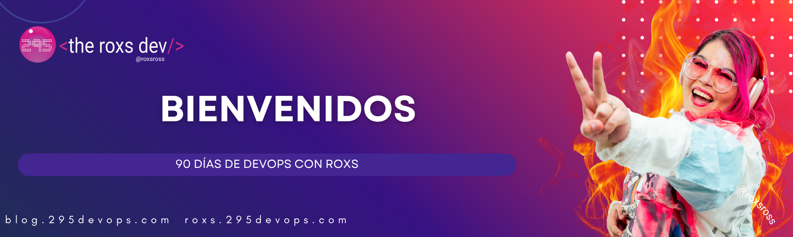
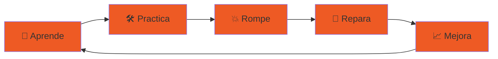
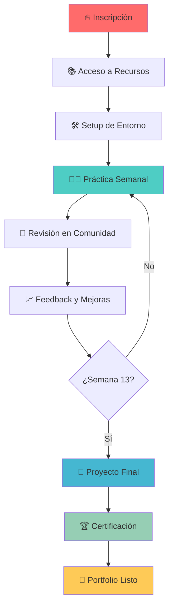
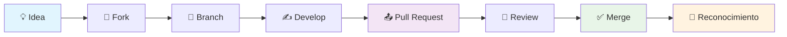

  

  

    <h1 style={{ fontSize: '3rem', margin: '0 0 1rem 0', textShadow: '2px 2px 4px rgba(0,0,0,0.3)' }}>
      🚀 90 Días de DevOps
    </h1>
    <h2 style={{ fontSize: '1.5rem', margin: '0 0 2rem 0', opacity: 0.9 }}>
      con Roxs - ¡Bienvenidos al Reto!
    </h2>
    

      <strong>¡El desafío más intensivo de DevOps en español!</strong> 
      Transforma tu carrera en 90 días con práctica real, proyectos épicos y una comunidad increíble.
    

    

      

        👥 <strong>+50K</strong> Participantes
      

      

        🛠️ <strong>15+</strong> Herramientas
      

      

        🔥 <strong>100%</strong> Práctico
      

    

  

:::tip 🎯 Tu Transformación DevOps Empieza AQUÍ
No importa si eres desarrollador, sysadmin, estudiante o simplemente curioso. Este programa está diseñado para llevarte de **cero a héroe DevOps** con práctica real y proyectos que impresionarán a cualquier reclutador.
:::

## 🔥 ¿Por qué este programa es DIFERENTE?

  

    <h3 style={{ color: 'var(--ifm-color-success-darker)', marginBottom: '1rem' }}>🛠️ 100% Hands-On</h3>
    
Nada de solo teoría. Desde el día 1 estarás deployando, automatizando y rompiendo cosas (para aprender a arreglarlas).

  

  
  

    <h3 style={{ color: 'var(--ifm-color-success-darker)', marginBottom: '1rem' }}>🚀 Proyectos Reales</h3>
    
Construirás una aplicación completa desde cero hasta producción, pasando por CI/CD, monitoreo y escalabilidad.

  

  
  

    <h3 style={{ color: 'var(--ifm-color-warning-darker)', marginBottom: '1rem' }}>👥 Comunidad Activa</h3>
    
Aprende junto a cientos de profesionales. Networking, mentorías y colaboración en cada paso del camino.

  

### 💡 La Filosofía DevOps Haciendo

:::info 🎯 Metodología Probada
**"Si no lo deployás, no lo aprendiste."** Esta es nuestra filosofía. Cada concepto viene acompañado de práctica inmediata en entornos que simulan el mundo real.
:::

## 🎯 Tu Transformación en 90 Días

  

    

      🚀
    

    <h3 style={{ color: '#ee5a24', marginBottom: '1rem' }}>Semanas 1-3: Fundamentos</h3>
    <ul style={{ textAlign: 'left', listStyle: 'none', padding: 0 }}>
      <li>✅ Linux y línea de comandos</li>
      <li>✅ Git y control de versiones</li>
      <li>✅ Docker y contenedores</li>
      <li>✅ Redes y seguridad básica</li>
    </ul>
  

  
  

    

      ⚙️
    

    <h3 style={{ color: '#4834d4', marginBottom: '1rem' }}>Semanas 4-6: Automatización</h3>
    <ul style={{ textAlign: 'left', listStyle: 'none', padding: 0 }}>
      <li>✅ Infrastructure as Code (Terraform)</li>
      <li>✅ Configuration Management (Ansible)</li>
      <li>✅ CI/CD Pipelines (GitHub Actions)</li>
      <li>✅ Testing automatizado</li>
    </ul>
  

  
  

    

      ☸️
    

    <h3 style={{ color: '#0097e6', marginBottom: '1rem' }}>Semanas 7-9: Orquestación</h3>
    <ul style={{ textAlign: 'left', listStyle: 'none', padding: 0 }}>
      <li>✅ Kubernetes desde cero</li>
      <li>✅ Microservicios y APIs</li>
      <li>✅ Service Mesh (Istio)</li>
      <li>✅ Deployment strategies</li>
    </ul>
  

  
  

    

      📊
    

    <h3 style={{ color: '#e84393', marginBottom: '1rem' }}>Semanas 10-12: Observabilidad</h3>
    <ul style={{ textAlign: 'left', listStyle: 'none', padding: 0 }}>
      <li>✅ Monitoring (Prometheus + Grafana)</li>
      <li>✅ Logging centralizado (ELK Stack)</li>
      <li>✅ Tracing distribuido</li>
      <li>✅ Alerting y SLO/SLI</li>
    </ul>
  

  
  

    

      🔒
    

    <h3 style={{ color: '#2ed573', marginBottom: '1rem' }}>Semana 13: Seguridad & Proyecto Final</h3>
    <ul style={{ textAlign: 'left', listStyle: 'none', padding: 0 }}>
      <li>✅ DevSecOps y security scanning</li>
      <li>✅ Secrets management</li>
      <li>✅ Compliance y auditoría</li>
      <li>✅ <strong>🎯 Proyecto final completo</strong></li>
    </ul>
  

### 🏆 Al Final del Programa Tendrás:

  

    

      <h4 style={{ color: 'var(--ifm-color-warning-darker)', marginBottom: '1rem' }}>🎯 Portfolio Completo</h4>
      <ul>
        <li>Aplicación web full-stack deployada</li>
        <li>Pipeline CI/CD automatizado</li>
        <li>Infraestructura como código</li>
        <li>Monitoreo y alertas configurados</li>
      </ul>
    

    

      <h4 style={{ color: 'var(--ifm-color-warning-darker)', marginBottom: '1rem' }}>💼 Skills Demandados</h4>
      <ul>
        <li>Docker & Kubernetes</li>
        <li>AWS/Azure/GCP</li>
        <li>Terraform & Ansible</li>
        <li>Prometheus & Grafana</li>
      </ul>
    

    

      <h4 style={{ color: 'var(--ifm-color-warning-darker)', marginBottom: '1rem' }}>🚀 Experiencia Real</h4>
      <ul>
        <li>Troubleshooting avanzado</li>
        <li>Arquitectura de sistemas</li>
        <li>Mejores prácticas de seguridad</li>
        <li>Mentalidad DevOps/SRE</li>
      </ul>
    

  

## 🛠️ Tu Journey DevOps: Paso a Paso

### 📋 ¿Cómo Funciona el Programa?

  

    <h4 style={{ color: 'var(--ifm-color-primary-darker)', display: 'flex', alignItems: 'center', gap: '0.5rem' }}>
      📁 Tu Repositorio Personal
    </h4>
    
Cada participante crea su repositorio en GitHub donde documentará:

    <ul>
      <li>✅ Ejercicios completados</li>
      <li>✅ Notas y aprendizajes</li>
      <li>✅ Código y configuraciones</li>
      <li>✅ Troubleshooting y soluciones</li>
    </ul>
  

  
  

    <h4 style={{ color: 'var(--ifm-color-success-darker)', display: 'flex', alignItems: 'center', gap: '0.5rem' }}>
      ⚡ Práctica Intensiva
    </h4>
    
Cada semana incluye:

    <ul>
      <li>🎯 Objetivos específicos y medibles</li>
      <li>🛠️ Ejercicios hands-on obligatorios</li>
      <li>📹 Sesiones en vivo opcionales</li>
      <li>🤝 Revisión peer-to-peer</li>
    </ul>
  

  
  

    <h4 style={{ color: 'var(--ifm-color-warning-darker)', display: 'flex', alignItems: 'center', gap: '0.5rem' }}>
      🤝 Comunidad y Mentoring
    </h4>
    
Apoyo constante a través de:

    <ul>
      <li>💬 Discord activo 24/7</li>
      <li>👥 Grupos de estudio</li>
      <li>🎥 Office hours semanales</li>
      <li>📊 Feedback personalizado</li>
    </ul>
  

:::tip 🔥 Compromiso y Consistencia
El programa requiere **15-20 horas semanales** de dedicación. No es fácil, pero los resultados valen cada minuto invertido. ¡Tu futuro DevOps te lo agradecerá!
:::

## 🤝 Contribuye y Haz Crecer la Comunidad

  <h3 style={{ color: 'white', textAlign: 'center', marginBottom: '1rem' }}>
    🚀 ¡Este Programa es Open Source!
  </h3>
  

    Construyamos juntos el mejor programa de DevOps en español. Tu experiencia y conocimientos pueden ayudar a miles de profesionales.
  

### 💡 Formas de Contribuir

  

    <h4 style={{ color: 'var(--ifm-color-primary-darker)', marginBottom: '1rem' }}>📝 Contenido y Documentación</h4>
    <ul style={{ color: 'var(--ifm-color-content)' }}>
      <li>Nuevos ejercicios y desafíos</li>
      <li>Casos de estudio reales</li>
      <li>Troubleshooting y soluciones</li>
      <li>Traducciones y mejoras</li>
    </ul>
  

  
  

    <h4 style={{ color: 'var(--ifm-color-success-darker)', marginBottom: '1rem' }}>🛠️ Herramientas y Automatización</h4>
    <ul style={{ color: 'var(--ifm-color-content)' }}>
      <li>Scripts de automatización</li>
      <li>Templates de configuración</li>
      <li>Workflows de GitHub Actions</li>
      <li>Herramientas de desarrollo</li>
    </ul>
  

  
  

    <h4 style={{ color: 'var(--ifm-color-warning-darker)', marginBottom: '1rem' }}>👥 Comunidad y Mentoring</h4>
    <ul style={{ color: 'var(--ifm-color-content)' }}>
      <li>Moderar discusiones</li>
      <li>Mentorear newcomers</li>
      <li>Organizar events</li>
      <li>Crear contenido educativo</li>
    </ul>
  

### 🔄 Proceso de Contribución Simplificado

  <h4 style={{ color: 'white', marginBottom: '1rem' }}>🚀 Quick Start para Contributors</h4>
  

    
# 1. Fork y clona el repositorio

    
git clone https://github.com/roxsross/90daysdevopsbyroxs

    
cd 90daysdevopsbyroxs

    
 

    
# 2. Crea tu rama de contribución

    
git checkout -b feature/mi-contribucion-epica

    
 

    
# 3. Haz tus cambios y commitea

    
git add .

    
git commit -m "feat: agregar ejercicio de Kubernetes"

    
 

    
# 4. Sube y crea PR

    
git push origin feature/mi-contribucion-epica

  

### 🏆 Reconocimiento a Contributors

  

    🥇 Contributor Badge
  

  

    📸 Spotlight en Redes
  

  

    🎯 Mentorship Opportunities
  

:::success 💫 Impacto Real
Cada contribución mejora la experiencia de aprendizaje de cientos de profesionales. **Tu código, tu conocimiento, tu experiencia pueden cambiar carreras.** ¡Ese es el verdadero poder del open source!
:::

### 📬 Conecta con la Comunidad

  <a href="https://github.com/roxsross" style={{ 
    display: 'flex', 
    alignItems: 'center', 
    gap: '0.5rem', 
    padding: '0.75rem 1.5rem', 
    background: '#333', 
    color: 'white', 
    borderRadius: '8px', 
    textDecoration: 'none',
    fontWeight: 'bold'
  }}>
    🐙 GitHub @roxsross
  </a>
  <a href="https://linkedin.com/in/roxsross" style={{ 
    display: 'flex', 
    alignItems: 'center', 
    gap: '0.5rem', 
    padding: '0.75rem 1.5rem', 
    background: '#0077b5', 
    color: 'white', 
    borderRadius: '8px', 
    textDecoration: 'none',
    fontWeight: 'bold'
  }}>
    � LinkedIn
  </a>
  <a href="https://discord.com/invite/RWQjCRaVJ3" style={{ 
    display: 'flex', 
    alignItems: 'center', 
    gap: '0.5rem', 
    padding: '0.75rem 1.5rem', 
    background: '#7289da', 
    color: 'white', 
    borderRadius: '8px', 
    textDecoration: 'none',
    fontWeight: 'bold'
  }}>
    💬 Discord
  </a>

---

  

  

    <h2 style={{ fontSize: '2.5rem', margin: '0 0 1rem 0', textShadow: '2px 2px 4px rgba(0,0,0,0.3)' }}>
      🚀 ¿Listo para Transformar tu Carrera?
    </h2>
    

      El momento es <strong>AHORA</strong>. Tu futuro DevOps te está esperando. 
      Únete a cientos de profesionales que ya están construyendo el futuro de la tecnología.
    

    

      <strong>90 días. 1 objetivo. Tu nueva carrera.</strong>
    

    

      🔥 ¡VAMOS! 🔥
    

  

