```mermaid
graph TB
    User[👤 Usuario] --> Vote[🗳️ Vote Service<br/>Flask App]
    Vote --> Redis[(🔴 Redis<br/>Message Queue)]
    Redis --> Worker[⚙️ Worker Service<br/>Node.js]
    Worker --> PostgreSQL[(🐘 PostgreSQL<br/>Database)]
    PostgreSQL --> Result[📊 Result Service<br/>Node.js + WebSockets]
    Result --> Dashboard[📈 Dashboard<br/>Real-time Results]
    
    classDef userClass fill:#3b82f6,stroke:#1e40af,stroke-width:3px,color:#ffffff
    classDef serviceClass fill:#8b5cf6,stroke:#7c3aed,stroke-width:3px,color:#ffffff
    classDef dataClass fill:#10b981,stroke:#059669,stroke-width:3px,color:#ffffff
    classDef uiClass fill:#f59e0b,stroke:#d97706,stroke-width:3px,color:#ffffff
    
    class User userClass
    class Vote,Worker,Result serviceClass
    class Redis,PostgreSQL dataClass
    class Dashboard uiClass
```

```mermaid
gantt
    title 🔥 Evolución del Proyecto Fuego
    dateFormat  X
    axisFormat %w
    
    section 🐧 Fundamentos
    Linux & Vagrant        :active, linux, 0, 1w
    Ansible Automation     :active, ansible, 0, 1w
    
    section 🐳 Contenedores
    Docker & Compose       :docker, 1, 1w
    Multi-service Setup    :compose, 1, 1w
    
    section 🔄 CI/CD
    GitHub Actions         :cicd, 2, 1w
    Self-hosted Runners    :runners, 2, 1w
    
    section 🌍 IaC
    Terraform Basics       :terraform, 3, 1w
    Infrastructure as Code :iac, 3, 1w
    
    section ☸️ Orquestación
    Kubernetes Local       :k8s, 4, 1w
    Kubernetes CI/CD       :k8scd, 5, 1w
    
    section 🔐 Seguridad
    Container Security     :security, 6, 1w
    Vulnerability Scanning :scan, 6, 1w
    
    section 📊 Observabilidad
    Prometheus & Grafana   :monitoring, 7, 1w
    
    section ☁️ Cloud
    AWS Simulation         :localstack, 8, 1w
    Production Deploy      :aws, 10, 1w
```

import Tabs from '@theme/Tabs';
import TabItem from '@theme/TabItem';

  

  

    
🔥

    <h1 style={{
      color: 'white',
      fontSize: '3rem',
      marginBottom: '1rem',
      textShadow: '2px 2px 4px rgba(0,0,0,0.3)'
    }}>
      El Fuego by Roxs
    </h1>
    

      El proyecto que encenderá tu pasión por DevOps y transformará tu carrera
    

  

:::tip **🎯 Tu Misión DevOps**
Dominar una aplicación distribuida real mientras aprendes las herramientas más demandadas de la industria. Este no es solo un tutorial, es tu **bootcamp intensivo** hacia el éxito profesional.
:::

## 🚀 **Estructura del Proyecto**

El proyecto en el que trabajarás se basa en el repositorio **[roxs-devops-project90](https://github.com/roxsross/roxs-devops-project90)**, un desafío educativo de **DevOps** creado para aprender **contenedorización**, **orquestación**, **automatización**, y **monitoreo**. Este repositorio es una versión mejorada del famoso **Docker Example Voting App** y está adaptado específicamente para el desafío de **90 Días de DevOps**.

  

    

      
🗳️

      
Vote App

      
Flask + Redis

    

    

  

  <h3 style={{color: 'var(--ifm-font-color-base)', marginBottom: '1rem'}}>🗳️ Interfaz de Votación</h3>
  

    Aplicación Flask moderna para votar entre opciones
  

  

    ✨ UI Moderna
    📱 Responsive
    ⚡ Tiempo Real
  

  

    

      
📊

      
Results

      
Node.js + WebSockets

    

    

  

  <h3 style={{color: 'var(--ifm-font-color-base)', marginBottom: '1rem'}}>📊 Dashboard de Resultados</h3>
  

    Visualización en tiempo real con WebSockets
  

  

    📈 Gráficos
    🔄 Live Updates
    💾 Persistencia
  

## 🏗️ **Arquitectura de la Aplicación**

  

    
🏗️

    <h3 style={{color: 'white', margin: 0}}>Arquitectura Distribuida</h3>
  

  

    Este repositorio incluye una <strong>aplicación distribuida</strong> compuesta por <strong>microservicios</strong> 
    que trabajan en conjunto para crear una experiencia completa de votación en tiempo real.
  

  
🗳️

  <h3 style={{color: 'var(--ifm-font-color-base)', textAlign: 'center', marginBottom: '1rem'}}>Vote Service</h3>
  
Flask Application

  <ul style={{color: 'var(--ifm-font-color-secondary)', paddingLeft: '1.2rem'}}>
    <li>Interfaz web moderna para votación</li>
    <li>Permite votar entre opciones (🐱 vs 🐶)</li>
    <li>Publica votos en Redis como message queue</li>
    <li>Responsive y optimizada para móviles</li>
  </ul>
  

    Python
    Flask
    Redis
  

  
⚙️

  <h3 style={{color: 'var(--ifm-font-color-base)', textAlign: 'center', marginBottom: '1rem'}}>Worker Service</h3>
  
Background Processor

  <ul style={{color: 'var(--ifm-font-color-secondary)', paddingLeft: '1.2rem'}}>
    <li>Procesa votos de forma asíncrona</li>
    <li>Consume mensajes desde Redis</li>
    <li>Almacena votos en PostgreSQL</li>
    <li>Maneja la lógica de negocio</li>
  </ul>
  

    Node.js
    PostgreSQL
    Redis
  

  
📊

  <h3 style={{color: 'var(--ifm-font-color-base)', textAlign: 'center', marginBottom: '1rem'}}>Result Service</h3>
  
Real-time Dashboard

  <ul style={{color: 'var(--ifm-font-color-secondary)', paddingLeft: '1.2rem'}}>
    <li>Dashboard interactivo de resultados</li>
    <li>Actualización en tiempo real con WebSockets</li>
    <li>Consulta datos desde PostgreSQL</li>
    <li>Visualización moderna con gráficos</li>
  </ul>
  

    Node.js
    WebSockets
    PostgreSQL
  

:::success **💡 El Poder del Aprendizaje Práctico**
Esta aplicación será tu base para practicar y aplicar los conceptos que irás aprendiendo. Trabajarás en todos los aspectos de esta app, desde su **dockerización**, **orquestación con Kubernetes**, hasta su **monitoreo con Prometheus y Grafana**.
:::

## 🎯 **¿Por qué sumarte al Fuego?**

  
🚀

  <h3 style={{color: 'var(--ifm-font-color-base)', marginBottom: '1rem'}}>Aprendizaje Acelerado</h3>
  

    Porque <strong>aprender DevOps no tiene por qué ser aburrido ni costoso</strong>. En este desafío vas a construir, romper y mejorar una app real... <strong>¡con tus propias manos!</strong>
  

  
⚡

  <h3 style={{color: 'var(--ifm-font-color-base)', marginBottom: '1rem'}}>Aplicación Inmediata</h3>
  

    Con cada semana vas a aprender algo nuevo, y lo más importante: <strong>vas a aplicarlo al instante</strong>. Nada de teoría sin práctica.
  

  
🏆

  <h3 style={{color: 'var(--ifm-font-color-base)', marginBottom: '1rem'}}>Proyecto Real</h3>
  

    No es un tutorial más, es un <strong>proyecto completo</strong> que podrás mostrar en tu portafolio y usar como referencia profesional.
  

  
🔧

  <h3 style={{color: 'var(--ifm-font-color-base)', marginBottom: '1rem'}}>Herramientas Industria</h3>
  

    Dominarás las <strong>herramientas más demandadas</strong> del mercado: Docker, Kubernetes, Terraform, Ansible, y más.
  

## 🛠️ **¿Qué vas a construir?**

  

    
🗺️

    <h3 style={{color: 'white', fontSize: '2rem', margin: 0}}>Tu Roadmap de Transformación DevOps</h3>
  

  

    A lo largo del programa, vas a convertirte en el <strong>arquitecto completo</strong> de esta aplicación:
  

  
  

    

      
📈

      <strong>Evolución gradual:</strong> Desde conceptos básicos hasta arquitecturas complejas
    

    

      
🔧

      <strong>Aprendizaje práctico:</strong> Cada semana construyes sobre lo anterior
    

    

      
🚀

      <strong>Resultado final:</strong> Una aplicación completa lista para producción
    

  

<Tabs>
  <TabItem value="containerization" label="� Contenedorización" default>
    

      <h4 style={{color: 'var(--ifm-color-primary)', marginBottom: '1rem'}}>Dockerización Completa</h4>
      <ul style={{color: 'var(--ifm-font-color-base)', lineHeight: 1.6}}>
        <li>✅ Crear <strong>Dockerfiles optimizados</strong> para cada servicio</li>
        <li>✅ Configurar <strong>Docker Compose</strong> para orquestación local</li>
        <li>✅ Implementar <strong>redes Docker personalizadas</strong></li>
        <li>✅ Optimizar imágenes para <strong>producción</strong></li>
      </ul>
      

        <strong style={{color: 'var(--ifm-color-primary)'}}>📁 Estructura de archivos que crearás:</strong>
        <pre style={{
          background: 'var(--ifm-code-background)',
          padding: '1rem',
          borderRadius: '6px',
          marginTop: '0.5rem',
          fontSize: '0.9rem',
          color: 'var(--ifm-font-color-base)'
        }}>
{`📦 roxs-devops-project90/
├── vote/Dockerfile
├── worker/Dockerfile  
├── result/Dockerfile
└── docker-compose.yml`}
        </pre>
      

    

  </TabItem>

  <TabItem value="automation" label="🤖 Automatización">
    

      <h4 style={{color: 'var(--ifm-color-warning)', marginBottom: '1rem'}}>Automatización Inteligente</h4>
      <ul style={{color: 'var(--ifm-font-color-base)', lineHeight: 1.6}}>
        <li>✅ Automatizar configuración con <strong>Ansible playbooks</strong></li>
        <li>✅ Gestionar infraestructura con <strong>Terraform</strong></li>
        <li>✅ Crear pipelines <strong>CI/CD robustos</strong></li>
        <li>✅ Implementar <strong>self-hosted runners</strong></li>
      </ul>
      

        <strong style={{color: 'var(--ifm-color-warning-dark)'}}>🎯 Resultado:</strong> Despliegue completamente automatizado con un solo comando
      

    

  </TabItem>

  <TabItem value="orchestration" label="☸️ Orquestación">
    

      <h4 style={{color: 'var(--ifm-color-info)', marginBottom: '1rem'}}>Kubernetes Mastery</h4>
      <ul style={{color: 'var(--ifm-font-color-base)', lineHeight: 1.6}}>
        <li>✅ Desplegar en <strong>clúster Kubernetes local</strong></li>
        <li>✅ Configurar <strong>Deployments, Services, Ingress</strong></li>
        <li>✅ Implementar <strong>autoscaling y rolling updates</strong></li>
        <li>✅ Gestionar <strong>secrets y configuraciones</strong></li>
      </ul>
      

        <strong style={{color: 'var(--ifm-color-info-dark)'}}>🚀 Meta:</strong> App lista para producción en cualquier cloud
      

    

  </TabItem>

  <TabItem value="monitoring" label="📊 Monitoreo">
    

      <h4 style={{color: 'var(--ifm-color-success)', marginBottom: '1rem'}}>Observabilidad Completa</h4>
      <ul style={{color: 'var(--ifm-font-color-base)', lineHeight: 1.6}}>
        <li>✅ Implementar <strong>Prometheus</strong> para métricas</li>
        <li>✅ Crear dashboards en <strong>Grafana</strong></li>
        <li>✅ Configurar <strong>alertas inteligentes</strong></li>
        <li>✅ Monitorear <strong>salud de la aplicación</strong></li>
      </ul>
      

        <strong style={{color: 'var(--ifm-color-success-dark)'}}>👁️ Visión:</strong> Conocimiento total del comportamiento de tu app
      

    

  </TabItem>

  <TabItem value="security" label="🔐 Seguridad">
    

      <h4 style={{color: 'var(--ifm-color-danger)', marginBottom: '1rem'}}>Seguridad por Diseño</h4>
      <ul style={{color: 'var(--ifm-font-color-base)', lineHeight: 1.6}}>
        <li>✅ Scanear vulnerabilidades con <strong>Trivy</strong></li>
        <li>✅ Implementar <strong>buenas prácticas de seguridad</strong></li>
        <li>✅ Configurar <strong>RBAC en Kubernetes</strong></li>
        <li>✅ Hardening de <strong>contenedores</strong></li>
      </ul>
      

        <strong style={{color: 'var(--ifm-color-danger-dark)'}}>🛡️ Objetivo:</strong> Aplicación segura y lista para auditorías
      

    

  </TabItem>

  <TabItem value="cloud" label="☁️ Cloud">
    

      <h4 style={{color: 'var(--ifm-color-primary)', marginBottom: '1rem'}}>Despliegue en la Nube</h4>
      <ul style={{color: 'var(--ifm-font-color-base)', lineHeight: 1.6}}>
        <li>✅ Simular AWS con <strong>Localstack</strong></li>
        <li>✅ Desplegar en <strong>AWS EC2</strong></li>
        <li>✅ Configurar <strong>EKS cluster</strong></li>
        <li>✅ Implementar <strong>best practices cloud</strong></li>
      </ul>
      

        <strong style={{color: 'var(--ifm-color-primary-dark)'}}>🌟 Logro final:</strong> App funcionando en producción real
      

    

  </TabItem>
</Tabs>

---

## 🚀 **¿Cómo empiezo?**

  
1

  <h3 style={{color: 'var(--ifm-font-color-base)', marginTop: '1rem', marginBottom: '1rem'}}>🔗 Clona el Repositorio</h3>
  
Obtén el código base del proyecto

  

    <pre style={{
      margin: 0,
      fontSize: '0.9rem',
      color: 'var(--ifm-font-color-base)'
    }}>
{`git clone https://github.com/roxsross/roxs-devops-project90.git
cd roxs-devops-project90`}
    </pre>
  

  
2

  <h3 style={{color: 'var(--ifm-font-color-base)', marginTop: '1rem', marginBottom: '1rem'}}>📚 Sigue el Material</h3>
  
Accede al material semanal en el sitio del programa

  

    <a href="../plan-de-estudio" style={{
      color: 'var(--ifm-color-success-dark)',
      textDecoration: 'none',
      fontWeight: 'bold',
      fontSize: '1.1rem'
    }}>📖 Ver Plan de Estudio</a>
  

  
3

  <h3 style={{color: 'var(--ifm-font-color-base)', marginTop: '1rem', marginBottom: '1rem'}}>🔥 ¡Empieza a Construir!</h3>
  
El código está listo para que lo personalices, dockerices y automatices

  

    💪 Tu momento es AHORA
  

:::warning **⚠️ Importante**
Antes de empezar, asegúrate de tener instalado:
- Git
- Docker & Docker Compose
- Visual Studio Code
- Node.js y Python (para desarrollo local)
:::

## ⭐ **Dale una estrella al repo**

  

  

    
🌟

    <h3 style={{color: 'white', fontSize: '2rem', marginBottom: '1rem'}}>¿Te gusta el proyecto?</h3>
    

      Si este proyecto te resulta útil o interesante, <strong>¡no olvides dejarle una estrella en GitHub!</strong>
    

    

      Tu apoyo ayuda a que más personas descubran este recurso educativo.
    

    <a 
      href="https://github.com/roxsross/roxs-devops-project90" 
      target="_blank" 
      rel="noopener noreferrer"
      style={{
        display: 'inline-block',
        background: 'white',
        color: 'var(--ifm-color-warning-dark)',
        padding: '1rem 2rem',
        borderRadius: '50px',
        textDecoration: 'none',
        fontWeight: 'bold',
        fontSize: '1.1rem',
        boxShadow: '0 4px 15px rgba(0,0,0,0.2)',
        transition: 'transform 0.3s ease'
      }}
    >
      ⭐ Dale una estrella a roxs-devops-project90
    </a>
  

## 🔗 **Enlaces y Recursos**

  

    <h3 style={{
      color: 'var(--ifm-font-color-base)',
      marginBottom: '2rem',
      textAlign: 'center',
      fontSize: '1.5rem'
    }}>🎯 Enlaces del Proyecto</h3>
    

      <a 
        href="https://github.com/roxsross/roxs-devops-project90" 
        style={{
          background: 'var(--ifm-card-background-color)',
          padding: '2rem',
          borderRadius: '16px',
          border: '2px solid var(--ifm-color-primary)',
          boxShadow: 'var(--ifm-global-shadow-md)',
          textDecoration: 'none',
          display: 'block',
          transition: 'transform 0.3s ease'
        }}
      >
        
📦

        <h4 style={{color: 'var(--ifm-font-color-base)', textAlign: 'center', marginBottom: '0.5rem'}}>Repositorio Principal</h4>
        
Código fuente completo del proyecto

      </a>
      
      <a 
        href="../plan-de-estudio" 
        style={{
          background: 'var(--ifm-card-background-color)',
          padding: '2rem',
          borderRadius: '16px',
          border: '2px solid var(--ifm-color-success)',
          boxShadow: 'var(--ifm-global-shadow-md)',
          textDecoration: 'none',
          display: 'block',
          transition: 'transform 0.3s ease'
        }}
      >
        
📚

        <h4 style={{color: 'var(--ifm-font-color-base)', textAlign: 'center', marginBottom: '0.5rem'}}>Plan de Estudio</h4>
        
Material semanal detallado

      </a>
      
      <a 
        href="../calendario" 
        style={{
          background: 'var(--ifm-card-background-color)',
          padding: '2rem',
          borderRadius: '16px',
          border: '2px solid var(--ifm-color-warning)',
          boxShadow: 'var(--ifm-global-shadow-md)',
          textDecoration: 'none',
          display: 'block',
          transition: 'transform 0.3s ease'
        }}
      >
        
📅

        <h4 style={{color: 'var(--ifm-font-color-base)', textAlign: 'center', marginBottom: '0.5rem'}}>Calendario de Encuentros</h4>
        
Sesiones en vivo y eventos

      </a>
    

  

  

    <h3 style={{
      color: 'var(--ifm-font-color-base)',
      marginBottom: '2rem',
      textAlign: 'center',
      fontSize: '1.5rem'
    }}>📚 Documentación Esencial</h3>
    <Tabs>
      <TabItem value="docker" label="🐳 Docker">
        

          <a href="https://docs.docker.com/get-started/" target="_blank" rel="noopener noreferrer" style={{
            display: 'block',
            padding: '1rem',
            background: 'var(--ifm-color-primary-lightest)',
            borderRadius: '8px',
            textDecoration: 'none',
            color: 'var(--ifm-color-primary-dark)',
            border: '1px solid var(--ifm-color-primary-light)'
          }}>📖 Documentación oficial Docker</a>
          <a href="https://labs.play-with-docker.com/" target="_blank" rel="noopener noreferrer" style={{
            display: 'block',
            padding: '1rem',
            background: 'var(--ifm-color-info-lightest)',
            borderRadius: '8px',
            textDecoration: 'none',
            color: 'var(--ifm-color-info-dark)',
            border: '1px solid var(--ifm-color-info-light)'
          }}>🎮 Play with Docker</a>
          <a href="https://docs.docker.com/compose/gettingstarted/" target="_blank" rel="noopener noreferrer" style={{
            display: 'block',
            padding: '1rem',
            background: 'var(--ifm-color-success-lightest)',
            borderRadius: '8px',
            textDecoration: 'none',
            color: 'var(--ifm-color-success-dark)',
            border: '1px solid var(--ifm-color-success-light)'
          }}>🧩 Guía Docker Compose</a>
        

      </TabItem>

      <TabItem value="kubernetes" label="☸️ Kubernetes">
        

          <a href="https://kubernetes.io/docs/tutorials/kubernetes-basics/" target="_blank" rel="noopener noreferrer" style={{
            display: 'block',
            padding: '1rem',
            background: 'var(--ifm-color-primary-lightest)',
            borderRadius: '8px',
            textDecoration: 'none',
            color: 'var(--ifm-color-primary-dark)',
            border: '1px solid var(--ifm-color-primary-light)'
          }}>📚 Kubernetes Basics</a>
          <a href="https://kubernetes.io/docs/concepts/" target="_blank" rel="noopener noreferrer" style={{
            display: 'block',
            padding: '1rem',
            background: 'var(--ifm-color-info-lightest)',
            borderRadius: '8px',
            textDecoration: 'none',
            color: 'var(--ifm-color-info-dark)',
            border: '1px solid var(--ifm-color-info-light)'
          }}>🎯 Conceptos de K8s</a>
          <a href="https://kind.sigs.k8s.io/" target="_blank" rel="noopener noreferrer" style={{
            display: 'block',
            padding: '1rem',
            background: 'var(--ifm-color-success-lightest)',
            borderRadius: '8px',
            textDecoration: 'none',
            color: 'var(--ifm-color-success-dark)',
            border: '1px solid var(--ifm-color-success-light)'
          }}>🔧 Kind Documentation</a>
        

      </TabItem>

      <TabItem value="terraform" label="🌍 Terraform">
        

          <a href="https://learn.hashicorp.com/collections/terraform/aws-get-started" target="_blank" rel="noopener noreferrer" style={{
            display: 'block',
            padding: '1rem',
            background: 'var(--ifm-color-primary-lightest)',
            borderRadius: '8px',
            textDecoration: 'none',
            color: 'var(--ifm-color-primary-dark)',
            border: '1px solid var(--ifm-color-primary-light)'
          }}>🚀 Terraform Learn</a>
          <a href="https://developer.hashicorp.com/terraform/docs" target="_blank" rel="noopener noreferrer" style={{
            display: 'block',
            padding: '1rem',
            background: 'var(--ifm-color-info-lightest)',
            borderRadius: '8px',
            textDecoration: 'none',
            color: 'var(--ifm-color-info-dark)',
            border: '1px solid var(--ifm-color-info-light)'
          }}>📋 Terraform Docs</a>
          <a href="https://registry.terraform.io/providers/hashicorp/local/latest/docs" target="_blank" rel="noopener noreferrer" style={{
            display: 'block',
            padding: '1rem',
            background: 'var(--ifm-color-success-lightest)',
            borderRadius: '8px',
            textDecoration: 'none',
            color: 'var(--ifm-color-success-dark)',
            border: '1px solid var(--ifm-color-success-light)'
          }}>🏠 Provider Local</a>
        

      </TabItem>

      <TabItem value="monitoring" label="📈 Observabilidad">
        

          <a href="https://prometheus.io/docs/prometheus/latest/getting_started/" target="_blank" rel="noopener noreferrer" style={{
            display: 'block',
            padding: '1rem',
            background: 'var(--ifm-color-primary-lightest)',
            borderRadius: '8px',
            textDecoration: 'none',
            color: 'var(--ifm-color-primary-dark)',
            border: '1px solid var(--ifm-color-primary-light)'
          }}>📊 Prometheus Getting Started</a>
          <a href="https://grafana.com/docs/grafana/latest/getting-started/" target="_blank" rel="noopener noreferrer" style={{
            display: 'block',
            padding: '1rem',
            background: 'var(--ifm-color-info-lightest)',
            borderRadius: '8px',
            textDecoration: 'none',
            color: 'var(--ifm-color-info-dark)',
            border: '1px solid var(--ifm-color-info-light)'
          }}>📈 Grafana Getting Started</a>
          <a href="https://play.grafana.org/" target="_blank" rel="noopener noreferrer" style={{
            display: 'block',
            padding: '1rem',
            background: 'var(--ifm-color-success-lightest)',
            borderRadius: '8px',
            textDecoration: 'none',
            color: 'var(--ifm-color-success-dark)',
            border: '1px solid var(--ifm-color-success-light)'
          }}>🎮 Grafana Play</a>
        

      </TabItem>

      <TabItem value="automation" label="🤖 Automatización">
        

          <a href="https://docs.ansible.com/" target="_blank" rel="noopener noreferrer" style={{
            display: 'block',
            padding: '1rem',
            background: 'var(--ifm-color-primary-lightest)',
            borderRadius: '8px',
            textDecoration: 'none',
            color: 'var(--ifm-color-primary-dark)',
            border: '1px solid var(--ifm-color-primary-light)'
          }}>⚙️ Documentación de Ansible</a>
          <a href="https://docs.github.com/en/actions/quickstart" target="_blank" rel="noopener noreferrer" style={{
            display: 'block',
            padding: '1rem',
            background: 'var(--ifm-color-info-lightest)',
            borderRadius: '8px',
            textDecoration: 'none',
            color: 'var(--ifm-color-info-dark)',
            border: '1px solid var(--ifm-color-info-light)'
          }}>🚀 GitHub Actions</a>
          <a href="https://docs.gitlab.com/" target="_blank" rel="noopener noreferrer" style={{
            display: 'block',
            padding: '1rem',
            background: 'var(--ifm-color-success-lightest)',
            borderRadius: '8px',
            textDecoration: 'none',
            color: 'var(--ifm-color-success-dark)',
            border: '1px solid var(--ifm-color-success-light)'
          }}>🦊 GitLab CI/CD</a>
        

      </TabItem>
    </Tabs>
  

  

  

    
🔥

    <h2 style={{
      color: 'white',
      fontSize: '2.5rem',
      marginBottom: '1.5rem',
      textShadow: '2px 2px 4px rgba(0,0,0,0.3)'
    }}>¡Es hora de encender el fuego!</h2>
    

      <strong>Súbete a la zona de peligro 🔥 y empieza a vivir la experiencia de DevOps desde el día uno!</strong>
    

    

      No esperes más, tu futuro en DevOps comienza con el primer <code style={{
        background: 'rgba(255,255,255,0.2)',
        padding: '0.2rem 0.5rem',
        borderRadius: '4px',
        color: 'white'
      }}>git clone</code>. 
      ¿Estás listo para la transformación?
    

    

      <a 
        href="https://github.com/roxsross/roxs-devops-project90" 
        style={{
          display: 'inline-block',
          background: 'white',
          color: '#ff6b35',
          padding: '1rem 2rem',
          borderRadius: '50px',
          textDecoration: 'none',
          fontWeight: 'bold',
          fontSize: '1.1rem',
          boxShadow: '0 4px 15px rgba(0,0,0,0.2)',
          transition: 'transform 0.3s ease'
        }}
      >
        🚀 Comenzar Ahora
      </a>
      <a 
        href="../plan-de-estudio" 
        style={{
          display: 'inline-block',
          background: 'rgba(255,255,255,0.2)',
          color: 'white',
          padding: '1rem 2rem',
          borderRadius: '50px',
          textDecoration: 'none',
          fontWeight: 'bold',
          fontSize: '1.1rem',
          border: '2px solid white',
          transition: 'transform 0.3s ease'
        }}
      >
        📚 Ver Plan Completo
      </a>
    

  

