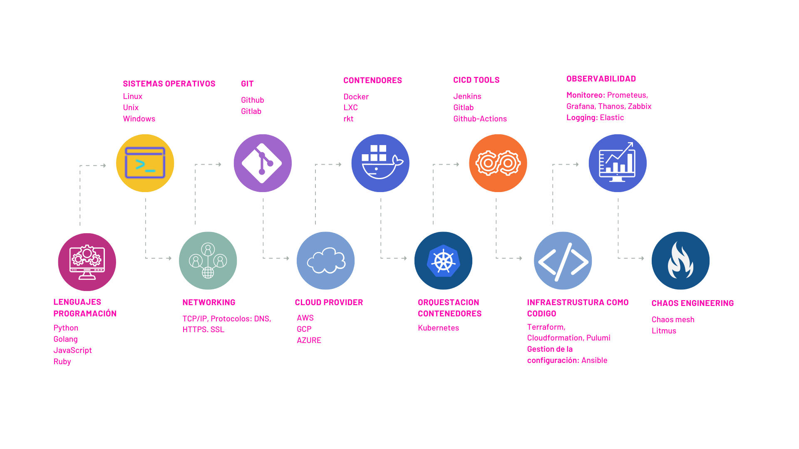

## Roadmap de DevOps

El **roadmap de DevOps** es una guía estratégica diseñada para ayudarte a navegar en mundo de DevOps, desde los conceptos básicos hasta las prácticas avanzadas. Este roadmap te ofrece una visión general de las habilidades y herramientas esenciales necesarias para construir, implementar y mantener aplicaciones y sistemas de manera eficiente.

  

Algunas características que todo experto DevOps debe tener

### **1. Fundamentos de Programación y Scripting**
   - **Lenguajes de Scripting:** 
     - **Bash:** Utilizado para scripting en sistemas Unix/Linux. Esencial para la automatización de tareas en sistemas operativos.
     - **Python:** Amplio uso en scripting y desarrollo de herramientas. Versátil para diversas tareas en DevOps.
     - **Lenguajes Adicionales:** 
       - **Go:** Ideal para desarrollo de herramientas de infraestructura.
       - **C/C++:** Beneficioso para tareas de bajo nivel y sistemas.
       - **PHP/Ruby/Node.js:** Útil para desarrollo web y automatización.
       - **PowerShell:** Importante para entornos Windows y administración.

### **2. Contenedores y Orquestación**
   - **Docker:** 
     - **Creación de Contenedores:** Aprende a empaquetar aplicaciones en contenedores para asegurar portabilidad y consistencia.
     - **Administración de Contenedores:** Gestiona la vida útil de los contenedores, desde la construcción hasta la ejecución.
   - **Kubernetes:** 
     - **Orquestación:** Maneja el despliegue, escalado y operación de aplicaciones en contenedores.
     - **Gestión de Clústeres:** Administra y coordina los clústeres de contenedores para alta disponibilidad y balanceo de carga.
   - **Otras Herramientas de Orquestación:**
     - **Docker Swarm:** Alternativa a Kubernetes para orquestación nativa de Docker.
     - **ECS:** Servicio de contenedores en AWS para manejar contenedores Docker.

### **3. Seguridad**
   - **Código Seguro:** 
     - **Prácticas de Seguridad:** Implementa buenas prácticas para proteger aplicaciones y sistemas.
     - **Análisis de Vulnerabilidades:** Utiliza herramientas para identificar y mitigar riesgos de seguridad.
   - **Automatización de Seguridad:** 
     - **Integración en CI/CD:** Incorpora controles de seguridad en el pipeline de integración y despliegue continuo.

### **4. Servidores Web**
   - **Nginx:** 
     - **Servidor Web:** Configura y administra Nginx para servir contenido web de forma eficiente.
     - **Reverse Proxy:** Utiliza Nginx como proxy inverso para equilibrar carga y mejorar el rendimiento.
   - **Apache:** 
     - **Configuración:** Configura Apache para servir aplicaciones web y manejar tráfico HTTP.
     - **Modularidad:** Aprovecha los módulos de Apache para extender sus capacidades.
   - **IIS y Tomcat:** 
     - **IIS:** Configura y administra el servidor web de Microsoft para aplicaciones .NET.
     - **Tomcat:** Administra aplicaciones Java utilizando el servidor de aplicaciones Tomcat.

### **5. Infraestructura como Código**
   - **Terraform:**
     - **Definición de Infraestructura:** Escribe configuraciones para aprovisionar infraestructura de manera declarativa.
     - **Modularidad y Reusabilidad:** Crea módulos reutilizables para gestionar infraestructuras complejas.
   - **CloudFormation:** 
     - **Modelado en AWS:** Utiliza plantillas para gestionar y provisionar recursos en AWS.
     - **Automatización:** Automatiza la configuración de servicios y recursos en la nube.

### **6. Automatización de Configuración**
   - **Ansible:** 
     - **Automatización de Configuración:** Define configuraciones de sistema y despliega aplicaciones sin agentes.
     - **Playbooks:** Escribe playbooks para gestionar configuraciones y despliegues.
   - **Chef/Puppet/Salt:** 
     - **Chef:** Automatiza la gestión de infraestructura usando recetas y roles.
     - **Puppet:** Utiliza manifiestos para definir el estado deseado de la infraestructura.
     - **Salt:** Administra sistemas y orquesta configuraciones de manera eficiente.

### **7. Implementación de Despliegues CI/CD**
   - **CI/CD Pipelines:** 
     - **Integración Continua:** Automatiza la construcción y pruebas del código en cada commit.
     - **Despliegue Continuo:** Despliega automáticamente aplicaciones a producción tras pasar pruebas.
   - **Herramientas de CI/CD:** 
     - **GitLab CI/GitHub Actions:** Configura pipelines para integrar y desplegar código.
     - **Jenkins:** Administra y personaliza pipelines de CI/CD con una amplia gama de plugins.
     - **Otras Herramientas:** Aprende a utilizar Bamboo, Azure DevOps, Travis CI, TeamCity y Circle CI según las necesidades del proyecto.

### **8. Cloud Computing**
   - **Plataformas en la Nube:** 
     - **AWS:** Gestiona servicios y recursos en la nube de Amazon.
     - **Azure:** Utiliza servicios en la nube de Microsoft para soluciones híbridas y empresariales.
     - **Google Cloud Platform:** Implementa y gestiona servicios en la nube de Google.
   - **Comparación de Servicios:** 
     - **IaaS vs PaaS:** Evalúa las ventajas de Infraestructura como Servicio frente a Plataforma como Servicio.
     - **Servicios Gestionados:** Utiliza servicios gestionados para simplificar el desarrollo y despliegue.

### **9. Monitorización de Infraestructura**
   - **Monitorización:** 
     - **Visibilidad en Tiempo Real:** Implementa soluciones para monitorear el estado y rendimiento de aplicaciones y sistemas.
     - **Alertas y Notificaciones:** Configura alertas para detectar y responder a problemas de forma proactiva.
   - **Herramientas de Monitorización:** 
     - **Prometheus:** Monitorea métricas y genera alertas basadas en condiciones definidas.
     - **Grafana:** Crea dashboards visuales para analizar datos y métricas de infraestructura.
     - **Sensu y New Relic:** Utiliza estas herramientas para monitoreo de sistemas y aplicaciones.

### **10. Metodologías Ágiles**
   - **Scrum y Kanban:** 
     - **Scrum:** Implementa un marco ágil para gestionar proyectos y mejorar la eficiencia del equipo.
     - **Kanban:** Utiliza tableros Kanban para visualizar el flujo de trabajo y gestionar tareas de manera continua.
   - **Gestión de Proyectos:** 
     - **División en Sprints:** Organiza el desarrollo en sprints para entregar incrementos de valor de forma regular.
     - **Iteración e Incremento:** Aplica enfoques iterativos e incrementales para mejorar continuamente el producto.

### **11. Soft Skills**
   - **Comunicación:** 
     - **Comunicación Efectiva:** Desarrolla habilidades para comunicar ideas claramente y colaborar con otros equipos.
     - **Negociación y Resolución de Conflictos:** Aprende a manejar desacuerdos y a negociar soluciones efectivas.
   - **Aprendizaje y Adaptabilidad:** 
     - **Aprendizaje Continuo:** Mantente actualizado con nuevas tecnologías y metodologías.
     - **Flexibilidad:** Adáptate a cambios en el entorno de trabajo y en las necesidades del proyecto.

### **12. Flexibilidad y Adaptación**
   - **Adaptación a Nuevas Tecnologías:** 
     - **Integración de Nuevos Sistemas:** Esté preparado para integrar nuevas herramientas y tecnologías a medida que evolucionan.
     - **Desarrollo Continuo:** Mantén la capacidad de adaptar y ajustar procesos y herramientas según los requerimientos del proyecto.

## Recursos

- [DevOps Roadmap](https://roadmap.sh/devops)
- [DevOps Roadmap by Milan](https://github.com/milanm/DevOps-Roadmap/blob/master/DevOps%20Roadmap.pdf)