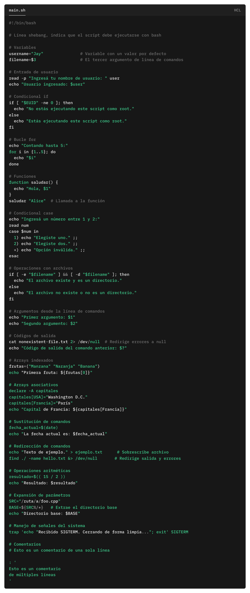

---

title: Día 5 - Automatizando Tareas con Bash Scripting 
description: Automatización avanzada en Bash
sidebar_position: 5
---

# ⚙️ Automatizando Tareas con Bash Scripting I


Hoy vas a descubrir cómo usar **Bash scripting** para automatizar tareas en Linux. Desde chequeos básicos hasta reiniciar servicios automáticamente, ¡vas a empezar a pensar como un verdadero DevOps!



---

## 💻 ¿Dónde practicar?

Podés seguir esta clase usando:

- Tu propia terminal si tenés **Linux o macOS**
- **WSL** o **Git Bash** en **Windows**
- Un entorno virtual con **Vagrant** (como viste en el Día 3)
- O incluso 100% online con:
  - [Killercoda](https://killercoda.com/)


---

## 🧠 Fundamentos de Bash: Scripts y Condicionales

Antes de empezar con los scripts más útiles, veamos cómo funciona un script básico en Bash.

### 📄 ¿Qué es un script Bash?

Es un archivo de texto con instrucciones que ejecutás en una terminal Linux, como si las escribieras vos misma.

Ejemplo mínimo:
```bash
#!/bin/bash
echo "Hola Roxs DevOps!"
````

📌 Guardalo como `hola.sh`, dale permisos y ejecutalo:

```bash
chmod +x hola.sh
./hola.sh
```

---

### 🔁 Estructura básica de un script

```bash
#!/bin/bash

# Comentario
echo "Hola Mundo"

# Variables
NOMBRE="Roxs"
echo "Hola $NOMBRE"

# Condicionales
if [ "$NOMBRE" == "Roxs" ]; then
    echo "¡Sos vos!"
else
    echo "¿Y vos quién sos?"
fi

# Bucle
for i in {1..3}; do
    echo "Iteración $i"
done
```

---

### ✅ Condicionales comunes en Bash

| Estructura         | Explicación                       |
| ------------------ | --------------------------------- |
| `if ...; then ...` | Ejecuta si se cumple la condición |
| `else`             | Ejecuta si **no** se cumple       |
| `elif`             | Evalúa una condición alternativa  |
| `[ "$a" == "$b" ]` | Compara cadenas                   |
| `[ $a -gt 5 ]`     | Mayor que (números)               |
| `[ -f archivo ]`   | ¿Existe el archivo?               |
| `[ -d carpeta ]`   | ¿Existe el directorio?            |

---

### 🔃 Bucles útiles

**Bucle `for`**

```bash
for i in {1..5}; do
  echo "Número: $i"
done
```

**Bucle `while`**

```bash
contador=1
while [ $contador -le 3 ]; do
  echo "Contador: $contador"
  ((contador++))
done
```

---

### 🧪 Buenas prácticas

* Usá `#!/bin/bash` siempre en la primera línea
* Usá `set -e` para salir si ocurre un error
* Comentá tu código con `#`
* Probá scripts en entornos controlados (como Vagrant o online)

---

## Calentenemos motores


## 🐣 Primeros Pasos con Bash

Estos scripts te ayudarán a practicar los fundamentos de Bash antes de automatizar tareas más complejas.

---

### ✅ Script 1: ¡Hola Roxs!

```bash
#!/bin/bash
echo "Hola Roxs DevOps!"
```

💡 Este es tu primer script. Guardalo como `hola.sh`, hacelo ejecutable con `chmod +x hola.sh` y corrélo con `./hola.sh`.

---

### 📦 Script 2: Variables y Saludos

```bash
#!/bin/bash
NOMBRE="Roxs"
echo "Hola $NOMBRE, bienvenida al mundo DevOps"
```

📌 Las variables en Bash no usan `let`, ni `var`. Solo asignás con `=` y sin espacios.

---

### ❓ Script 3: Preguntar al usuario

```bash
#!/bin/bash
echo "¿Cómo te llamás?"
read NOMBRE
echo "¡Hola $NOMBRE!"
```

📌 Usamos `read` para capturar input del usuario. Guardalo como `pregunta.sh`.

---

### 🔁 Script 4: Condicional simple

```bash
#!/bin/bash
read -p "¿Tenés sed? (sí/no): " RESPUESTA

if [ "$RESPUESTA" == "sí" ]; then
  echo "Andá por un cafecito ☕"
else
  echo "Seguimos con DevOps 🚀"
fi
```

💡 Usamos `if`, `then`, `else` y `fi` para crear condiciones.

---

### 🔂 Script 5: Bucle `for` para repetir tareas

```bash
#!/bin/bash
for i in {1..5}; do
  echo "DevOps es 🔥 - iteración $i"
done
```

---

### 🕵️ Script 6: Detectar si un archivo existe

```bash
#!/bin/bash
ARCHIVO="config.txt"

if [ -f "$ARCHIVO" ]; then
  echo "El archivo $ARCHIVO existe"
else
  echo "No encontré el archivo $ARCHIVO"
fi
```

💡 Muy útil para evitar errores al trabajar con archivos o scripts dependientes.

---

## 🧪 Sugerencia extra para practicar

Creá un script llamado `mi_status.sh` que muestre:

* El nombre del usuario actual
* El directorio en el que estás
* La fecha y hora actual

```bash
#!/bin/bash
echo "Usuario: $(whoami)"
echo "Directorio actual: $(pwd)"
echo "Fecha: $(date)"
```

---

> Si trabajas en DevOps o como administrador de sistemas, automatizar tareas rutinarias es esencial.
---


## 📁 Script 1: Monitoreo de Uso de Disco y Alertas 🚨

Problema: ¿Alguna vez se te llenó la partición raíz (/) sin aviso? Este script verifica:
Si la partición `/` está al 90% o si `/home` supera los 2GB.

```bash
#!/bin/bash
ADMIN="admin@ejemplo.com"
USO_RAIZ=$(df / | grep / | awk '{print $5}' | sed 's/%//g')
TAMANO_HOME=$(du -sh /home | awk '{print $1}' | sed 's/G//g')

if [ "$USO_RAIZ" -ge 90 ]; then
    echo "¡Alerta: Partición / al ${USO_RAIZ}%!" | mail -s "Alerta Partición /" $ADMIN
fi

if (( $(echo "$TAMANO_HOME > 2" | bc -l) )); then
    echo "¡Alerta: /home ocupa ${TAMANO_HOME}GB!" | mail -s "Alerta Directorio /home" $ADMIN
fi
```

📌 Programalo con cron para que corra cada hora:

```bash
0 * * * * /ruta/monitor_disco.sh
```

---

## 🔄 Script 2: Verificación y Reinicio de Servicios

Problema: ¿Tu servidor web (apache/nginx) se cae y no te das cuenta? Este script lo verifica y reinicia automáticamente.

Verifica si un servicio está caído y lo reinicia automáticamente.

```bash
#!/bin/bash
SERVICIO="apache2"

if ! systemctl is-active --quiet $SERVICIO; then
    systemctl start $SERVICIO
    echo "El servicio $SERVICIO fue reiniciado." | mail -s "Reinicio de $SERVICIO" admin@ejemplo.com
fi
```

📌 Cron sugerido:

```bash
* * * * * /ruta/monitor_servicio.sh
```

---

## 📊 Script 3: Monitoreo de Salud del Sistema

Reporte en tiempo real de uso de memoria, disco y CPU:

```bash
#!/bin/bash
TIEMPO=$(date "+%Y-%m-%d %H:%M:%S")
echo -e "Hora\t\t\tMemoria\t\tDisco (root)\tCPU"
segundos="3600"
fin=$((SECONDS+segundos))

while [ $SECONDS -lt $fin ]; do
    MEMORIA=$(free -m | awk 'NR==2{printf "%.f%%\t\t", $3*100/$2 }')
    DISCO=$(df -h | awk '$NF=="/"{printf "%s\t\t", $5}')
    CPU=$(top -bn1 | grep "Cpu(s)" | sed "s/.*, *\([0-9.]*\)%* id.*/\1/" | awk '{printf("%.f\n", 100 - $1)}')
    echo -e "$TIEMPO\t$MEMORIA$DISCO$CPU"
    sleep 3
done
```

📌 Podés guardar la salida en un archivo:

```bash
./monitor.sh >> /var/log/salud_sistema.log
```

---


## 📚 Tareas Opcionales del Día 4

> *Hoy diste tus primeros pasos con Bash. Ahora es momento de practicar de verdad.*
> Elegí los desafíos que más te interesen... ¡o hacelos todos! 😉

---

### 🧪 Nivel 1: Calentando motores

1. ✅ **Crear un script llamado `presentacion.sh`** que pida tu nombre y edad, y devuelva:

   ```bash
   Hola Roxs, tenés 30 años. ¡Bienvenida al mundo Bash!
   ```

2. ✅ **Creá un script `multiplicar.sh`** que reciba dos números por argumento y muestre el resultado de la multiplicación.

3. ✅ **Armá un bucle `for`** que muestre la tabla del 5.

---

### 🧩 Nivel 2: Automatización útil

4. 🛠 **Creá un script `backup_logs.sh`** que:

   * Comprima el contenido de `/var/log`
   * Lo guarde con timestamp en `/home/tu_usuario/backups/`
   * Elimine backups de más de 7 días

5. 🔍 **Creá `buscar_palabra.sh`** que:

   * Reciba un nombre de archivo y una palabra como argumentos
   * Busque si la palabra aparece en el archivo (con `grep`)
   * Devuelva "¡Encontrado!" o "No encontrado."

---

### 🔥 Nivel 3: Reto DevOps Pro

6. 🚀 **Modificá `monitor_disco.sh`** para que guarde un historial en un archivo log, incluyendo la fecha.

7. 🔁 **Creá un `servicio_status.sh`** que:

   * Revise varios servicios (`nginx`, `mysql`, `docker`)
   * Informe cuáles están activos y cuáles no
   * Envíe un mail si alguno está caído (tip: usá un array y bucle)

8. 📈 **Extendé el script de salud del sistema** para que:

   * Corte el monitoreo si la CPU supera el 85% tres veces seguidas
   * O guarde un log separado llamado `alertas_cpu.log`

---

### 💬 Bonus creativo

9. 🎤 **Hacé un script que sea un cuestionario loco**:

   * Preguntá el nombre, edad y color favorito
   * Mostrá un mensaje personalizado según lo que responda
   * Usá `if`, `read`, y emojis en `echo` 💥

10. 📸 **Subí tu favorito a redes**

    * Captura de pantalla, gif o video corto
    * Hashtag: **#BashConRoxs** o **#DevOpsConRoxs**

### Material Extra

Accede al Repositorio [Awesome Bash](https://github.com/awesome-lists/awesome-bash)

Libro Recomendado [introduction-to-bash-scripting](https://github.com/bobbyiliev/introduction-to-bash-scripting)


---


## ⚙️ Automatizando Tareas con Bash Scripting II


---

## 🧩 Parte 2: Técnicas Avanzadas con Bash

### 🔁 Funciones: Modularizando tus Scripts

Las funciones te permiten organizar y reutilizar lógica:

```bash
#!/bin/bash
saludar_usuario() {
    echo "¡Hola, $1!"
}
saludar_usuario "Ana"
saludar_usuario "Carlos"
```

📌 Las funciones pueden ir al principio del script y luego las llamás donde las necesites.

---

### 📚 Manejo de Arrays

Los arrays sirven para manejar listas de elementos:

```bash
#!/bin/bash
archivos=("documento1.txt" "documento2.txt" "informe.pdf")
for archivo in "${archivos[@]}"; do
    echo "Procesando $archivo"
done
```

---

### ❗ Manejo de Errores

Evitá que tu script falle silenciosamente:

```bash
#!/bin/bash
archivo="datos.csv"
if [[ -f $archivo ]]; then
    echo "Leyendo $archivo"
    cat "$archivo"
else
    echo "Error: ¡$archivo no existe!"
    exit 1
fi
```

---

### 🕒 Programación con Cron

Automatizá tus scripts en horarios definidos:

```bash
crontab -e
# Ejecutar cada día a las 2 AM
0 2 * * * /ruta/tu_script.sh
```

Usá `crontab -l` para listar tus cron jobs activos.

---

### 🐞 Depuración de Scripts

Activá el modo debug para ver qué hace tu script paso a paso:

```bash
#!/bin/bash
set -x  # Muestra cada comando antes de ejecutarlo
# Tu lógica aquí
```

Sumale `set -e` para que el script se detenga ante errores:

```bash
set -e
```

---

## 🧠 Técnicas Bash Avanzadas

### 1. 🧪 Validación de Entradas

```bash
#!/bin/bash
if [[ $# -ne 1 ]]; then
    echo "Uso: $0 <archivo>"
    exit 1
fi
```

### 2. ⚙️ Manejo de Procesos en Segundo Plano

```bash
#!/bin/bash
proceso_largo() {
    sleep 5
    echo "Proceso completado"
}
proceso_largo &
pid=$!
wait $pid
```

### 3. 🔍 Expresiones Regulares con Bash

```bash
#!/bin/bash
texto="Usuario: María, Email: maria@ejemplo.com"
if [[ $texto =~ Usuario:\ ([^,]+),\ Email:\ ([^ ]+) ]]; then
    usuario=${BASH_REMATCH[1]}
    email=${BASH_REMATCH[2]}
    echo "Usuario: $usuario, Email: $email"
fi
```

### 4. 🧵 Arrays Asociativos (Bash 4+)

```bash
#!/bin/bash
declare -A colores
colores[rojo]="#FF0000"
colores[verde]="#00FF00"
for color in "${!colores[@]}"; do
    echo "$color: ${colores[$color]}"
done
```

### 5. 🔗 Integración con Herramientas Externas (ej. `jq`)

```bash
#!/bin/bash
json='{"nombre": "Pedro", "edad": 28}'
nombre=$(echo "$json" | jq -r '.nombre')
edad=$(echo "$json" | jq -r '.edad')
echo "Nombre: $nombre, Edad: $edad"
```

📌 Asegurate de tener `jq` instalado (`sudo apt install jq` en Debian/Ubuntu).

### 6. 🧩 Scripts Modulares

Dividí tu lógica en archivos reutilizables:

```bash
# helpers.sh
function mostrar_ayuda() {
    echo "Este script realiza..."
}

# principal.sh
#!/bin/bash
source ./helpers.sh
mostrar_ayuda
```

---

## 📝 Consejos Finales

1. Usá `set -e` y `set -x` para seguridad y debug
2. Validá argumentos y rutas antes de operar
3. Comentá tus scripts para entenderlos después
4. Usá [ShellCheck](https://www.shellcheck.net/) para verificar errores
5. Guardá tus scripts en un repo Git

---

## 🎯 Reto del Día 5
---

> Automatización + modularidad + validación = nivel DevOps pro

📌 **Objetivo**: Crear un script llamado `gestion_usuarios.sh` que permita:

1. Crear un nuevo usuario pasando el nombre como argumento
2. Validar si el usuario ya existe
3. Registrar la acción en un log (`usuarios.log`)
4. Usar una función llamada `crear_usuario` definida en un archivo `funciones.sh`

### Estructura sugerida:

**funciones.sh**

```bash
crear_usuario() {
  if id "$1" &>/dev/null; then
    echo "El usuario $1 ya existe."
  else
    sudo useradd "$1"
    echo "Usuario $1 creado el $(date)" >> usuarios.log
    echo "Usuario $1 creado."
  fi
}
```

**gestion\_usuarios.sh**

```bash
#!/bin/bash
source ./funciones.sh

if [[ $# -ne 1 ]]; then
  echo "Uso: $0 <nombre_usuario>"
  exit 1
fi

crear_usuario "$1"
```

🙌 Cuando termines, compartí tu captura con el log o el resultado del script con el hashtag **#BashProConRoxs**


--
### 💥 Bonus: Automatizá el Despliegue de la Aplicación Flask 📚"Book Library"📚 con Nginx y Gunicorn

¡En este desafío vas a crear un **script de automatización completo** que despliegue una aplicación Flask usando Gunicorn como servidor WSGI y Nginx como proxy inverso!

> Este reto es clave para afianzar tus habilidades en scripting, automatización y despliegue.

### 🎯 Objetivo:

Crear un script llamado `desplegar_app.sh` que realice automáticamente los siguientes pasos:

1. ✅ Instale dependencias necesarias: Python, pip, virtualenv, Nginx y Git.
  ```bash
  instalar_dependencias() {
    sudo apt update
    sudo apt install -y python3 python3-pip python3-venv nginx git
  }
  instalar_dependencias
  ```
2. 🧱 Cree un entorno virtual, instale dependencias y clone la app:

   ```bash
   git clone -b booklibrary https://github.com/roxsross/devops-static-web.git
   cd devops-static-web
   python3 -m venv venv && source venv/bin/activate
   pip install -r requirements.txt
   pip install gunicorn
   ```
3. 🚀 Configure Gunicorn para correr la app:

   ```bash
   gunicorn -w 4 -b 127.0.0.1:8000 library_site:app:app
   ```
4. 🌐 Configure Nginx para redirigir al puerto 8000 de Gunicorn.
5. 🔄 Reinicie servicios y verifique que todo esté online.
6. 📜 Guarde logs del proceso en `logs_despliegue.txt`

---

### 📝 Ejemplo de `desplegar_app.sh`

```bash
#!/bin/bash

LOG="logs_despliegue.txt"

instalar_dependencias() {
  echo "Instalando dependencias..." | tee -a $LOG
  sudo apt update && sudo apt install -y python3 python3-pip python3-venv nginx git >> $LOG 2>&1
  sudo systemctl enable nginx >> $LOG 2>&1
  sudo systemctl start nginx >> $LOG 2>&1
}

clonar_app() {
  echo "Clonando la aplicación..." | tee -a $LOG
  git clone -b booklibrary https://github.com/roxsross/devops-static-web.git >> $LOG 2>&1
  cd devops-static-web
}

configurar_entorno() {
  echo "Configurando entorno virtual..." | tee -a ../$LOG
  python3 -m venv venv && source venv/bin/activate
  pip install -r requirements.txt >> ../$LOG 2>&1
  pip install gunicorn >> ../$LOG 2>&1
}

configurar_gunicorn() {
  echo "Iniciando Gunicorn..." | tee -a ../$LOG
  # CORREGIDO: Eliminar el :app extra
  nohup venv/bin/gunicorn -w 4 -b 0.0.0.0:8000 library_site:app >> ../$LOG 2>&1 &
  sleep 3  # Dar tiempo a que Gunicorn inicie
}

configurar_nginx() {
  echo "Configurando Nginx..." | tee -a ../$LOG
  
  # NUEVO: Eliminar configuración por defecto
  sudo rm -f /etc/nginx/sites-enabled/default
  
  # CORREGIDO: Usar 127.0.0.1:8000 en lugar de 0.0.0.0:8000
  sudo tee /etc/nginx/sites-available/booklibrary > /dev/null <<EOF
server {
    listen 80;
    server_name _;
    
    location / {
        proxy_pass http://127.0.0.1:8000;
        proxy_set_header Host \$host;
        proxy_set_header X-Real-IP \$remote_addr;
        proxy_set_header X-Forwarded-For \$proxy_add_x_forwarded_for;
        proxy_set_header X-Forwarded-Proto \$scheme;
        proxy_redirect off;
    }
    
    location /static/ {
        alias $(pwd)/static/;
        expires 30d;
    }
    
    access_log /var/log/nginx/booklibrary_access.log;
    error_log /var/log/nginx/booklibrary_error.log;
}
EOF
  
  sudo ln -sf /etc/nginx/sites-available/booklibrary /etc/nginx/sites-enabled/
  sudo nginx -t >> ../$LOG 2>&1 && sudo systemctl reload nginx
}

verificar_servicios() {
  echo "Verificando servicios..." | tee -a ../$LOG
  
  # Verificar Nginx
  if systemctl is-active --quiet nginx; then
    echo "✓ Nginx está activo" | tee -a ../$LOG
  else
    echo "✗ Nginx no está activo" | tee -a ../$LOG
  fi
  
  # Verificar Gunicorn
  if pgrep -f "gunicorn.*library_site" > /dev/null; then
    echo "✓ Gunicorn está corriendo" | tee -a ../$LOG
  else
    echo "✗ Gunicorn no está corriendo" | tee -a ../$LOG
  fi
  
  # Verificar puerto 8000
  if netstat -tlnp | grep -q ":8000"; then
    echo "✓ Puerto 8000 está en uso" | tee -a ../$LOG
  else
    echo "✗ Puerto 8000 no está en uso" | tee -a ../$LOG
  fi
  
  # Probar conexión directa a Gunicorn
  if curl -s http://127.0.0.1:8000 > /dev/null; then
    echo "✓ Gunicorn responde correctamente" | tee -a ../$LOG
  else
    echo "✗ Gunicorn no responde" | tee -a ../$LOG
  fi
}

main() {
  echo "=== Iniciando despliegue de Book Library ===" | tee $LOG
  instalar_dependencias
  clonar_app
  configurar_entorno
  configurar_gunicorn
  configurar_nginx
  verificar_servicios
  
  echo "=== Despliegue finalizado ===" | tee -a ../$LOG
  echo "Revisá $LOG para detalles." | tee -a ../$LOG
  echo "La aplicación debería estar disponible en: http://$(hostname -I | awk '{print $1}')" | tee -a ../$LOG
}

main
```
--- 

### 🖼️ Resultados esperados


---

**Para programar la verificación semanal con cron:**

```bash
# Editá tu crontab con crontab -e y agregá:
0 3 * * 1 /ruta/desplegar_app.sh
```

---

### 🧩 Tip extra:

Podés separar la lógica en funciones como:

* `instalar_dependencias()`
* `clonar_app()`
* `configurar_gunicorn()`
* `configurar_nginx()`

### 📦 Bonus extra:

Convertí este script en una **tarea programada semanal con cron** para que revise si la app está online y la reinicie si no lo está.

Cuando lo termines, ¡compartilo con la comunidad usando el hashtag **#DevOpsConRoxs**! 🎯

Para evitar la configuración manual, podés crear un script Bash que automatice el despliegue de la aplicación.

---

### 🚀 Desafío: Despliegue de Aplicaciones con PM2

En este reto vas a crear un script Bash para desplegar una aplicación Node.js usando **PM2** como gestor de procesos.

#### 🎯 Objetivo

Automatizar el despliegue de una app Node.js siguiendo estos pasos:

1. Instalar Node.js, npm y PM2 si no están presentes.
2. Clonar el repositorio de la aplicación.
3. Instalar dependencias con `npm install`.
4. Iniciar la app con PM2.
5. Guardar la configuración de PM2 para reinicio automático.
6. Registrar el proceso en un log `logs_pm2.txt`.

---

### 📦 Repositorio de la Aplicación 

El código fuente de la aplicación Node.js para este desafío se encuentra en el siguiente repositorio (rama `ecommerce-ms`):

- **Repositorio:** [https://github.com/roxsross/devops-static-web.git](https://github.com/roxsross/devops-static-web.git)
- **Rama:** `ecommerce-ms`

Cloná la rama específica con:

```bash
git clone -b ecommerce-ms https://github.com/roxsross/devops-static-web.git
```

---

### 🖼️ Resultados esperados


---

## **🔥 Extras Desafíos**

🔹 **Desafío 1**: Escribe un script simple de Bash que imprima "Hello DevOps" junto con la fecha y hora actual.

🔹 **Desafío 2**: Crea un script que verifique si un sitio web (ej., https://roxs.295devops.com) es accesible usando curl o ping. Imprime un mensaje de éxito o fallo.

🔹 **Desafío 3**: Escribe un script que tome un nombre de archivo como argumento, verifique si existe, e imprima el contenido del archivo en consecuencia.

🔹 **Desafío 4**: Crea un script que liste todos los procesos en ejecución y escriba la salida a un archivo llamado process_list.txt.

🔹 **Desafío 5**: Escribe un script que instale múltiples paquetes a la vez (ej., git, vim, curl). El script debe verificar si cada paquete ya está instalado antes de intentar la instalación.

🔹 **Desafío 6**: Crea un script que monitoree el uso de CPU y memoria cada 5 segundos y registre los resultados en un archivo.

🔹 **Desafío 7**: Escribe un script que elimine automáticamente archivos de log mayores a 7 días desde /var/log.

🔹 **Desafío 8**: Automatiza la creación de cuentas de usuario – Escribe un script que tome el nombre de usuario como argumento, verifique si el usuario existe, dé el mensaje "el usuario ya existe", de lo contrario cree un nuevo usuario, lo agregue a un grupo "devops", y configure un directorio home por defecto.

🔹 **Desafío 9**: Usa awk o sed en un script para procesar un archivo de log y extraer solo los mensajes de error.

🔹 **Desafío 10**: Configura un cron job que ejecute un script para hacer respaldo (zip/tar) de un directorio diariamente.


📢 Usá el hashtag **#DevOpsConRoxs** o compartilo en el canal de la comunidad. 🎯
