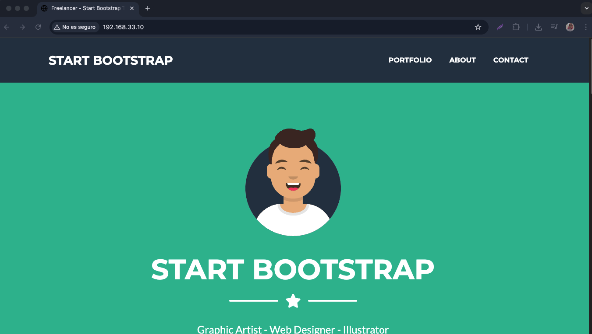

## ⚙️ Introducción a Ansible  


> *"La automatización no es un lujo, es una necesidad en DevOps"*  

Ansible es una herramienta de automatización **sin agentes** que usa SSH para gestionar servidores. Hoy aprenderás:  
- ✅ Filosofía de Infraestructura como Código (IaC)  
- ✅ Arquitectura de Ansible (Control Node vs Managed Nodes)  
- ✅ Playbooks en YAML  
- ✅ Módulos esenciales  

---

## 🧠 **Conceptos Clave**  

### 1. ¿Por qué Ansible?  
- **Agente-less**: No requiere software adicional en los nodos gestionados  
- **Idempotencia**: Ejecuta solo cambios necesarios (no acciones redundantes)  
- **YAML**: Lenguaje humano-readable para playbooks  

### 2. Componentes Principales  
| Componente       | Función                                                                 |
|------------------|-------------------------------------------------------------------------|
| **Inventario**   | Lista de hosts gestionados (`/etc/ansible/hosts`)                       |
| **Playbooks**    | "Recetas" de automatización (archivos YAML)                             |
| **Módulos**      | Unidades de acción (ej: `apt`, `copy`, `service`)                       |
| **Roles**        | Plantillas reusables para organizar playbooks complejos                 |

---

## 🛠️ **Instalación Básica**  

### En el Nodo de Control (Ubuntu):  
```bash
sudo apt update
sudo apt install ansible -y
ansible --version  # Verificar instalación
```

### Configuración Inicial:  
1. Editar el inventario:  
```bash
sudo nano /etc/ansible/hosts
```  
2. Añadir tus nodos:  
```ini
[webservers]
192.168.1.10 ansible_user=admin
192.168.1.11 ansible_user=admin

[databases]
db01.example.com
```

---

## 🔄 **Primeros Comandos**  

### Test de Conexión:  
```bash
ansible all -m ping -u admin
```  
*Salida esperada:*  
```json
192.168.1.10 | SUCCESS => {
    "changed": false,
    "ping": "pong"
}
```

### Comandos Ad-Hoc:  
```bash
# Instalar Nginx en webservers
ansible webservers -m apt -a "name=nginx state=present" -b --become-user=root

# Reiniciar servicios
ansible all -m service -a "name=nginx state=restarted"
```

---

## 📜 **Tu Primer Playbook**  
Crea `primer-playbook.yml`:  

```yaml
---
- name: Configuración básica de servidor
  hosts: webservers
  become: yes
  
  tasks:
    - name: Instalar paquetes esenciales
      apt:
        name: ["git", "tree", "htop"]
        state: present
        update_cache: yes

    - name: Crear usuario deploy
      user:
        name: deploy
        groups: sudo
        append: yes
        password: "{{ 'miPassword123' | password_hash('sha512') }}"

    - name: Habilitar firewall
      ufw:
        rule: allow
        port: "22,80,443"
        proto: tcp
```

### Ejecución:  
```bash
ansible-playbook primer-playbook.yml
```

---

## 🧩 **Módulos Esenciales**  

| Módulo         | Uso Típico                          | Ejemplo                          |
|----------------|-------------------------------------|----------------------------------|
| `copy`         | Copiar archivos                     | `src: files/config.conf dest: /etc/` |
| `template`     | Plantillas Jinja2                   | `src: templates/nginx.j2 dest: /etc/nginx/nginx.conf` |
| `lineinfile`   | Editar líneas específicas           | `path: /etc/ssh/sshd_config line: "PermitRootLogin no"` |
| `docker_container` | Gestionar contenedores          | `name: mi-app image: nginx:latest ports: "8080:80"` |

---

## 🏗️ **Estructura Profesional**  
Para proyectos reales:  
```bash
mi-proyecto-ansible/
├── inventories/
│   ├── production/
│   └── staging/
├── roles/
│   ├── nginx/
│   └── mysql/
├── playbooks/
│   ├── deploy-web.yml
│   └── setup-db.yml
└── ansible.cfg
```

---

## 🚨 **Solución de Problemas**  

### Debugging:  
```bash
ansible-playbook playbook.yml -vvv  # Modo verboso
```

### Check Mode (Dry Run):  
```bash
ansible-playbook playbook.yml --check
```

---

## 📌 **Tarea Práctica**  
1. Automatiza la instalación de:  
   - Un servidor Nginx con página personalizada  
   - Usuario con acceso SSH  
   - Reglas de firewall básicas  
2. Comparte tu playbook en la comunidad con #AnsibleConRoxs  

```yaml
# Ejemplo de solución parcial
- name: Desplegar landing page
  hosts: webservers
  tasks:
    - name: Copiar HTML
      copy:
        src: files/index.html
        dest: /var/www/html/
```

---

## 🔗 **Recursos Adicionales**  
- [Documentación Oficial](https://docs.ansible.com/)  
- [Galaxy - Roles prehechos](https://galaxy.ansible.com/)  
 

> 💡 **Tip**: Usa `ansible-doc <module>` para ver ayuda de cualquier módulo!


---

## 🚀 Desplegando StartBootstrap Freelancer con Vagrant y Ansible

En este ejemplo crearemos un entorno reproducible que:
1. **Levanta una máquina virtual** con Vagrant
2. **Configura automáticamente** Nginx usando Ansible
3. **Despliega el template** Freelancer de StartBootstrap

---

## 📦 Prerrequisitos

```bash
# Instalar en tu máquina local:
vagrant --version || brew install vagrant  # macOS
ansible --version || pip install ansible
virtualbox --version || brew install virtualbox
```

---

## 1. Estructura del Proyecto

```bash
freelancer-deploy/
├── Vagrantfile          # Configuración de la VM
├── playbook.yml         # Automatización Ansible
├── files/
│   └── nginx.conf       # Config personalizada
```

---

## 2. Configuración de Vagrant (`Vagrantfile`)

```ruby
Vagrant.configure("2") do |config|
  config.vm.box = "bento/ubuntu-24.04"
  config.vm.network "private_network", ip: "192.168.33.10"
  
  # Provisionamiento con Ansible
  config.vm.provision "ansible" do |ansible|
    ansible.playbook = "playbook.yml"
    ansible.verbose = "v"
  end
end
```

---

## 3. Playbook de Ansible (`playbook.yml`)

```yaml
---
- name: Despliegue Fullstack Freelancer
  hosts: all
  become: yes

  vars:
    repo_url: "https://github.com/startbootstrap/startbootstrap-freelancer/archive/gh-pages.zip"
    web_root: "/var/www/freelancer"

  tasks:
    - name: Instalar dependencias
      apt:
        name: ["nginx", "unzip", "wget"]
        state: present
        update_cache: yes

    - name: Crear directorio web
      file:
        path: "{{ web_root }}"
        state: directory
        mode: '0755'

    - name: Descargar template
      get_url:
        url: "{{ repo_url }}"
        dest: "/tmp/freelancer.zip"
        mode: '0644'

    - name: Descomprimir template
      unarchive:
        src: "/tmp/freelancer.zip"
        dest: "/tmp/"
        remote_src: yes

    - name: Mover contenido del subdirectorio
      shell: |
        cd /tmp/startbootstrap-freelancer-gh-pages
        cp -r * {{ web_root }}/
        chown -R www-data:www-data {{ web_root }}

    - name: Limpiar archivos temporales
      file:
        path: "{{ item }}"
        state: absent
      loop:
        - "/tmp/freelancer.zip"
        - "/tmp/startbootstrap-freelancer-gh-pages"

    - name: Configurar Nginx
      template:
        src: files/nginx.conf
        dest: /etc/nginx/sites-available/freelancer
      notify: Restart Nginx

    - name: Habilitar sitio
      file:
        src: /etc/nginx/sites-available/freelancer
        dest: /etc/nginx/sites-enabled/freelancer
        state: link

    - name: Eliminar default site
      file:
        path: /etc/nginx/sites-enabled/default
        state: absent

  handlers:
    - name: Restart Nginx
      service:
        name: nginx
        state: restarted
```

---

## 4. Configuración de Nginx (`files/nginx.conf`)

```nginx
server {
    listen 80;
    server_name _;
    root /var/www/freelancer;
    index index.html;

    location / {
        try_files $uri $uri/ =404;
    }
}
```

---

## 🚀 Ejecución

```bash
# Iniciar la VM y ejecutar el playbook automáticamente
vagrant up

# Acceder vía SSH para verificar
vagrant ssh
curl localhost

# O desde tu navegador local:
open http://192.168.33.10
```

### Resultado Esperado:


---

## 🛠️ Comandos Útiles para Debugging

```bash
# Re-provisionar sin recrear la VM
vagrant provision

# Ver logs de Nginx
vagrant ssh -c "sudo tail -f /var/log/nginx/error.log"

# Ver contenido descargado
vagrant ssh -c "ls -la /var/www/freelancer"
```

---

## 💡 Mejoras Opcionales

1. **Variables Dinámicas**: Mover `repo_url` a un archivo `vars.yml`
2. **Templates Jinja2**: Personalizar el HTML antes de desplegar
3. **HTTPS**: Añadir certificado SSL con Let's Encrypt
4. **Multi-VM**: Crear un cluster con load balancer

```yaml
# Ejemplo de variable en grupo
- name: Set web_root based on environment
  set_fact:
    web_root: "/var/www/{{ env }}/freelancer"
  when: env is defined
```
---

# 🔌 Uso Avanzado: CLI de Ansible para Aprovisionamiento

---

Además de Vagrant, puedes ejecutar playbooks de Ansible **directamente contra cualquier servidor** (físico, virtual, cloud o contenedor) usando la CLI. Aquí cómo hacerlo:

---

## 🖥️ Método 1: Usando ansible-playbook directamente

### Requisitos previos:
1. **Acceso SSH** al servidor destino
2. **Python instalado** en el nodo gestionado
3. **Inventario configurado** o dirección IP explícita

```bash
# Ejecutar playbook en un servidor remoto (sin Vagrant)
ansible-playbook -i 192.168.1.100, -u ubuntu --private-key ~/.ssh/id_rsa playbook.yml
```

### Parámetros clave:
| Flag               | Descripción                              | Ejemplo                     |
|--------------------|------------------------------------------|-----------------------------|
| `-i`               | Inventario o IP                          | `-i mi-inventario.ini`      |
| `-u`               | Usuario SSH                              | `-u ec2-user`               |
| `--private-key`    | Ruta a clave privada                     | `--key-file ~/.ssh/aws.pem` |
| `-e`               | Variables extra                          | `-e "env=prod"`             |
| `-l`               | Limitar a hosts específicos              | `-l webservers`             |

---

## 📋 Ejemplo Completo CLI

### 1. Crear inventario dinámico (`hosts.ini`)
```ini
[webservers]
web1 ansible_host=192.168.1.100 ansible_user=ubuntu ansible_ssh_private_key_file=~/.ssh/id_rsa

[databases]
db1 ansible_host=192.168.1.101 ansible_user=admin
```

### 2. Ejecutar con inventario
```bash
ansible-playbook -i hosts.ini playbook.yml
```

### 3. Sobreescribir variables
```bash
ansible-playbook -i hosts.ini playbook.yml -e "web_root=/var/www/custom"
```

---

## 🔄 Comparativa: Vagrant vs CLI pura

| Característica          | Vagrant                      | CLI Ansible                  |
|-------------------------|------------------------------|------------------------------|
| **Entorno**             | Máquinas virtuales locales   | Cualquier servidor SSH       |
| **Uso típico**          | Desarrollo/Testing           | Producción                   |
| **Configuración**       | `Vagrantfile`                | Inventario Ansible           |
| **Ventaja principal**   | Entorno reproducible         | Flexibilidad en conexión     |

---

## 🛠️ Comandos Esenciales para Debugging

```bash
# Ver hosts disponibles en inventario
ansible-inventory -i hosts.ini --list

# Probar conexión SSH
ansible all -i hosts.ini -m ping

# Ejecutar comando ad-hoc
ansible webservers -i hosts.ini -a "free -h"
```
--- 
Claro, acá tenés la **tarea del Día 6** lista para compartir de forma independiente:

---

¡Claro! Acá tenés el contenido en formato `README.md` que podés incluir dentro del repositorio del desafío del Día 6:


### 🚀 Desafío Ansible - Día 6

Este reto forma parte del programa **90 Días de DevOps con Roxs** y te permitirá aplicar lo aprendido sobre Ansible automatizando la configuración de un servidor desde cero.

## 🎯 Objetivo

Crear un playbook Ansible llamado `desplegar_app.yml` que:

- 📦 Instale **Nginx** y cree una **landing page personalizada**
- 👤 Cree un usuario **devops** con acceso sudo
- 🔐 Configure reglas de firewall para puertos **22**, **80** y **443**
- 📂 Utilice una **estructura profesional** con `inventories/` y `roles/`

Además, deberás integrar este despliegue con **Vagrant** para que la máquina virtual se configure automáticamente.

---

## 📁 Estructura del Proyecto

```

desafio\_ansible\_dia6/
├── Vagrantfile
├── playbook.yml
├── inventories/
│   └── vagrant
│       └── hosts.ini
├── roles/
│   ├── nginx/
│   │   └── tasks/main.yml
│   ├── devops/
│   │   └── tasks/main.yml
│   └── firewall/
│       └── tasks/main.yml
└── README.md

````

---

## ⚙️ Instrucciones

### 1. Instalación de dependencias

Asegurate de tener instalados:

```bash
vagrant --version
ansible --version
virtualbox --version
````

Si te falta alguno, podés instalarlo vía Homebrew (macOS) o apt (Linux).

---

### 2. Ejecutar la VM

```bash
vagrant up
```

Esto levantará la VM y ejecutará automáticamente el playbook `playbook.yml`.

---

### 3. Verificar

Una vez finalizado:

```bash
vagrant ssh
curl localhost
```

Deberías ver tu landing page servida por Nginx desde la máquina virtual.

---

## 🧠 Tips

* Podés personalizar la landing en `roles/nginx/files/index.html`
* Para hacer debugging, usá:

```bash
ansible-playbook playbook.yml -vvv
```

* Para volver a ejecutar el provisionamiento sin destruir la VM:

```bash
vagrant provision
```

---

## 🎁 Bonus

* Añadí más roles como `docker`, `nodejs`, o `python`
* Usá variables con `vars/` o `group_vars/`
* Documentá tu código con comentarios y buenas prácticas

---

## 📸 Compartí tu Reto

Mostranos tu avance en la comunidad con el hashtag **#DevOpsConRoxs**
¡Queremos ver cómo vas automatizando como un pro! 🚀

---

## 🔗 Recursos

* [Documentación Oficial de Ansible](https://docs.ansible.com/)
* [StartBootstrap Templates](https://startbootstrap.com/themes)
* [Ansible Galaxy](https://galaxy.ansible.com/)
