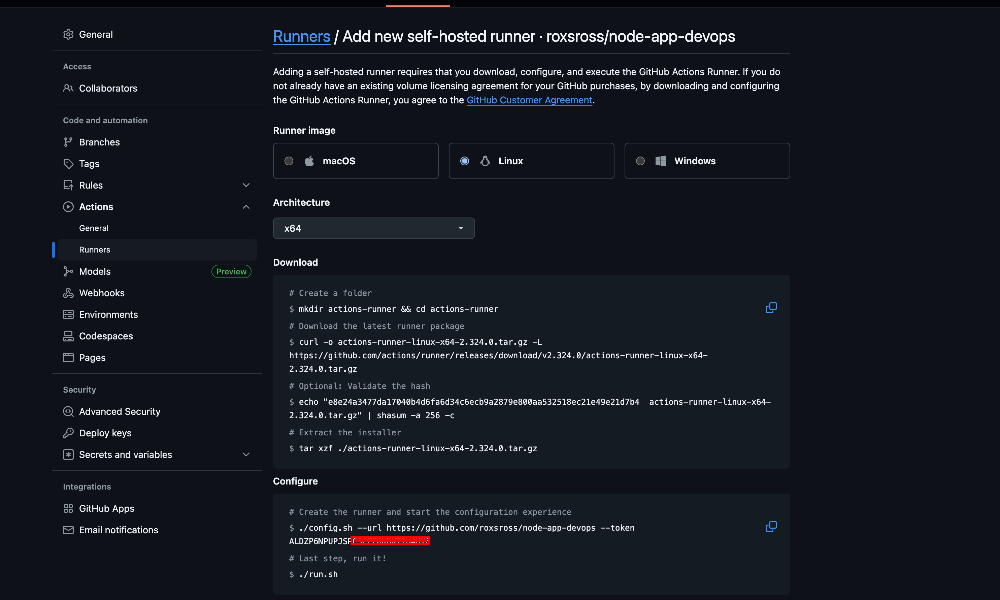
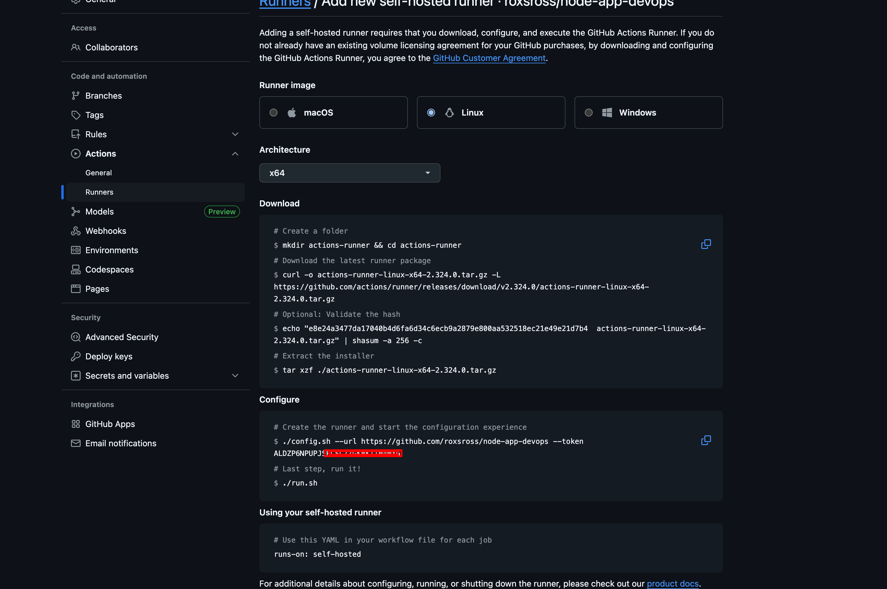
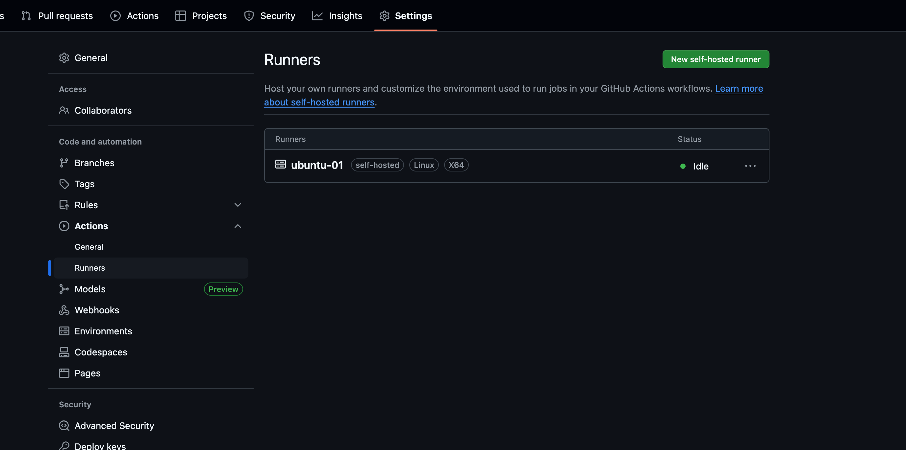
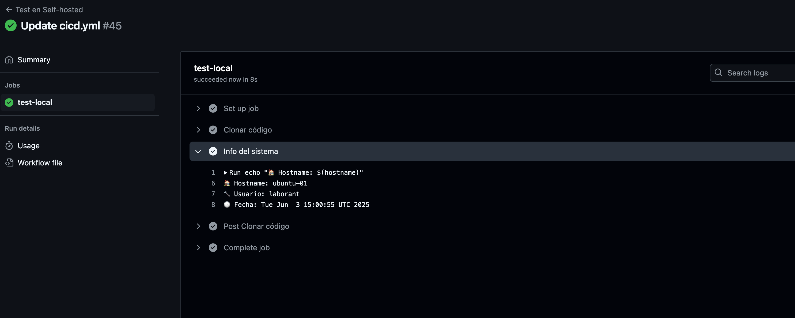
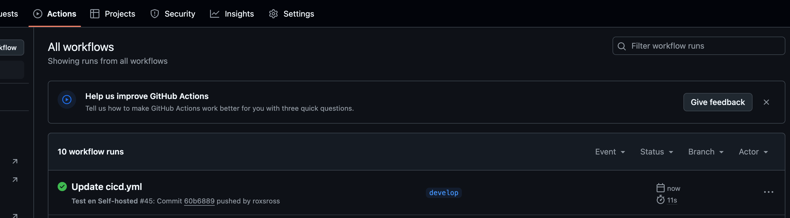

## 🏠 Tu propia máquina ejecutando CI/CD


> "A veces, lo mejor es tener el control total."

Hoy vas a aprender a configurar un **self-hosted runner**: una máquina propia que ejecuta workflows de GitHub Actions.  
Ideal para pruebas reales, acceso a servicios locales, o proyectos donde querés más control.

---

## 🤔 ¿Por qué usar un runner propio?

| GitHub-hosted               | Self-hosted                         |
|-----------------------------|-------------------------------------|
| ✅ Fácil y rápido            | 🔧 Más configurable                  |
| ✅ Siempre limpio             | 🛠️ Persistencia entre builds        |
| ❌ Limitado a 2,000 min/mes   | ✅ Sin límite de minutos             |
| ❌ No accede a recursos locales | ✅ Accede a tu red, archivos, puertos |

🧠 Lo usás cuando querés:
- Acceso a bases de datos locales
- Ejecutar contenedores pesados
- Saltarte límites de tiempo
- Automatizar despliegues internos

---

## 🛠️ Paso 1: Preparar tu máquina

```bash
sudo apt update && sudo apt upgrade -y
sudo apt install -y curl wget git docker.io
sudo usermod -aG docker $USER
newgrp docker
````

📌 Verificá:

```bash
docker --version
```

---

## 🛡️ Paso 2: Crear el runner en GitHub

1. Andá a tu repositorio → ⚙️ *Settings* → *Actions* → *Runners*
2. Click en **“New self-hosted runner”**
3. Elegí Linux y copiá el token y comandos que te da



---

## 🔧 Paso 3: Configurar el runner

```bash
mkdir actions-runner && cd actions-runner

# Descargar
curl -o actions-runner-linux-x64-2.311.0.tar.gz -L \
  https://github.com/actions/runner/releases/download/v2.311.0/actions-runner-linux-x64-2.311.0.tar.gz

tar xzf actions-runner-linux-x64-2.311.0.tar.gz

# Configurar (reemplazá los datos)
./config.sh \
  --url https://github.com/TU-USUARIO/TU-REPO \
  --token TU-TOKEN \
  --name mi-runner-local \
  --labels self-hosted,linux,rox \
  --work _work \
  --replace
```


---

## 🚀 Paso 4: Ejecutar el runner

```bash
# Modo manual
./run.sh
```



---

## ✅ Paso 5: Crear workflow que lo use

`.github/workflows/self-hosted-test.yml`

```yaml
name: Test en Self-hosted

on:
  push:
    branches: [main]
  workflow_dispatch:

jobs:
  test-local:
    runs-on: [self-hosted]
    
    steps:
    - name: Clonar código
      uses: actions/checkout@v4

    - name: Info del sistema
      run: |
        echo "🏠 Hostname: $(hostname)"
        echo "🔧 Usuario: $(whoami)"
        echo "🕓 Fecha: $(date)"

```



---

## 🐳 Extra: Usar Docker en el runner

`.github/workflows/docker-en-runner.yml`

```yaml
name: Docker en Self-hosted

on:
  push:
    branches: [main]

jobs:
  docker-build:
    runs-on: [self-hosted]

    steps:
    - uses: actions/checkout@v4

    - name: Build Docker
      run: docker build -t mi-app:runner .

    - name: Test Docker
      run: |
        docker run -d --name app-runner -p 5000:5000 mi-app:runner
        sleep 10
        curl -f http://localhost:5000/health
        docker stop app-runner && docker rm app-runner
```

---

## 🧪 Tarea del Día

1. Configurá un runner propio
2. Creá un workflow que lo use
3. Ejecutá un test local (Flask o Docker)
4. Verificá que GitHub use tu runner

🎁 Extra: Nombrá tu runner con estilo: `rox-runner`
📸 Subí captura en Discord o redes con **#DevOpsConRoxs - Día 18**

---

## 🧠 Revisión rápida

| Pregunta                                               | ✔️ / ❌ |
| ------------------------------------------------------ | ------ |
| ¿Qué es un runner?                                     |        |
| ¿Qué diferencia hay entre self-hosted y GitHub-hosted? |        |
| ¿Podés ejecutar contenedores desde tu runner?          |        |

---

## 🏁 Cierre del Día

Hoy tenés **tu propio motor de automatización**, sin depender de los recursos de GitHub.
Mañana veremos cómo **hacer deploy con Docker Compose**, ideal para entornos completos.

Nos vemos en el **Día 19** 💥🐙

