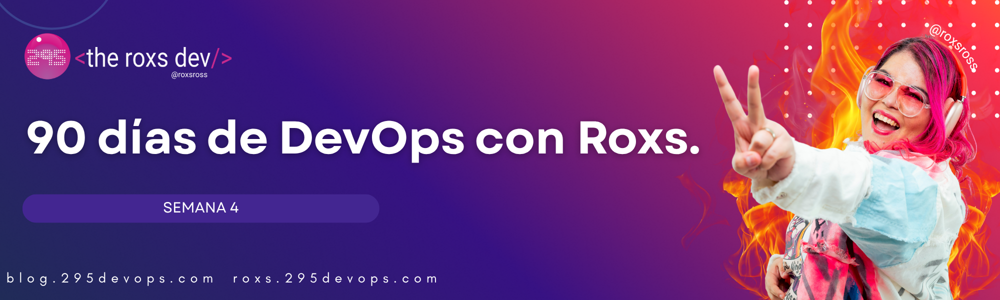

## 🔧 Variables y Configuración en Terraform



¡Continuamos construyendo nuestros conocimientos de Terraform!  
Hoy aprenderemos a hacer nuestro código más flexible y reutilizable usando **variables**, **locals** y **funciones**.

---

## 📝 Variables en Terraform

Las variables permiten parametrizar tu configuración, haciéndola flexible y reutilizable.

### Definición de Variables

#### `variables.tf`
```hcl
# Variable simple
variable "app_name" {
  description = "Nombre de la aplicación"
  type        = string
  default     = "mi-app"
}

# Variable con validación
variable "environment" {
  description = "Entorno de despliegue"
  type        = string
  
  validation {
    condition     = contains(["dev", "staging", "prod"], var.environment)
    error_message = "El environment debe ser: dev, staging, o prod."
  }
}

# Variable sin valor por defecto (requerida)
variable "instance_count" {
  description = "Número de instancias"
  type        = number
}

# Variable booleana
variable "enable_monitoring" {
  description = "Habilitar monitoreo"
  type        = bool
  default     = true
}
```

---

## 🏷️ Tipos de Datos

### Tipos Primitivos
```hcl
# String
variable "region" {
  type    = string
  default = "us-west-2"
}

# Number
variable "port" {
  type    = number
  default = 8080
}

# Boolean
variable "enabled" {
  type    = bool
  default = true
}
```

### Tipos Complejos
```hcl
# List
variable "availability_zones" {
  type    = list(string)
  default = ["us-west-2a", "us-west-2b", "us-west-2c"]
}

# Map
variable "tags" {
  type = map(string)
  default = {
    Environment = "dev"
    Project     = "devops-challenge"
    Owner       = "roxs"
  }
}

# Object
variable "database_config" {
  type = object({
    name     = string
    port     = number
    username = string
    ssl      = bool
  })
  
  default = {
    name     = "app_db"
    port     = 5432
    username = "admin"
    ssl      = true
  }
}

# Set
variable "security_groups" {
  type    = set(string)
  default = ["sg-123", "sg-456"]
}
```

---

## 📊 Usando Variables

### En Recursos
```hcl
resource "local_file" "config" {
  filename = "${var.app_name}-config.txt"
  content  = templatefile("config.tmpl", {
    app_name    = var.app_name
    environment = var.environment
    port        = var.port
    enabled     = var.enable_monitoring
  })
}
```

### Con Interpolación
```hcl
resource "local_file" "dynamic_config" {
  filename = "app-${var.environment}.conf"
  content = <<-EOF
    [${upper(var.app_name)}]
    environment = ${var.environment}
    instance_count = ${var.instance_count}
    monitoring = ${var.enable_monitoring}
    
    # Zones
    %{ for zone in var.availability_zones ~}
    zone = ${zone}
    %{ endfor ~}
  EOF
}
```

---

## 🏠 Variables Locales (Locals)

Los locals permiten definir valores computados que se pueden reutilizar:

```hcl
locals {
  # Valores computados
  full_name = "${var.app_name}-${var.environment}"
  
  # Transformaciones
  uppercase_tags = {
    for key, value in var.tags : upper(key) => upper(value)
  }
  
  # Lógica condicional
  instance_type = var.environment == "prod" ? "t3.large" : "t3.micro"
  
  # Combinaciones complejas
  common_tags = merge(var.tags, {
    Terraform   = "true"
    CreatedDate = timestamp()
  })
  
  # Cálculos
  total_storage = var.instance_count * 100
}

# Usar locals en recursos
resource "local_file" "summary" {
  filename = "${local.full_name}-summary.txt"
  content = <<-EOF
    Application: ${local.full_name}
    Instance Type: ${local.instance_type}
    Total Storage: ${local.total_storage}GB
    
    Tags:
    %{ for key, value in local.common_tags ~}
    ${key}: ${value}
    %{ endfor ~}
  EOF
}
```

---

## 🎛️ Formas de Asignar Variables

### 1. Archivo `terraform.tfvars`
```hcl
app_name         = "roxs-voting-app"
environment      = "dev"
instance_count   = 3
enable_monitoring = true

availability_zones = [
  "us-west-2a",
  "us-west-2b"
]

tags = {
  Project = "90-days-devops"
  Owner   = "roxs"
  Team    = "devops"
}
```

### 2. Variables de Entorno
```bash
export TF_VAR_app_name="roxs-app"
export TF_VAR_instance_count=5
export TF_VAR_enable_monitoring=false
```

### 3. Línea de Comandos
```bash
terraform apply -var="app_name=cli-app" -var="instance_count=2"
terraform apply -var-file="production.tfvars"
```

### 4. Archivos `.auto.tfvars`
```hcl
# dev.auto.tfvars (se carga automáticamente)
environment = "dev"
instance_count = 1
```

---

## 🧮 Funciones Built-in

Terraform incluye muchas funciones útiles:

### Funciones de String
```hcl
locals {
  # Manipulación de strings
  upper_name    = upper(var.app_name)          # "ROXS-APP"
  lower_name    = lower(var.app_name)          # "roxs-app"
  title_name    = title(var.app_name)          # "Roxs-App"
  trimmed       = trim(var.app_name, "-")      # Sin guiones al inicio/final
  
  # Formateo
  formatted_port = format("Port: %d", var.port)
  padded_number  = format("%05d", var.instance_count)  # "00003"
}
```

### Funciones de Colección
```hcl
locals {
  # Listas
  first_zone = element(var.availability_zones, 0)
  zone_count = length(var.availability_zones)
  
  # Mapas
  tag_keys   = keys(var.tags)
  tag_values = values(var.tags)
  
  # Filtros y transformaciones
  prod_zones = [
    for zone in var.availability_zones : zone
    if can(regex("us-west-2[a-c]", zone))
  ]
  
  # Combinaciones
  merged_config = merge(
    var.tags,
    {
      Application = var.app_name
      Environment = var.environment
    }
  )
}
```

### Funciones de Fecha y Tiempo
```hcl
locals {
  current_time = timestamp()
  formatted_date = formatdate("YYYY-MM-DD", timestamp())
  
  # Para nombres únicos
  unique_suffix = formatdate("YYYY-MM-DD-hhmm", timestamp())
  unique_name = "${var.app_name}-${local.unique_suffix}"
}
```

---

## 🧪 Ejercicio Práctico: Configuración Dinámica

Vamos a crear un proyecto que genere configuraciones para diferentes entornos:

### 1. Estructura del Proyecto
```
terraform-config/
├── main.tf
├── variables.tf
├── locals.tf
├── outputs.tf
├── terraform.tfvars
├── dev.tfvars
└── prod.tfvars
```

### 2. `variables.tf`
```hcl
variable "app_name" {
  description = "Nombre de la aplicación"
  type        = string
}

variable "environment" {
  description = "Entorno de despliegue"
  type        = string
  
  validation {
    condition     = contains(["dev", "staging", "prod"], var.environment)
    error_message = "Environment debe ser: dev, staging, o prod."
  }
}

variable "replica_count" {
  description = "Número de réplicas"
  type        = number
  default     = 1
}

variable "features" {
  description = "Features habilitadas"
  type = object({
    monitoring = bool
    logging    = bool
    backup     = bool
  })
  
  default = {
    monitoring = false
    logging    = true
    backup     = false
  }
}

variable "database" {
  description = "Configuración de base de datos"
  type = object({
    engine   = string
    version  = string
    port     = number
    ssl      = bool
  })
  
  default = {
    engine  = "postgres"
    version = "13"
    port    = 5432
    ssl     = true
  }
}
```

### 3. `locals.tf`
```hcl
locals {
  # Configuraciones por entorno
  env_config = {
    dev = {
      instance_size = "small"
      replica_count = 1
      features = {
        monitoring = false
        logging    = true
        backup     = false
      }
    }
    staging = {
      instance_size = "medium"
      replica_count = 2
      features = {
        monitoring = true
        logging    = true
        backup     = true
      }
    }
    prod = {
      instance_size = "large"
      replica_count = 3
      features = {
        monitoring = true
        logging    = true
        backup     = true
      }
    }
  }
  
  # Configuración actual basada en environment
  current_config = local.env_config[var.environment]
  
  # Tags comunes
  common_tags = {
    Application = var.app_name
    Environment = var.environment
    ManagedBy   = "terraform"
    CreatedDate = formatdate("YYYY-MM-DD", timestamp())
    Team        = "devops"
  }
  
  # Configuración final
  final_replica_count = coalesce(var.replica_count, local.current_config.replica_count)
  final_features      = merge(local.current_config.features, var.features)
}
```

### 4. `main.tf`
```hcl
terraform {
  required_version = ">= 1.0"
  required_providers {
    local = {
      source  = "hashicorp/local"
      version = "~> 2.0"
    }
  }
}

# Archivo de configuración de aplicación
resource "local_file" "app_config" {
  filename = "${var.app_name}-${var.environment}.yaml"
  content = templatefile("${path.module}/templates/app-config.yaml", {
    app_name      = var.app_name
    environment   = var.environment
    replica_count = local.final_replica_count
    instance_size = local.current_config.instance_size
    features      = local.final_features
    database      = var.database
    tags          = local.common_tags
  })
}

# Archivo de docker-compose dinámico
resource "local_file" "docker_compose" {
  filename = "docker-compose-${var.environment}.yml"
  content = templatefile("${path.module}/templates/docker-compose.yaml", {
    app_name      = var.app_name
    replica_count = local.final_replica_count
    database      = var.database
    features      = local.final_features
  })
}
```

### 5. `terraform.tfvars`
```hcl
app_name    = "roxs-voting-app"
environment = "dev"

features = {
  monitoring = true
  logging    = true
  backup     = false
}

database = {
  engine  = "postgres"
  version = "15"
  port    = 5432
  ssl     = true
}
```

---

## 📤 Outputs

Los outputs permiten extraer información de tu configuración:

### `outputs.tf`
```hcl
output "app_info" {
  description = "Información de la aplicación"
  value = {
    name        = var.app_name
    environment = var.environment
    replicas    = local.final_replica_count
    features    = local.final_features
  }
}

output "config_files" {
  description = "Archivos de configuración generados"
  value = {
    app_config     = local_file.app_config.filename
    docker_compose = local_file.docker_compose.filename
  }
}

output "environment_summary" {
  description = "Resumen del entorno"
  value = <<-EOF
    🚀 Aplicación: ${var.app_name}
    🌍 Entorno: ${upper(var.environment)}
    📦 Réplicas: ${local.final_replica_count}
    💾 Base de datos: ${var.database.engine} ${var.database.version}
    ⚡ Features habilitadas: ${join(", ", [for k, v in local.final_features : k if v])}
  EOF
}
```

---

## 🔍 Comandos para Testing

```bash
# Validar sintaxis
terraform validate

# Formatear código
terraform fmt

# Ver outputs sin aplicar
terraform plan -out=tfplan
terraform show tfplan

# Aplicar con variables específicas
terraform apply -var-file="dev.tfvars"

# Ver solo outputs
terraform output
terraform output app_info
```

---

## ✅ ¿Qué Aprendiste Hoy?

✅ **Definición y uso de variables** con diferentes tipos de datos  
✅ **Variables locales (locals)** para valores computados  
✅ **Validación de variables** y buenas prácticas  
✅ **Funciones built-in** de Terraform  
✅ **Diferentes formas** de asignar valores a variables  
✅ **Outputs** para extraer información  
✅ **Configuración dinámica** basada en entornos  

---

## 🔮 ¿Qué Sigue Mañana?

Mañana en el **Día 24** aprenderemos sobre:
- Introducción al Provider Docker
- Gestión de imágenes Docker con Terraform
- Creación de contenedores
- Redes y volúmenes

---

**💬 Comparte tu progreso en la comunidad con el hashtag #DevOpsConRoxs**

¡Excelente trabajo dominando las variables en Terraform! 🎉