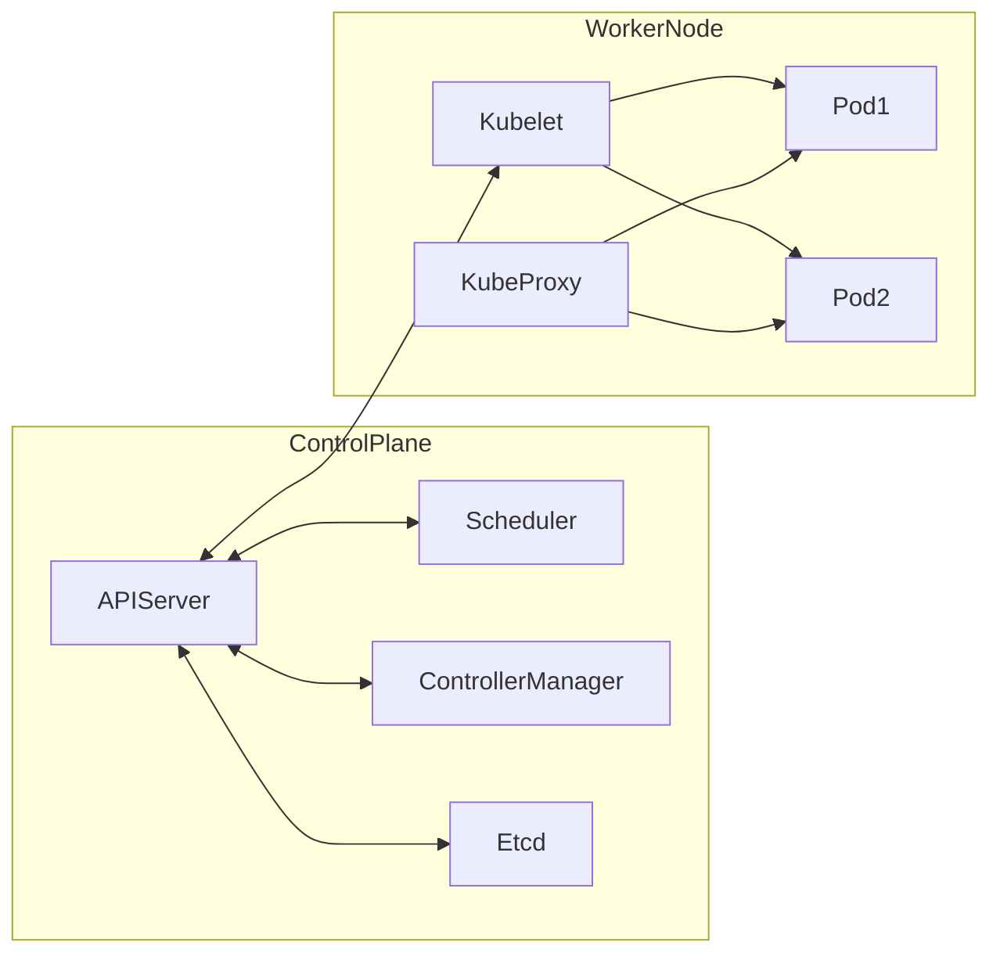

## 🧭 ¡Bienvenido al mundo de Kubernetes!


## 🤔 ¿Qué es Kubernetes?

**Kubernetes** (K8s) es un **orquestador de contenedores** open source que automatiza el despliegue, escalado, operación y recuperación de aplicaciones en contenedores.

**¿Por qué es tan importante?**

- 🏗️ **Despliegue automático** de apps y microservicios
- ⚖️ **Escalado horizontal** según demanda (¡sin downtime!)
- 🔄 **Actualizaciones continuas** y rollback seguro
- 🛡️ **Alta disponibilidad** y autorecuperación ante fallos
- 🌐 **Balanceo de carga** y gestión de tráfico

### 🧱 Conceptos Clave (¡memorízalos!)

| Concepto       | Descripción breve y visual |
|--------------- |---------------------------|
| **Clúster**    | 🖥️🖥️🖥️ Grupo de máquinas (nodos) que ejecutan Kubernetes |
| **Node**       | 💻 Máquina física/virtual del clúster (puede ser worker o master) |
| **Pod**        | 📦 Unidad mínima: uno o más contenedores que comparten red y almacenamiento |
| **Deployment** | 🚀 Controla el ciclo de vida de los Pods (actualizaciones, réplicas) |
| **Service**    | 🌐 Expone Pods y balancea tráfico |
| **Namespace**  | 🏷️ Agrupa recursos lógicamente |
| **ConfigMap/Secret** | 🔑 Configuración y secretos para tus apps |

> 📌 **Tip:** ¡Aprende estos términos! Son la base de todo lo que harás en Kubernetes.

---

¿Ya dominas Docker? ¡Ahora es momento de dar el siguiente gran salto! Si Docker nos ayuda a empaquetar aplicaciones, **Kubernetes** (K8s) nos permite **orquestarlas, escalarlas y gestionarlas** como lo hacen las empresas líderes del mundo.

Esta semana conocerás uno de los pilares del DevOps moderno y la nube: **Kubernetes**. Aprenderás a crear tu propio clúster, desplegar aplicaciones y entender los conceptos que usan los equipos de alto rendimiento.

> 💡 **Motivación:** Kubernetes es la tecnología estándar para operar aplicaciones en producción, desde startups hasta gigantes como Google, Spotify o Airbnb. ¡Dominarlo te abre puertas en el mundo IT!

---


## 🛠️ La CLI de Kubernetes: `kubectl`

`kubectl` es la herramienta principal para interactuar con tu clúster Kubernetes desde la terminal. Permite crear, consultar, modificar y eliminar recursos, así como depurar y automatizar tareas.

**Comandos esenciales:**

- `kubectl get <recurso>`: Lista recursos (pods, deployments, services, etc.)
- `kubectl describe <recurso> <nombre>`: Detalla información y eventos de un recurso
- `kubectl logs <pod>`: Muestra los logs de un pod
- `kubectl apply -f archivo.yaml`: Aplica configuraciones declarativas
- `kubectl exec -it <pod> -- bash`: Accede a la terminal de un contenedor

> 📌 **Tip:** Usa `kubectl explain <recurso>` para ver la documentación inline de cualquier recurso.

Más adelante en el reto, aprenderás a usar `kubectl` con archivos YAML para gestionar infraestructuras complejas.

---

## 🏗️ Arquitectura de Kubernetes (visión general)

Kubernetes sigue una arquitectura maestro-trabajador (master-worker) y está compuesto por varios componentes clave:

### Arquitectura visual (oficial)


> Fuente: [kubernetes.io/docs/concepts/architecture/](https://kubernetes.io/docs/concepts/architecture/)

---

### Diagrama simplificado



### Componentes principales

- **API Server:** Puerta de entrada al clúster, recibe comandos de `kubectl` y otras apps.
- **etcd:** Base de datos distribuida que almacena el estado del clúster.
- **Scheduler:** Decide en qué nodo se ejecuta cada pod.
- **Controller Manager:** Supervisa el estado y realiza acciones automáticas (replicas, jobs, etc).
- **Kubelet:** Agente que corre en cada nodo worker, ejecuta los pods y reporta al API Server.
- **Kube-Proxy:** Gestiona el networking y el balanceo de tráfico hacia los pods.

> 🧠 **Resumen:**
> - El plano de control (control plane) administra el clúster.
> - Los nodos workers ejecutan las aplicaciones (pods).
> - `kubectl` se comunica con el API Server para gestionar todo.

---


## 🛠️ Instalación de Herramientas

### 1. `kubectl` (CLI de Kubernetes)

<details>
<summary>▶️ Ver instrucciones según sistema operativo</summary>

**Windows**
```bash
choco install kubernetes-cli
curl -LO "https://dl.k8s.io/release/v1.28.0/bin/windows/amd64/kubectl.exe"
```

**macOS**

```bash
brew install kubectl
# Alternativa:
sudo port install kubectl
```

**Linux**

```bash
curl -LO "https://dl.k8s.io/release/$(curl -s https://dl.k8s.io/release/stable.txt)/bin/linux/amd64/kubectl"
sudo install -o root -g root -m 0755 kubectl /usr/local/bin/kubectl
```

</details>

> ✅ **Valida la instalación:**
```bash
kubectl version --client
```
Debe mostrar la versión instalada. Si no, revisa tu PATH.

### 2. `Minikube` (Entorno local de Kubernetes)

<details>
<summary>▶️ Ver instrucciones según sistema operativo</summary>

**Windows**

```bash
choco install minikube
# o descargar desde: https://minikube.sigs.k8s.io/docs/start/
```

**macOS**

```bash
brew install minikube
```

**Linux**

```bash
curl -LO https://storage.googleapis.com/minikube/releases/latest/minikube-linux-amd64
sudo install minikube-linux-amd64 /usr/local/bin/minikube
```

</details>

> 💡 **Requisito:** Necesitas tener instalado Docker, VirtualBox o similar como backend de Minikube.
---

## 🚀 Crear tu Primer Clúster Local

```bash
minikube start
minikube status
```

### Verificar que todo funcione

```bash
kubectl version --client
kubectl cluster-info
kubectl get nodes
```

---


## 📦 Desplegar tu Primera App

### Ejemplo rápido: Hola Mundo con `kubectl run`

Puedes lanzar un contenedor simple de Nginx (o cualquier imagen) con un solo comando:

```bash
kubectl run hola-mundo --image=nginx --port=80
kubectl get pods
```

Esto crea un Pod llamado `hola-mundo` usando la imagen oficial de Nginx. Puedes ver el pod corriendo con `kubectl get pods`.

> 📝 **Nota:** `kubectl run` es útil para pruebas rápidas, pero en producción se recomienda usar `kubectl create deployment`.

---

### Despliegue recomendado (Deployment + Service)

```bash
kubectl create deployment hello-minikube --image=k8s.gcr.io/echoserver:1.4
kubectl expose deployment hello-minikube --type=NodePort --port=8080
kubectl get services hello-minikube
minikube service hello-minikube
```

---

## 📋 Comandos Básicos

```bash
kubectl get all
kubectl describe pod <nombre-pod>
kubectl logs <nombre-pod>
kubectl delete deployment <nombre-deployment>
kubectl <comando> --help
```

---

## 🧪 BONUS: Explorar el Dashboard

```bash
minikube dashboard
```

> 🎯 Tip: Explorá visualmente tus Pods, Deployments, Services y mucho más.

---

## 📝 Tareas del Día

1. ✅ Instalar `kubectl` y `minikube`
2. ✅ Iniciar tu primer clúster con `minikube start`
3. ✅ Verificar que `kubectl` se conecta correctamente
4. ✅ Desplegar y acceder a `hello-minikube`
5. ✅ Abrir y explorar el `minikube dashboard`
6. ✅ Tomar un screenshot de tu clúster funcionando
7. 🆕 **\[Nueva]** Crear un archivo llamado `mi-cluster.md` y anotar:

   * Qué es un Pod, Node y Deployment (en tus palabras)
   * Qué comandos usaste hoy
   * Qué fue lo que más te sorprendió de Kubernetes

---

## 🛠️ Solución de Problemas

<details>
<summary>🧯 Minikube no inicia</summary>

```bash
minikube start --help | grep driver
minikube start --driver=docker  # o virtualbox
```

</details>

<details>
<summary>❌ kubectl no encuentra el clúster</summary>

```bash
kubectl config current-context
kubectl config use-context minikube
```

</details>

---

## 🐳 Alternativa: KIND (Kubernetes IN Docker)

Ideal si ya usás Docker y querés evitar VMs.
Para instalar y probar:

```bash
curl -Lo ./kind https://kind.sigs.k8s.io/dl/v0.20.0/kind-$(uname)-amd64
chmod +x ./kind
sudo mv ./kind /usr/local/bin/kind

kind create cluster
```

> 📌 Ver documentación: [KIND Docs](https://kind.sigs.k8s.io/)

---

## 📚 Recursos Útiles

* 🌐 [Documentación oficial de Kubernetes](https://kubernetes.io/docs/)
* 🧪 [Minikube Docs](https://minikube.sigs.k8s.io/docs/)
* 📜 [Kubectl Cheat Sheet](https://kubernetes.io/docs/reference/kubectl/cheatsheet/)

---

## 🎉 ¡Lo lograste!

Tenés tu primer clúster funcionando.
Mañana exploramos Pods y Deployments a fondo 🚀

📸 ¡Compartí tu progreso en la comunidad con `#DevOpsConRoxs`!


