## 🌐 Services y Networking - Conectando el Mundo


Hoy aprenderás a conectar y exponer aplicaciones en Kubernetes como lo hacen los equipos DevOps profesionales. Los **Services** son el puente entre tus Pods y el mundo, y la clave para la comunicación interna y externa.

> 🚀 **Motivación:** Dominar los Services te permite construir arquitecturas escalables, seguras y resilientes, tanto en la nube como on-premise.

---

### 🔎 ¿Cómo fluye el tráfico en Kubernetes?

```mermaid
flowchart LR
  User((Usuario))
  Internet((Internet))
  NodePort[Service NodePort]
  LoadBalancer[Service LoadBalancer]
  ClusterIP[Service ClusterIP]
  Pod1[Pod 1]
  Pod2[Pod 2]
  User-->|Navegador|Internet-->|Petición|LoadBalancer-->|Balanceo|NodePort-->|Red interna|ClusterIP-->|Selector|Pod1
  ClusterIP-->|Selector|Pod2
```



---


## 🤔 ¿Por qué necesitamos Services?

Imagina que tienes una aplicación web con 3 réplicas (3 Pods). Cada Pod tiene su propia IP, pero:

- 📱 Las IPs de los Pods **cambian** cuando se reinician
- ⚖️ Necesitas **balancear la carga** entre las 3 réplicas
- 🌍 Quieres **una sola dirección** para acceder a tu aplicación

**¡Aquí entran los Services!** 🦸‍♂️

Un Service proporciona:
- 🏷️ **Una IP estable** para acceder a un grupo de Pods
- ⚖️ **Balanceador de carga** automático
- 🔍 **Descubrimiento de servicios** (DNS interno)

---


## 🔧 Tipos de Services en Kubernetes

### 1. ClusterIP (por defecto)
- 🏠 **Solo accesible dentro del clúster**
- 🔗 Para comunicación interna entre servicios (microservicios, backend, DB)

### 2. NodePort
- 🌐 **Accesible desde fuera del clúster**
- 🚪 Expone un puerto en todos los nodos (rango 30000-32767)

### 3. LoadBalancer
- ☁️ **Para proveedores cloud** (AWS, GCP, Azure)
- ⚖️ Crea un load balancer externo automáticamente

### 4. ExternalName
- 🔗 **Redirecciona** a un servicio externo (fuera del clúster)
- 📋 Como un alias DNS (útil para integrar APIs externas)

### 5. Headless Service (avanzado)
- 🧩 No asigna IP propia, expone los endpoints directamente
- 🔬 Útil para bases de datos, StatefulSets, descubrimiento avanzado

---

---


## 🛠️ Creando y Usando Services


### Service ClusterIP (Interno)

Primero, creemos un deployment:

```bash
# Crear deployment
kubectl create deployment web-app --image=nginx:latest --replicas=3
```

Ahora el Service (`clusterip-service.yaml`):

```yaml
apiVersion: v1
kind: Service
metadata:
  name: web-app-service
spec:
  selector:
    app: web-app
  ports:
  - protocol: TCP
    port: 80          # Puerto del Service
    targetPort: 80    # Puerto del contenedor
  type: ClusterIP     # Opcional, es el tipo por defecto
```

```bash
# Aplicar el service
kubectl apply -f clusterip-service.yaml

# Ver el service creado
kubectl get services
kubectl describe service web-app-service
```


---

### Service NodePort (Acceso Externo)
---

### Service LoadBalancer (Cloud)

```yaml
apiVersion: v1
kind: Service
metadata:
  name: web-app-lb
spec:
  selector:
    app: web-app
  ports:
    - protocol: TCP
      port: 80
      targetPort: 80
  type: LoadBalancer
```

> ☁️ **Nota:** Solo funciona en clusters cloud o con MetalLB en local.

---

### Headless Service (avanzado)

```yaml
apiVersion: v1
kind: Service
metadata:
  name: db-headless
spec:
  clusterIP: None
  selector:
    app: db
  ports:
    - port: 5432
      targetPort: 5432
```

> 🔬 Útil para bases de datos distribuidas, StatefulSets, Cassandra, etc.

---

### ExternalName Service

```yaml
apiVersion: v1
kind: Service
metadata:
  name: external-api
spec:
  type: ExternalName
  externalName: api.externa.com
```

> 📋 Permite que los pods usen un nombre DNS interno para acceder a servicios externos.

Crea `nodeport-service.yaml`:

```yaml
apiVersion: v1
kind: Service
metadata:
  name: web-app-nodeport
spec:
  selector:
    app: web-app
  ports:
  - protocol: TCP
    port: 80
    targetPort: 80
    nodePort: 30080   # Puerto expuesto en el nodo (30000-32767)
  type: NodePort
```

```bash
# Aplicar el service
kubectl apply -f nodeport-service.yaml

# Ver la URL del service en Minikube
minikube service web-app-nodeport --url

# Abrir en el navegador
minikube service web-app-nodeport
```

---

## 🧪 Ejercicio Práctico: Aplicación Frontend + Backend

Vamos a crear una aplicación completa con frontend y backend:

### 1. Backend Service

`backend-deployment.yaml`:
```yaml
apiVersion: apps/v1
kind: Deployment
metadata:
  name: backend-app
spec:
  replicas: 2
  selector:
    matchLabels:
      app: backend
  template:
    metadata:
      labels:
        app: backend
    spec:
      containers:
      - name: backend
        image: httpd:2.4
        ports:
        - containerPort: 80
---
apiVersion: v1
kind: Service
metadata:
  name: backend-service
spec:
  selector:
    app: backend
  ports:
  - port: 80
    targetPort: 80
  type: ClusterIP  # Solo interno
```

### 2. Frontend Service

`frontend-deployment.yaml`:
```yaml
apiVersion: apps/v1
kind: Deployment
metadata:
  name: frontend-app
spec:
  replicas: 2
  selector:
    matchLabels:
      app: frontend
  template:
    metadata:
      labels:
        app: frontend
    spec:
      containers:
      - name: frontend
        image: nginx:latest
        ports:
        - containerPort: 80
        env:
        - name: BACKEND_URL
          value: "http://backend-service"  # Nombre del service interno
---
apiVersion: v1
kind: Service
metadata:
  name: frontend-service
spec:
  selector:
    app: frontend
  ports:
  - port: 80
    targetPort: 80
    nodePort: 30090
  type: NodePort  # Acceso externo
```

```bash
# Desplegar todo
kubectl apply -f backend-deployment.yaml
kubectl apply -f frontend-deployment.yaml

# Ver servicios
kubectl get services
kubectl get pods

# Acceder al frontend
minikube service frontend-service
```

---


## 🔍 Descubrimiento de Servicios y Endpoints
### ¿Qué son los Endpoints y EndpointSlices?

- **Endpoints:** Listan las IPs de los Pods asociados a un Service.
- **EndpointSlices:** Versión escalable y moderna de Endpoints (K8s >= 1.17).

```bash
kubectl get endpoints
kubectl get endpointslices
```

> Si un Service no tiene endpoints, revisa los labels y el selector.
---

## 🛡️ Buenas Prácticas y Seguridad

- Usa nombres claros y consistentes para tus services (`<app>-service`, `<app>-nodeport`, etc).
- No expongas servicios sensibles como NodePort o LoadBalancer si no es necesario.
- Limita los puertos expuestos y usa NetworkPolicy para restringir el tráfico.
- Usa ServiceAccount y RBAC para controlar el acceso a los servicios.
- Documenta los puertos y dependencias de cada servicio.

### Ejemplo básico de NetworkPolicy

```yaml
apiVersion: networking.k8s.io/v1
kind: NetworkPolicy
metadata:
  name: allow-frontend-to-backend
spec:
  podSelector:
    matchLabels:
      app: backend
  ingress:
    - from:
        - podSelector:
            matchLabels:
              app: frontend
      ports:
        - protocol: TCP
          port: 80
```

---

Kubernetes proporciona DNS interno automáticamente:

```bash
# Probar conectividad desde un pod
kubectl run test-pod --image=busybox -it --rm --restart=Never -- sh

# Dentro del pod, probar:
nslookup backend-service
wget -qO- http://backend-service
exit
```

### Formatos de DNS interno:
- `service-name` (mismo namespace)
- `service-name.namespace.svc.cluster.local` (nombre completo)

---

## ⚖️ Load Balancing en Acción

Vamos a ver cómo Kubernetes balancea la carga:

```bash
# Crear deployment con múltiples réplicas
kubectl create deployment echo-app --image=k8s.gcr.io/echoserver:1.4 --replicas=3

# Exponer como NodePort
kubectl expose deployment echo-app --type=NodePort --port=8080

# Ver el service
kubectl get services echo-app

# Acceder múltiples veces y ver cómo cambia el pod que responde
minikube service echo-app
```

---

## 🔧 Port-Forward para Testing

Útil para probar servicios sin exponerlos:

```bash
# Reenviar puerto local al service
kubectl port-forward service/backend-service 8080:80

# Ahora puedes acceder en: http://localhost:8080
```

---


## 📝 Comandos Útiles y Debug
# Ver endpoints de un service
kubectl get endpoints `service-name`

# Ver EndpointSlices
kubectl get endpointslices `service-name`
---

## 🧠 Preguntas Frecuentes (FAQ)

**¿Por qué mi Service no tiene endpoints?**
- Los labels del selector no coinciden con los pods.
- No hay pods corriendo con esos labels.

**¿Por qué no puedo acceder a mi NodePort?**
- El firewall del host bloquea el puerto.
- El pod no está en estado Running/Ready.

**¿Cómo accedo a un Service desde otro namespace?**
- Usa el nombre completo: `service.namespace.svc.cluster.local`

**¿Cómo monitoreo el tráfico de un Service?**
- Usa herramientas como `kubectl top`, Prometheus, Grafana, Kiali, etc.

**¿Puedo exponer un Service solo a ciertos pods?**
- Sí, usando NetworkPolicy.

---

```bash
# Ver todos los services
kubectl get svc


# Describir un service
kubectl describe svc `service-name`

# Ver endpoints de un service
kubectl get endpoints `service-name`

# Editar un service
kubectl edit svc `service-name`

# Eliminar un service
kubectl delete svc `service-name`

# Ver services con más información
kubectl get svc -o wide
```

---

## 🧪 Ejercicio de Debug

Cuando un Service no funciona, sigue estos pasos:

1. **Verificar el Service existe:**
   ```bash
   kubectl get svc
   ```

2. **Verificar los endpoints:**
   ```bash
   kubectl get endpoints <service-name>
   ```

3. **Verificar los labels coinciden:**
   ```bash
   kubectl get pods --show-labels
   kubectl describe svc <service-name>
   ```

4. **Probar conectividad interna:**
   ```bash
   kubectl run debug --image=busybox -it --rm -- sh
   # wget -qO- http://service-name:port
   ```

---


## 📝 Tareas del Día y Desafíos
9. 🏅 **Extra:** Crea un Headless Service y prueba el DNS interno.
10. 🏅 **Extra:** Aplica una NetworkPolicy para restringir el acceso.

---

1. ✅ Crear un deployment con 3 réplicas
2. ✅ Crear un Service ClusterIP para el deployment
3. ✅ Crear un Service NodePort para acceso externo
4. ✅ Desplegar la aplicación frontend + backend
5. ✅ Probar la conectividad entre servicios
6. ✅ Usar port-forward para acceder a un service
7. ✅ Experimentar con los comandos de debug
8. ✅ Acceder a los servicios desde el navegador

---

## 🎨 Ejemplo Completo: Aplicación Web

`complete-app.yaml`:
```yaml
# Backend Deployment
apiVersion: apps/v1
kind: Deployment
metadata:
  name: api-backend
spec:
  replicas: 2
  selector:
    matchLabels:
      app: api
      tier: backend
  template:
    metadata:
      labels:
        app: api
        tier: backend
    spec:
      containers:
      - name: api
        image: httpd:2.4
        ports:
        - containerPort: 80
---
# Backend Service (interno)
apiVersion: v1
kind: Service
metadata:
  name: api-service
spec:
  selector:
    app: api
    tier: backend
  ports:
  - port: 80
---
# Frontend Deployment
apiVersion: apps/v1
kind: Deployment
metadata:
  name: web-frontend
spec:
  replicas: 3
  selector:
    matchLabels:
      app: web
      tier: frontend
  template:
    metadata:
      labels:
        app: web
        tier: frontend
    spec:
      containers:
      - name: web
        image: nginx:latest
        ports:
        - containerPort: 80
---
# Frontend Service (externo)
apiVersion: v1
kind: Service
metadata:
  name: web-service
spec:
  selector:
    app: web
    tier: frontend
  ports:
  - port: 80
    nodePort: 30100
  type: NodePort
```

---


## 🔗 Recursos, Laboratorios y Checklist


- [Service Documentation](https://kubernetes.io/docs/concepts/services-networking/service/)
- [DNS for Services](https://kubernetes.io/docs/concepts/services-networking/dns-pod-service/)
- [Network Policies](https://kubernetes.io/docs/concepts/services-networking/network-policies/)
- [Headless Services](https://kubernetes.io/docs/concepts/services-networking/service/#headless-services)
- [ExternalName Services](https://kubernetes.io/docs/concepts/services-networking/service/#externalname)
- [Kubernetes Networking Labs (Katacoda)](https://www.katacoda.com/courses/kubernetes/networking-introduction)

> ✅ **Checklist de dominio:**
- [ ] Crear y exponer servicios de todos los tipos
- [ ] Usar y depurar endpoints y DNS interno
- [ ] Aplicar NetworkPolicy básica
- [ ] Usar port-forward y debuggear conectividad
- [ ] Documentar y asegurar tus servicios

---

---

🌟 **¡Genial!** Ya sabes cómo conectar aplicaciones en Kubernetes. Mañana trabajaremos con ConfigMaps y Secrets para gestionar configuraciones.

**¡Comparte tu aplicación funcionando con #DevOpsConRoxs!** 🚀