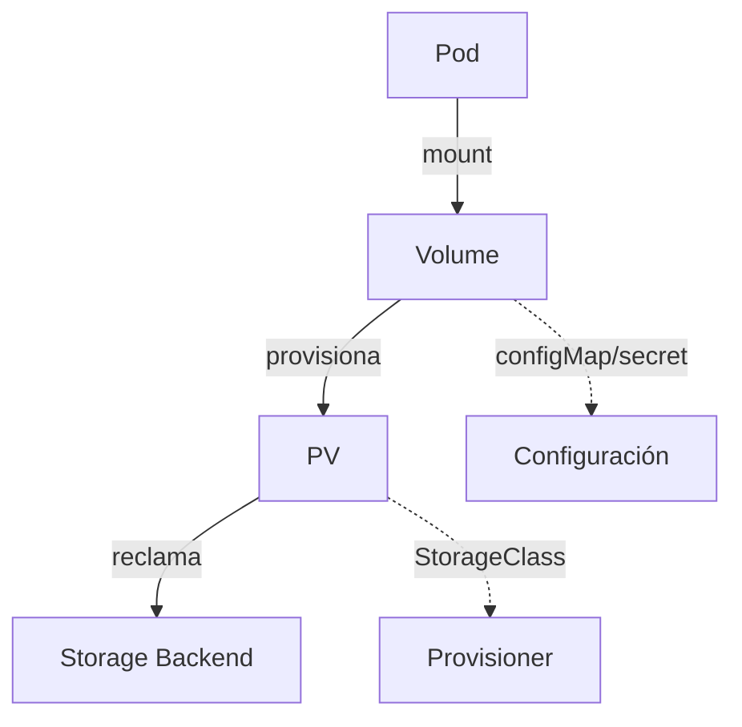

## 💾 Volúmenes y Almacenamiento - Datos que Perduran


¡Hoy aprenderemos a persistir datos en Kubernetes!  
Los **volúmenes** nos permiten mantener información importante incluso cuando los Pods se reinician o eliminan.


## 🧩 Comparativa de Tipos de Volúmenes

| Tipo                | Persistencia | Acceso Multi-Pod | Uso común                | Ejemplo clave           |
|---------------------|--------------|------------------|--------------------------|------------------------|
| emptyDir            | No           | Sí (en el mismo Pod) | Cache, temp, scratch      | Compartir logs entre contenedores |
| hostPath            | Sí (en nodo) | No               | Desarrollo, pruebas       | Acceso a archivos del host |
| configMap/secret    | No           | Sí               | Configuración, credenciales| Montar config como archivo |
| nfs/cifs            | Sí           | Sí               | Compartir datos entre Pods| Volumen compartido en red |
| awsEBS/gcePD/azure  | Sí           | No (ReadWriteOnce)| Producción, bases de datos| Disco persistente cloud |
| PV/PVC              | Sí           | Depende del tipo | Cualquier uso persistente | Reclamar almacenamiento |

---

## 🖼️ Diagrama: Flujo de Almacenamiento en Kubernetes



---

## 🤔 ¿Por qué necesitamos Volúmenes?

Los contenedores son **efímeros** por naturaleza:
- 💨 Cuando un Pod se reinicia, **todos los datos se pierden**
- 🔄 Los archivos creados dentro del contenedor **no persisten**
- 🗃️ Las bases de datos necesitan **almacenamiento duradero**

**Los volúmenes resuelven esto proporcionando:**
- 📦 Almacenamiento que **sobrevive a reinicios** de Pods
- 🔄 **Compartición de datos** entre contenedores
- 💾 **Persistencia** para aplicaciones stateful

---

## 📂 Tipos de Volúmenes en Kubernetes

### 1. Volúmenes Temporales
- **emptyDir**: Directorio vacío que vive con el Pod
- **configMap/secret**: Configuraciones montadas como archivos

### 2. Volúmenes del Host
- **hostPath**: Monta un directorio del nodo host

### 3. Volúmenes de Red
- **nfs**: Network File System
- **cifs**: Common Internet File System

### 4. Volúmenes de Proveedores Cloud
- **awsEBS**: Amazon Elastic Block Store
- **gcePersistentDisk**: Google Cloud Persistent Disk
- **azureDisk**: Azure Disk

### 5. Volúmenes Persistentes
- **PersistentVolume (PV)**: Almacenamiento provisionado por el administrador
- **PersistentVolumeClaim (PVC)**: Solicitud de almacenamiento por parte del usuario

---

## 🛠️ Volúmenes Básicos

### EmptyDir - Almacenamiento Temporal

`emptydir-example.yaml`:
```yaml
apiVersion: v1
kind: Pod
metadata:
  name: shared-volume-pod
spec:
  containers:
  - name: writer
    image: busybox
    command: ["/bin/sh", "-c"]
    args:
    - while true; do
        echo "$(date): Escribiendo datos..." >> /shared/log.txt;
        sleep 10;
      done
    volumeMounts:
    - name: shared-data
      mountPath: /shared
  
  - name: reader
    image: busybox
    command: ["/bin/sh", "-c"]
    args:
    - while true; do
        echo "Contenido del archivo:";
        cat /shared/log.txt 2>/dev/null || echo "Archivo no encontrado";
        sleep 15;
      done
    volumeMounts:
    - name: shared-data
      mountPath: /shared
  
  volumes:
  - name: shared-data
    emptyDir: {}
```

```bash
# Desplegar el pod
kubectl apply -f emptydir-example.yaml

# Ver logs de ambos contenedores
kubectl logs shared-volume-pod -c writer
kubectl logs shared-volume-pod -c reader
```

### HostPath - Acceso al Sistema de Archivos del Host

`hostpath-example.yaml`:
```yaml
apiVersion: v1
kind: Pod
metadata:
  name: hostpath-pod
spec:
  containers:
  - name: app
    image: nginx:latest
    volumeMounts:
    - name: host-storage
      mountPath: /usr/share/nginx/html
  
  volumes:
  - name: host-storage
    hostPath:
      path: /tmp/nginx-data  # Directorio en el host
      type: DirectoryOrCreate
```

⚠️ **Nota**: hostPath solo funciona si el Pod se programa en el mismo nodo.

---

## 💾 Persistent Volumes (PV) y Claims (PVC)

### ¿Qué son PV y PVC?

- **PersistentVolume (PV)**: Un recurso de almacenamiento en el clúster
- **PersistentVolumeClaim (PVC)**: Una solicitud de almacenamiento por parte de un usuario

**Es como:**
- 🏠 **PV** = Casa disponible para alquilar
- 📋 **PVC** = Solicitud de alquiler con requisitos específicos

### Crear un PersistentVolume

`persistent-volume.yaml`:
```yaml
apiVersion: v1
kind: PersistentVolume
metadata:
  name: local-pv
spec:
  capacity:
    storage: 1Gi
  accessModes:
  - ReadWriteOnce  # Solo un nodo puede montarlo en modo lectura-escritura
  persistentVolumeReclaimPolicy: Retain
  storageClassName: local-storage
  hostPath:
    path: /tmp/k8s-data
    type: DirectoryOrCreate
```

### Crear un PersistentVolumeClaim

`persistent-volume-claim.yaml`:
```yaml
apiVersion: v1
kind: PersistentVolumeClaim
metadata:
  name: app-pvc
spec:
  accessModes:
  - ReadWriteOnce
  resources:
    requests:
      storage: 500Mi  # Solicito 500MB del PV de 1GB
  storageClassName: local-storage
```

### Usar el PVC en un Pod

`pod-with-pvc.yaml`:
```yaml
apiVersion: v1
kind: Pod
metadata:
  name: app-with-storage
spec:
  containers:
  - name: app
    image: nginx:latest
    volumeMounts:
    - name: persistent-storage
      mountPath: /usr/share/nginx/html
  
  volumes:
  - name: persistent-storage
    persistentVolumeClaim:
      claimName: app-pvc
```

```bash
# Aplicar en orden
kubectl apply -f persistent-volume.yaml
kubectl apply -f persistent-volume-claim.yaml
kubectl apply -f pod-with-pvc.yaml

# Verificar el estado
kubectl get pv
kubectl get pvc
kubectl get pods
```

---

## 🗃️ Ejemplo Práctico: Base de Datos MySQL

Vamos a crear una base de datos MySQL con almacenamiento persistente:

`mysql-storage.yaml`:
```yaml
# PersistentVolume para MySQL
apiVersion: v1
kind: PersistentVolume
metadata:
  name: mysql-pv
spec:
  capacity:
    storage: 2Gi
  accessModes:
  - ReadWriteOnce
  persistentVolumeReclaimPolicy: Retain
  storageClassName: mysql-storage
  hostPath:
    path: /tmp/mysql-data
    type: DirectoryOrCreate

---
# PersistentVolumeClaim para MySQL
apiVersion: v1
kind: PersistentVolumeClaim
metadata:
  name: mysql-pvc
spec:
  accessModes:
  - ReadWriteOnce
  resources:
    requests:
      storage: 2Gi
  storageClassName: mysql-storage

---
# Secret para credenciales de MySQL
apiVersion: v1
kind: Secret
metadata:
  name: mysql-secret
type: Opaque
stringData:
  MYSQL_ROOT_PASSWORD: "rootpassword123"
  MYSQL_DATABASE: "myapp"
  MYSQL_USER: "appuser"
  MYSQL_PASSWORD: "userpassword123"

---
# Deployment de MySQL
apiVersion: apps/v1
kind: Deployment
metadata:
  name: mysql
spec:
  replicas: 1  # Solo 1 réplica para bases de datos
  selector:
    matchLabels:
      app: mysql
  template:
    metadata:
      labels:
        app: mysql
    spec:
      containers:
      - name: mysql
        image: mysql:8.0
        ports:
        - containerPort: 3306
        envFrom:
        - secretRef:
            name: mysql-secret
        volumeMounts:
        - name: mysql-storage
          mountPath: /var/lib/mysql
        resources:
          requests:
            memory: "256Mi"
            cpu: "250m"
          limits:
            memory: "512Mi"
            cpu: "500m"
      
      volumes:
      - name: mysql-storage
        persistentVolumeClaim:
          claimName: mysql-pvc

---
# Service para MySQL
apiVersion: v1
kind: Service
metadata:
  name: mysql-service
spec:
  selector:
    app: mysql
  ports:
  - port: 3306
    targetPort: 3306
  type: ClusterIP
```

```bash
# Desplegar MySQL
kubectl apply -f mysql-storage.yaml

# Verificar que todo esté funcionando
kubectl get pv,pvc
kubectl get pods
kubectl logs deployment/mysql
```

### Probar la Persistencia

```bash
# Conectarse a MySQL y crear datos
kubectl exec -it <mysql-pod-name> -- mysql -u root -p
# Introducir la contraseña: rootpassword123

# En MySQL, crear algunos datos:
CREATE DATABASE testdb;
USE testdb;
CREATE TABLE usuarios (id INT, nombre VARCHAR(50));
INSERT INTO usuarios VALUES (1, 'Juan'), (2, 'Maria');
SELECT * FROM usuarios;
exit;

# Eliminar el pod para probar persistencia
kubectl delete pod <mysql-pod-name>

# Esperar a que se cree un nuevo pod
kubectl get pods -w

# Conectarse de nuevo y verificar que los datos persisten
kubectl exec -it <nuevo-mysql-pod-name> -- mysql -u root -p
USE testdb;
SELECT * FROM usuarios;  # Los datos deberían estar ahí!
```

---

## 📊 StorageClasses - Aprovisionamiento Dinámico

Las **StorageClasses** permiten el aprovisionamiento dinámico de volúmenes:

`storageclass.yaml`:
```yaml
apiVersion: storage.k8s.io/v1
kind: StorageClass
metadata:
  name: fast-storage
provisioner: kubernetes.io/no-provisioner  # Para local
volumeBindingMode: WaitForFirstConsumer
allowVolumeExpansion: true
```

Con StorageClass, los PVCs pueden crear PVs automáticamente:

`dynamic-pvc.yaml`:
```yaml
apiVersion: v1
kind: PersistentVolumeClaim
metadata:
  name: dynamic-pvc
spec:
  accessModes:
  - ReadWriteOnce
  resources:
    requests:
      storage: 1Gi
  storageClassName: fast-storage  # Usa esta StorageClass
```

---

## 🧪 Ejercicio Completo: Aplicación Web + Base de Datos

`complete-app-with-storage.yaml`:
```yaml
# MySQL con almacenamiento persistente
apiVersion: v1
kind: PersistentVolumeClaim
metadata:
  name: mysql-pvc-app
spec:
  accessModes:
  - ReadWriteOnce
  resources:
    requests:
      storage: 1Gi

---
apiVersion: apps/v1
kind: Deployment
metadata:
  name: mysql-app
spec:
  replicas: 1
  selector:
    matchLabels:
      app: mysql-app
  template:
    metadata:
      labels:
        app: mysql-app
    spec:
      containers:
      - name: mysql
        image: mysql:8.0
        env:
        - name: MYSQL_ROOT_PASSWORD
          value: "rootpass123"
        - name: MYSQL_DATABASE
          value: "webapp"
        volumeMounts:
        - name: mysql-data
          mountPath: /var/lib/mysql
      volumes:
      - name: mysql-data
        persistentVolumeClaim:
          claimName: mysql-pvc-app

---
apiVersion: v1
kind: Service
metadata:
  name: mysql-app-service
spec:
  selector:
    app: mysql-app
  ports:
  - port: 3306

---
# Aplicación web que se conecta a MySQL
apiVersion: apps/v1
kind: Deployment
metadata:
  name: webapp-with-db
spec:
  replicas: 2
  selector:
    matchLabels:
      app: webapp-with-db
  template:
    metadata:
      labels:
        app: webapp-with-db
    spec:
      containers:
      - name: webapp
        image: httpd:2.4
        env:
        - name: DB_HOST
          value: "mysql-app-service"
        - name: DB_NAME
          value: "webapp"
        volumeMounts:
        - name: web-content
          mountPath: /usr/local/apache2/htdocs
      
      volumes:
      - name: web-content
        emptyDir: {}

---
apiVersion: v1
kind: Service
metadata:
  name: webapp-service
spec:
  selector:
    app: webapp-with-db
  ports:
  - port: 80
    nodePort: 30300
  type: NodePort
```

---

## 🏗️ Ejemplo Avanzado: StatefulSet y ReadWriteMany

`statefulset-rwx.yaml`:
```yaml
apiVersion: v1
kind: PersistentVolumeClaim
metadata:
  name: shared-pvc
spec:
  accessModes:
  - ReadWriteMany
  resources:
    requests:
      storage: 2Gi
  storageClassName: nfs-storage

---
apiVersion: apps/v1
kind: StatefulSet
metadata:
  name: web-stateful
spec:
  serviceName: "web"
  replicas: 3
  selector:
    matchLabels:
      app: web-stateful
  template:
    metadata:
      labels:
        app: web-stateful
    spec:
      containers:
      - name: web
        image: nginx:alpine
        volumeMounts:
        - name: shared-data
          mountPath: /usr/share/nginx/html
      volumes:
      - name: shared-data
        persistentVolumeClaim:
          claimName: shared-pvc
```

> **Tip:** RWX requiere un backend compatible (NFS, GlusterFS, etc). Ideal para compartir archivos entre réplicas.

---

## 💡 Backup y Restore de Volúmenes

**Backup manual:**
```bash
kubectl cp <pod>:/ruta/datos /backup/local
```
**Restore:**
```bash
kubectl cp /backup/local <pod>:/ruta/datos
```

Para backup automatizado y programado, explora [Velero](https://velero.io/).

---

## 📝 Comandos Útiles para Almacenamiento

```bash
# Ver volúmenes persistentes
kubectl get pv
kubectl describe pv <pv-name>

# Ver claims de volúmenes
kubectl get pvc
kubectl describe pvc <pvc-name>

# Ver StorageClasses
kubectl get storageclass
kubectl describe storageclass <sc-name>

# Ver uso de almacenamiento en pods
kubectl exec -it <pod-name> -- df -h

# Crear PVC dinámicamente
kubectl create pvc <name> --size=1Gi --storageclass=<class>

# Eliminar PVC (cuidado con los datos!)
kubectl delete pvc <pvc-name>
```

---

## 🔄 Políticas de Reclamación

Cuando eliminas un PVC, ¿qué pasa con los datos?


```yaml
# En el PV
spec:
  persistentVolumeReclaimPolicy: Retain  # o Delete
```

---

## 🛡️ Mejores Prácticas y Checklist de Seguridad

### Mejores Prácticas
- Usa StorageClass para aprovisionamiento dinámico y evitar cuellos de botella manuales.
- Define políticas de retención según el ciclo de vida de tus datos.
- Usa ReadWriteMany (RWX) solo si realmente necesitas acceso concurrente.
- Para bases de datos, prefiere volúmenes dedicados y con backup.
- Monitorea el uso de almacenamiento y el estado de los PV/PVC.
- Documenta el propósito de cada volumen y claim.

### Errores Comunes
- No limpiar PVs con política Retain, generando "volúmenes huérfanos".
- Usar hostPath en producción (solo para pruebas o nodos dedicados).
- No proteger los directorios del host usados por hostPath.
- No considerar la expansión de volúmenes (allowVolumeExpansion).

### Checklist de Seguridad
- Limita el acceso a los volúmenes sensibles con RBAC.
- Usa cifrado en reposo si el backend lo soporta.
- Realiza backups periódicos de los datos críticos.
- Audita el acceso a los volúmenes y los cambios en los PVC.

---

---

## 📝 Tareas del Día

1. ✅ Crear un Pod con volumen emptyDir compartido entre contenedores
2. ✅ Crear un PersistentVolume y PersistentVolumeClaim
3. ✅ Desplegar MySQL con almacenamiento persistente
4. ✅ Probar que los datos persisten al eliminar pods
5. ✅ Crear la aplicación completa web + base de datos
6. ✅ Verificar que puedes acceder a la aplicación
7. ✅ Experimentar con diferentes tipos de volúmenes
8. ✅ Monitorear el uso de almacenamiento en los pods

---

## 🛠️ Troubleshooting y Preguntas Frecuentes (FAQ)

**¿Por qué mi PVC queda en estado Pending?**
- No hay PVs disponibles que cumplan los requisitos de tamaño, accessMode o StorageClass.

**¿Por qué los datos no persisten tras reiniciar el pod?**
- Verifica que usas un PVC y no un emptyDir o hostPath efímero.

**¿Puedo expandir el tamaño de un PVC?**
- Sí, si la StorageClass tiene `allowVolumeExpansion: true`.

**¿Cómo hago backup y restore de un volumen?**
- Usa herramientas como Velero, o scripts que copien los datos del volumen a almacenamiento externo.

**¿Qué diferencia hay entre ReadWriteOnce, ReadOnlyMany y ReadWriteMany?**
- RWO: Un solo nodo puede escribir. ROX: Muchos nodos pueden leer. RWX: Muchos nodos pueden leer y escribir (requiere soporte del backend).

**¿Cómo monitoreo el uso de almacenamiento?**
- Usa `kubectl exec ... -- df -h` y herramientas como Prometheus + Grafana.

---

## 🔗 Recursos Adicionales

- [Kubernetes Volumes](https://kubernetes.io/docs/concepts/storage/volumes/)
- [Persistent Volumes](https://kubernetes.io/docs/concepts/storage/persistent-volumes/)
- [StorageClass](https://kubernetes.io/docs/concepts/storage/storage-classes/)
- [Dynamic Provisioning](https://kubernetes.io/docs/concepts/storage/dynamic-provisioning/)
- [StatefulSet y almacenamiento](https://kubernetes.io/docs/concepts/workloads/controllers/statefulset/)
- [Velero (Backups)](https://velero.io/)

---