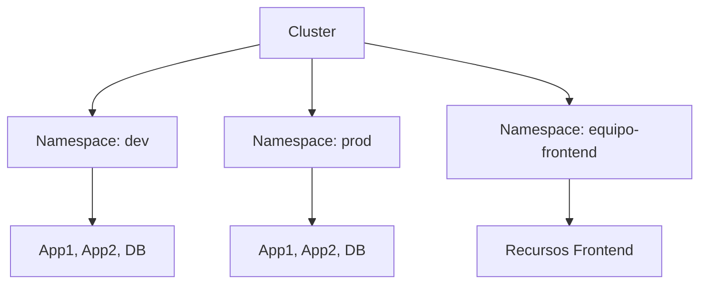

## 🏗️ Namespaces - Organizando tu Clúster


¡Hoy aprenderemos a organizar nuestro clúster de forma simple!  
Los **Namespaces** nos ayudan a separar aplicaciones como si fueran carpetas en tu computadora.


## 🧩 Comparativa y Conceptos Clave

| Característica         | Namespace                | Sin Namespace (default)      |
|-----------------------|--------------------------|------------------------------|
| Aislamiento lógico    | Sí                       | No                           |
| Control de acceso     | Sí (RBAC por namespace)  | Limitado                     |
| Cuotas de recursos    | Sí                       | No                           |
| Nombres duplicados    | Permitido (en distintos namespaces) | No                |
| Uso recomendado       | Multi-equipo, multi-app, ambientes | Proyectos simples   |

---

## 🖼️ Diagrama: Organización con Namespaces



---

## 🛡️ Mejores Prácticas y Checklist

- Usa nombres descriptivos y consistentes para namespaces.
- Aplica RBAC por namespace para limitar accesos.
- Usa labels para categorizar y buscar recursos fácilmente.
- Define cuotas (`ResourceQuota`) y límites (`LimitRange`) por namespace.
- No mezcles ambientes (dev, prod) en el mismo namespace.
- Automatiza la creación de namespaces y recursos con CI/CD.

---

## 📁 ¿Qué son los Namespaces?

Piensa en los **Namespaces** como **carpetas** en tu computadora:

- 📂 **Separar proyectos**: Una carpeta para cada proyecto
- 👥 **Evitar conflictos**: Dos archivos con el mismo nombre en carpetas diferentes
- 🧹 **Organizar mejor**: Todo en su lugar
- 🔍 **Encontrar fácil**: Sabes dónde está cada cosa

### Ejemplo de uso común:
- `mi-app-dev` - Para desarrollo
- `mi-app-prod` - Para producción  
- `equipo-frontend` - Para el equipo de frontend
- `equipo-backend` - Para el equipo de backend

---

## 👀 Ver Namespaces Existentes

```bash
# Ver todos los namespaces
kubectl get namespaces

# Forma más corta
kubectl get ns

# Ver con más detalles
kubectl get ns --show-labels
```

### Namespaces que ya existen por defecto:
- `default` - Donde van los recursos si no especificas namespace
- `kube-system` - Recursos internos de Kubernetes
- `kube-public` - Recursos públicos

---

## 🛠️ Creando tu Primer Namespace

### Forma rápida (comando):
```bash
# Crear namespace para desarrollo
kubectl create namespace mi-app-dev

# Crear namespace para producción
kubectl create namespace mi-app-prod

# Ver que se crearon
kubectl get ns
```

### Forma con archivo YAML:

`mis-namespaces.yaml`:
```yaml
apiVersion: v1
kind: Namespace
metadata:
  name: mi-app-dev
  labels:
    ambiente: desarrollo
    proyecto: mi-aplicacion

---
apiVersion: v1
kind: Namespace
metadata:
  name: mi-app-prod
  labels:
    ambiente: produccion
    proyecto: mi-aplicacion
```

```bash
# Aplicar el archivo
kubectl apply -f mis-namespaces.yaml

# Verificar con labels
kubectl get ns --show-labels
```

---

## 🚀 Desplegando Aplicaciones en Namespaces

### Ejemplo 1: Aplicación de Desarrollo

`app-desarrollo.yaml`:
```yaml
# Deployment en namespace de desarrollo
apiVersion: apps/v1
kind: Deployment
metadata:
  name: web-app
  namespace: mi-app-dev  # ← Aquí especificamos el namespace
spec:
  replicas: 1  # Solo 1 réplica en dev
  selector:
    matchLabels:
      app: web-app
  template:
    metadata:
      labels:
        app: web-app
        ambiente: desarrollo
    spec:
      containers:
      - name: web
        image: nginx:latest
        ports:
        - containerPort: 80

---
# Service para acceder a la aplicación
apiVersion: v1
kind: Service
metadata:
  name: web-service
  namespace: mi-app-dev  # ← Mismo namespace
spec:
  selector:
    app: web-app
  ports:
  - port: 80
    nodePort: 30100
  type: NodePort
```

### Ejemplo 2: Aplicación de Producción

`app-produccion.yaml`:
```yaml
# Deployment en namespace de producción
apiVersion: apps/v1
kind: Deployment
metadata:
  name: web-app
  namespace: mi-app-prod  # ← Namespace diferente
spec:
  replicas: 3  # Más réplicas en producción
  selector:
    matchLabels:
      app: web-app
  template:
    metadata:
      labels:
        app: web-app
        ambiente: produccion
    spec:
      containers:
      - name: web
        image: nginx:latest
        ports:
        - containerPort: 80

---
# Service para producción
apiVersion: v1
kind: Service
metadata:
  name: web-service
  namespace: mi-app-prod  # ← Mismo namespace que el deployment
spec:
  selector:
    app: web-app
  ports:
  - port: 80
    nodePort: 30200
  type: NodePort
```

```bash
# Desplegar ambas aplicaciones
kubectl apply -f app-desarrollo.yaml
kubectl apply -f app-produccion.yaml
```

---

## 🔍 Trabajando con Namespaces

### Ver recursos en namespaces específicos:
```bash
# Ver pods en desarrollo
kubectl get pods -n mi-app-dev

# Ver pods en producción
kubectl get pods -n mi-app-prod

# Ver todo en un namespace
kubectl get all -n mi-app-dev

# Ver recursos en TODOS los namespaces
kubectl get pods -A
kubectl get all -A
```

### Cambiar namespace por defecto:
```bash
# Cambiar a namespace de desarrollo
kubectl config set-context --current --namespace=mi-app-dev

# Ahora todos los comandos serán en mi-app-dev
kubectl get pods  # Solo verás pods de mi-app-dev

# Ver qué namespace estás usando
kubectl config view --minify | grep namespace

# Volver al namespace default
kubectl config set-context --current --namespace=default
```

---

## 🧪 Ejercicio Práctico: Tienda Online

Vamos a crear una tienda online simple en dos ambientes diferentes:

### Paso 1: Crear namespaces para la tienda

`tienda-namespaces.yaml`:
```yaml
apiVersion: v1
kind: Namespace
metadata:
  name: tienda-dev
  labels:
    proyecto: tienda-online
    ambiente: desarrollo

---
apiVersion: v1
kind: Namespace
metadata:
  name: tienda-prod
  labels:
    proyecto: tienda-online
    ambiente: produccion
```

### Paso 2: Aplicación de tienda en desarrollo

`tienda-desarrollo.yaml`:
```yaml
# Frontend de la tienda en desarrollo
apiVersion: apps/v1
kind: Deployment
metadata:
  name: frontend
  namespace: tienda-dev
spec:
  replicas: 1
  selector:
    matchLabels:
      app: frontend
  template:
    metadata:
      labels:
        app: frontend
        tipo: web
    spec:
      containers:
      - name: web
        image: nginx:latest
        ports:
        - containerPort: 80

---
# Base de datos en desarrollo
apiVersion: apps/v1
kind: Deployment
metadata:
  name: database
  namespace: tienda-dev
spec:
  replicas: 1
  selector:
    matchLabels:
      app: database
  template:
    metadata:
      labels:
        app: database
    spec:
      containers:
        env:
          value: "dev123"
        - name: MYSQL_DATABASE
          value: "tienda_dev"
        ports:

---
apiVersion: v1
kind: Service
  name: frontend-service
  namespace: tienda-dev
  selector:
    app: frontend
  - port: 80
  type: NodePort

---
apiVersion: v1
kind: Service
metadata:
  name: database-service
  namespace: tienda-dev
spec:
  selector:
    app: database
  ports:
  - port: 3306
  type: ClusterIP
```

### Paso 3: Aplicación de tienda en producción

`tienda-produccion.yaml`:
```yaml
# Frontend de la tienda en producción
apiVersion: apps/v1
kind: Deployment
metadata:
  name: frontend
  namespace: tienda-prod
spec:
  replicas: 3  # Más réplicas en prod
  selector:
    matchLabels:
      app: frontend
  template:
    metadata:
      labels:
        app: frontend
        tipo: web
    spec:
      containers:
      - name: web
        image: nginx:latest
        ports:
        - containerPort: 80

---
# Base de datos en producción
apiVersion: apps/v1
kind: Deployment
metadata:
  name: database
  namespace: tienda-prod
spec:
  replicas: 1
  selector:
    matchLabels:
      app: database
  template:
    metadata:
      labels:
        app: database
        tipo: db
    spec:
      containers:
      - name: mysql
        image: mysql:8.0
        env:
        - name: MYSQL_ROOT_PASSWORD
          value: "supersecret789"
        - name: MYSQL_DATABASE
          value: "tienda_prod"
        ports:
        - containerPort: 3306

---
# Services para producción
apiVersion: v1
kind: Service
metadata:
  name: frontend-service
  namespace: tienda-prod
spec:
  selector:
    app: frontend
  ports:
  - port: 80
    nodePort: 30210
  type: NodePort

---
apiVersion: v1
kind: Service
metadata:
  name: database-service
  namespace: tienda-prod
spec:
  selector:
    app: database
  ports:
  - port: 3306
  type: ClusterIP
```

### Paso 4: Ejecutar el ejercicio

```bash
# 1. Crear los namespaces
kubectl apply -f tienda-namespaces.yaml

# 2. Desplegar desarrollo
kubectl apply -f tienda-desarrollo.yaml

# 3. Desplegar producción
kubectl apply -f tienda-produccion.yaml

# 4. Verificar todo está funcionando
kubectl get all -n tienda-dev
kubectl get all -n tienda-prod
```

---

## 🔄 Comandos Útiles para el Día a Día

```bash
# Ver todos los namespaces
kubectl get ns

# Crear namespace rápido
kubectl create namespace mi-nuevo-proyecto

# Ver recursos en namespace específico
kubectl get pods -n mi-namespace
kubectl get all -n mi-namespace

# Describir un namespace
kubectl describe namespace mi-namespace

# Eliminar namespace (¡cuidado! elimina todo lo que contiene)
kubectl delete namespace mi-namespace

# Cambiar namespace por defecto
kubectl config set-context --current --namespace=mi-namespace

# Ver en qué namespace estás trabajando
kubectl config view --minify | grep namespace

# Ver recursos de todos los namespaces
kubectl get pods -A
kubectl get services -A
```

---

## 🎯 Comparar tus Ambientes

```bash
# Ver diferencias entre desarrollo y producción
echo "=== DESARROLLO ==="
kubectl get pods -n tienda-dev

echo "=== PRODUCCIÓN ==="
kubectl get pods -n tienda-prod

# Comparar réplicas
kubectl get deployments -n tienda-dev
kubectl get deployments -n tienda-prod

# Ver los servicios
kubectl get services -n tienda-dev
kubectl get services -n tienda-prod
```

### Script para comparar ambientes:

```bash
#!/bin/bash
echo "🔍 COMPARACIÓN DE AMBIENTES"
echo "=========================="

for env in tienda-dev tienda-prod; do
    echo ""
    echo "📁 Ambiente: $env"
    echo "-------------------"
    
    echo "Pods:"
    kubectl get pods -n $env --no-headers | wc -l | xargs echo "  Total:"
    
    echo "Réplicas frontend:"
    kubectl get deployment frontend -n $env -o jsonpath='{.spec.replicas}' | xargs echo "  "
    
    echo "Acceso web:"
    if [ "$env" = "tienda-dev" ]; then
        echo "  http://$(minikube ip):30110"
    else
        echo "  http://$(minikube ip):30210"
    fi
done
```

---

## 📝 Tareas del Día

### ✅ Lista de verificación:

1. **Crear namespaces básicos**
   - [ ] Crear namespace para desarrollo
   - [ ] Crear namespace para producción
   - [ ] Verificar que se crearon correctamente

2. **Desplegar aplicaciones**
   - [ ] Desplegar aplicación en namespace de desarrollo
   - [ ] Desplegar aplicación en namespace de producción
   - [ ] Verificar que cada una tiene diferente número de réplicas

3. **Práctica con comandos**
   - [ ] Ver pods en cada namespace por separado
   - [ ] Cambiar namespace por defecto
   - [ ] Ver recursos en todos los namespaces

4. **Ejercicio de la tienda**
   - [ ] Crear la tienda completa en ambos ambientes
   - [ ] Acceder a ambas versiones por el navegador
   - [ ] Comparar las diferencias entre ambientes

5. **Experimentar**
   - [ ] Crear tu propio namespace con tu nombre
   - [ ] Desplegar algo simple en tu namespace personal
   - [ ] Practicar eliminar y recrear namespaces

---

## 💡 Conceptos Clave Aprendidos

### ✅ Namespaces te ayudan a:
- **Organizar** proyectos y equipos
- **Evitar conflictos** entre recursos con el mismo nombre
- **Separar ambientes** (dev, staging, prod)
- **Trabajar en equipo** sin pisarse

### ✅ Buenas prácticas:
- Usa nombres descriptivos para namespaces
- Agrupa recursos relacionados en el mismo namespace
- Usa labels para organizar mejor
- No olvides especificar el namespace en tus YAMLs

### ✅ Recuerda:
- Cada namespace es independiente
- Los Services se comunican entre namespaces usando nombres completos
- Eliminar un namespace elimina TODO lo que contiene

---

## 🔗 Recursos Adicionales

- [Namespaces Documentation](https://kubernetes.io/docs/concepts/overview/working-with-objects/namespaces/)
- [Best Practices for Namespaces](https://kubernetes.io/docs/concepts/overview/working-with-objects/namespaces/#when-to-use-multiple-namespaces)

---

🏗️ **¡Excelente!** Ya sabes organizar tu clúster como un profesional. Mañana será el gran día: desplegaremos la aplicación roxs-voting-app completa en Kubernetes.

**¡Comparte tu tienda online funcionando en diferentes namespaces con #DevOpsConRoxs!** 🚀