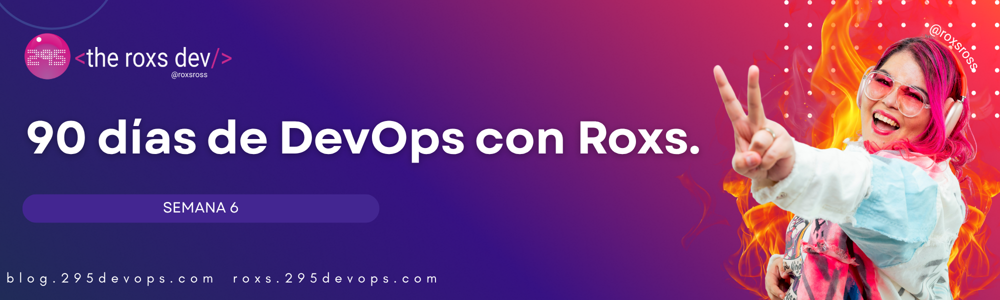

## 🧱 Día 41: CI/CD completo - De tu código al clúster usando kubectl



> “Un buen pipeline no solo despliega, también prueba, construye y lo deja TODO ready para producción.” — Roxs

Hoy vas a integrar TODO en un flujo CI/CD real:

✅ Pruebas automáticas  
✅ Build de imagen Docker  
✅ Push a Docker Hub  
✅ Despliegue en Kubernetes con `kubectl`  

---

## 🎯 Objetivo del Día

- Crear un pipeline profesional en GitHub Actions
- Validar tu código con tests antes del build
- Usar `kubectl` directamente para aplicar manifiestos YAML
- Aprender a automatizar un flujo completo desde cero

---

## 📁 Estructura esperada del proyecto

```

tu-proyecto/
├── .github/workflows/deploy.yml
├── Dockerfile
├── app/
│   ├── main.py
│   ├── requirements.txt
│   └── tests/test\_app.py
├── k8s/
│   ├── deployment.yaml
│   └── service.yaml

````

---

## 🧪 Código de ejemplo

📄 `app/main.py`

```python
from fastapi import FastAPI

app = FastAPI()

@app.get("/")
def read_root():
    return {"message": "Hola desde Kubernetes!"}

@app.get("/health")
def health():
    return {"status": "ok"}
````

📄 `app/requirements.txt`

```
fastapi
uvicorn
pytest
```

📄 `app/tests/test_app.py`

```python
from fastapi.testclient import TestClient
from app.main import app

client = TestClient(app)

def test_read_root():
    response = client.get("/")
    assert response.status_code == 200
    assert response.json() == {"message": "Hola desde Kubernetes!"}
```

---

## 🐳 Dockerfile

```Dockerfile
FROM python:3.10-slim

WORKDIR /app
COPY app /app
COPY app/requirements.txt .

RUN pip install --no-cache-dir -r requirements.txt

CMD ["uvicorn", "main:app", "--host", "0.0.0.0", "--port", "3000"]
```

---

## ☸️ Manifiestos Kubernetes en `k8s/`

📄 `k8s/deployment.yaml`

```yaml
apiVersion: apps/v1
kind: Deployment
metadata:
  name: mi-app
spec:
  replicas: 1
  selector:
    matchLabels:
      app: mi-app
  template:
    metadata:
      labels:
        app: mi-app
    spec:
      containers:
        - name: mi-app
          image: docker.io/USUARIO/mi-app:latest
          ports:
            - containerPort: 3000
          readinessProbe:
            httpGet:
              path: /health
              port: 3000
            initialDelaySeconds: 5
            periodSeconds: 10
          livenessProbe:
            httpGet:
              path: /health
              port: 3000
            initialDelaySeconds: 15
            periodSeconds: 20
```

📄 `k8s/service.yaml`

```yaml
apiVersion: v1
kind: Service
metadata:
  name: mi-app
spec:
  selector:
    app: mi-app
  ports:
    - protocol: TCP
      port: 80
      targetPort: 3000
  type: ClusterIP
```

---

## 🔐 Secrets requeridos en GitHub

* `DOCKER_USER`: Tu usuario de Docker Hub
* `DOCKER_TOKEN`: Token o contraseña de Docker Hub
* `KUBE_CONFIG`: kubeconfig para conectarse a tu clúster Kubernetes

---

## ⚙️ Workflow `.github/workflows/deploy.yml`

```yaml
name: CI/CD con kubectl

on:
  push:
    branches: [main]
  workflow_dispatch:

jobs:
  test:
    name: 🧪 Test
    runs-on: ubuntu-latest
    steps:
      - uses: actions/checkout@v4
      - uses: actions/setup-python@v4
        with:
          python-version: '3.10'
      - run: |
          pip install -r app/requirements.txt
          pytest app/tests/

  build-and-push:
    name: 🐳 Build & Push
    needs: test
    runs-on: ubuntu-latest
    steps:
      - uses: actions/checkout@v4
      - name: Docker login
        run: echo "${{ secrets.DOCKER_TOKEN }}" | docker login -u ${{ secrets.DOCKER_USER }} --password-stdin
      - run: docker build -t ${{ secrets.DOCKER_USER }}/mi-app:latest .
      - run: docker push ${{ secrets.DOCKER_USER }}/mi-app:latest

  deploy:
    name: ☸️ Despliegue con kubectl
    needs: build-and-push
    runs-on: ubuntu-latest
    steps:
      - uses: actions/checkout@v4

      - name: Instalar kubectl
        run: |
          curl -LO "https://dl.k8s.io/release/$(curl -s https://dl.k8s.io/release/stable.txt)/bin/linux/amd64/kubectl"
          chmod +x kubectl && sudo mv kubectl /usr/local/bin/

      - name: Configurar kubeconfig
        run: |
          echo "${{ secrets.KUBE_CONFIG }}" > kubeconfig
          export KUBECONFIG=$PWD/kubeconfig
          kubectl version --client

      - name: Reemplazar imagen
        run: |
          sed -i "s|docker.io/USUARIO/mi-app:latest|docker.io/${{ secrets.DOCKER_USER }}/mi-app:latest|g" k8s/deployment.yaml

      - name: Desplegar con kubectl
        run: |
          kubectl apply -f k8s/
          kubectl rollout status deployment/mi-app
```

---

## ✅ Tareas del Día

1. Crea tus tests en `app/tests/test_app.py`
2. Asegurate de tener los secrets cargados en GitHub
3. Empujá a `main` para activar el pipeline
4. Verificá que el servicio esté en funcionamiento
5. Compartí tu captura en Discord con **#DevOpsConRoxs - Día 41**

---

## 🧠 ¿Qué aprendiste hoy?

| Pregunta                                  | ✔️ / ❌ |
| ----------------------------------------- | ------ |
| ¿Por qué se hace testing antes del build? |        |
| ¿Cómo funciona un push a Docker Hub?      |        |
| ¿Cuál es el rol del `kubectl apply -f`?   |        |
| ¿Qué recursos Kubernetes se desplegaron?  |        |

---

## ✨ Cierre del Día

¡Boom! 💥
Hoy hiciste todo lo que haría una DevOps en producción: tests, imagen, push y despliegue.
Y lo hiciste con herramientas base, sin magia: solo `kubectl` y YAML.
