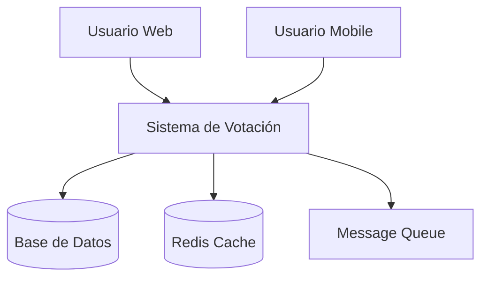
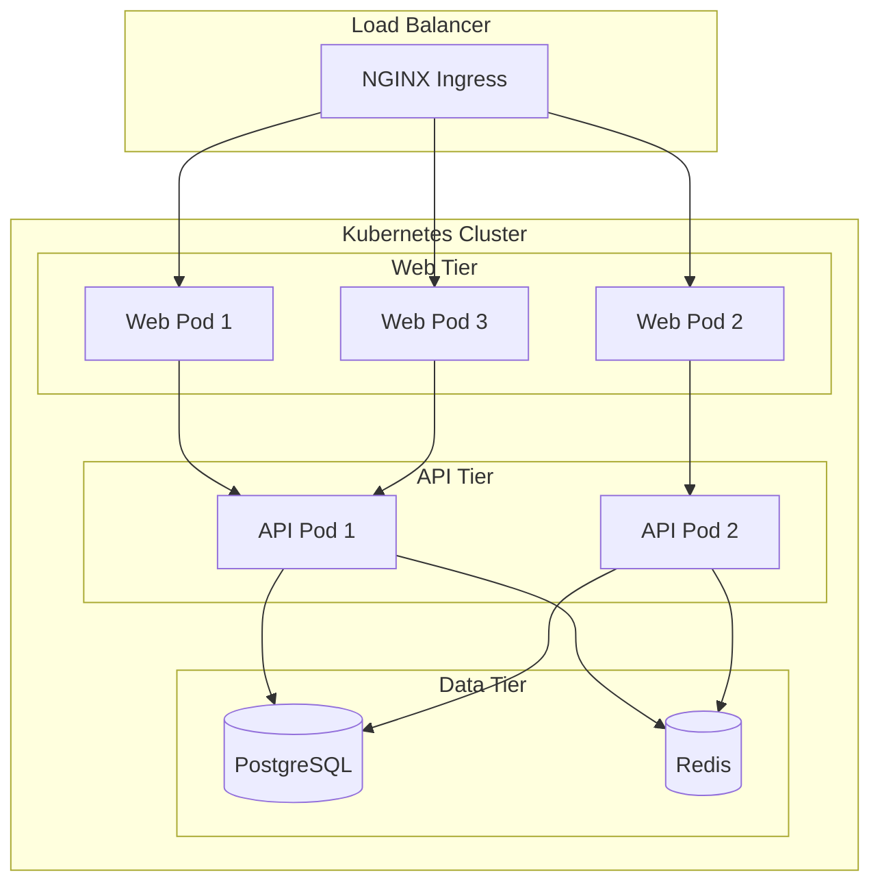

### semana10


## Objetivo
Crear documentación técnica exhaustiva que permita mantener y operar el sistema

## Actividades Principales

### 1. Documentar Arquitectura Completa
- **Diagramas de arquitectura** actualizados
- **Flujo de datos** entre componentes
- **Decisiones técnicas** y su justificación

### 2. Crear Guías Operacionales
- **Procedimientos de deployment**
- **Guías de troubleshooting**
- **Runbooks** para incidentes comunes

### 3. Documentar APIs y Servicios
- **Especificaciones OpenAPI**
- **Ejemplos de uso**
- **Guías de integración**

## Entregables del Día

- [ ] Documentación de arquitectura completa
- [ ] Guías operacionales actualizadas
- [ ] Documentación de APIs finalizada

## Checklist de Documentación

### Arquitectura del Sistema
- [ ] Diagrama de alto nivel actualizado
- [ ] Diagramas de flujo de datos
- [ ] Documentación de decisiones (ADRs)
- [ ] Matriz de dependencias

### Operaciones
- [ ] Procedimientos de deployment
- [ ] Guías de troubleshooting
- [ ] Runbooks de incidentes
- [ ] Procedimientos de backup/restore

### APIs y Servicios
- [ ] Especificaciones OpenAPI/Swagger
- [ ] Ejemplos de requests/responses
- [ ] Guías de autenticación
- [ ] Rate limiting y políticas

## Templates de Documentación

### Architecture Decision Record (ADR)
```markdown
# ADR-001: Adopción de Microservicios

## Estado
Aceptado

## Contexto
Necesitamos escalar el equipo y la aplicación de manera independiente.
La aplicación monolítica actual presenta limitaciones de escalabilidad.

## Decisión
Migraremos a una arquitectura de microservicios usando Docker y Kubernetes.

## Consecuencias
**Positivas:**
- Escalabilidad independiente por servicio
- Equipos pueden trabajar de forma autónoma
- Tecnologías específicas por servicio

**Negativas:**
- Complejidad de red y comunicación
- Necesidad de monitoreo distribuido
- Curva de aprendizaje inicial

## Alternativas Consideradas
- Mantener monolito con optimizaciones
- Arquitectura modular pero en el mismo proceso

## Fecha
2024-06-04

## Participantes
- Tech Lead
- Senior Developers
- DevOps Engineer
```

### Runbook Template
```markdown
# Runbook: Alta Latencia en API

## Síntomas
- Response time > 500ms en el 95th percentile
- Alertas de Prometheus/Grafana activas
- Quejas de usuarios sobre lentitud

## Diagnóstico Inicial
1. Verificar dashboards de Grafana:
   - CPU y memoria de pods
   - Latencia de base de datos
   - Rate de requests

2. Comandos de diagnóstico:
   ```bash
   kubectl top pods -n production
   kubectl logs -f deployment/api-service -n production
   ```

## Soluciones Comunes
### Alta CPU
```bash
# Verificar utilización
kubectl top pods -n production

# Escalar horizontalmente
kubectl scale deployment api-service --replicas=5 -n production
```

### Base de Datos Lenta
```bash
# Verificar conexiones activas
kubectl exec -it postgres-0 -n production -- psql -c "SELECT * FROM pg_stat_activity;"

# Verificar queries lentas
kubectl exec -it postgres-0 -n production -- psql -c "SELECT query, mean_time FROM pg_stat_statements ORDER BY mean_time DESC LIMIT 10;"
```

## Escalamiento
Si el problema persiste:
1. Contactar al Tech Lead
2. Considerar escalar verticalmente
3. Revisar código de la última release

## Post-Incidente
- Documentar en Jira
- Actualizar alertas si es necesario
- Revisar en retrospectiva semanal
```

### API Documentation Template
```yaml
openapi: 3.0.0
info:
  title: User Management API
  description: API para gestión de usuarios
  version: 1.0.0
  contact:
    name: DevOps Team
    email: devops@company.com

servers:
  - url: https://api.company.com/v1
    description: Production server
  - url: https://staging-api.company.com/v1
    description: Staging server

paths:
  /users:
    get:
      summary: Listar usuarios
      description: Obtiene lista paginada de usuarios
      parameters:
        - name: page
          in: query
          schema:
            type: integer
            default: 1
        - name: limit
          in: query
          schema:
            type: integer
            default: 20
            maximum: 100
      responses:
        '200':
          description: Lista de usuarios
          content:
            application/json:
              schema:
                type: object
                properties:
                  users:
                    type: array
                    items:
                      $ref: '#/components/schemas/User'
                  pagination:
                    $ref: '#/components/schemas/Pagination'

components:
  schemas:
    User:
      type: object
      properties:
        id:
          type: integer
          example: 123
        email:
          type: string
          format: email
          example: user@example.com
        created_at:
          type: string
          format: date-time
```

## Diagramas de Arquitectura

### Diagrama C4 - Contexto


### Diagrama de Deployment


## Procedimientos Operacionales

### Deployment Procedure
```markdown
# Procedimiento de Deployment

## Pre-requisitos
- [ ] Tests pasando en CI/CD
- [ ] Code review aprobado
- [ ] Backup de base de datos realizado

## Pasos de Deployment

### 1. Preparación
```bash
# Verificar estado del cluster
kubectl get nodes
kubectl get pods -n production

# Verificar imagen disponible
docker pull myregistry/app:v1.2.3
```

### 2. Deployment
```bash
# Actualizar deployment
kubectl set image deployment/api-service api=myregistry/app:v1.2.3 -n production

# Verificar rollout
kubectl rollout status deployment/api-service -n production
```

### 3. Verificación
```bash
# Health checks
curl https://api.company.com/health

# Verificar logs
kubectl logs -f deployment/api-service -n production --tail=50
```

### 4. Rollback (si es necesario)
```bash
kubectl rollout undo deployment/api-service -n production
```

## Post-Deployment
- [ ] Verificar métricas en Grafana
- [ ] Confirmar que alertas no se disparan
- [ ] Notificar al equipo del deployment exitoso
```

## Herramientas de Documentación

### Automated Documentation
```yaml
# .github/workflows/docs.yml
name: Generate Documentation

on:
  push:
    branches: [main]

jobs:
  docs:
    runs-on: ubuntu-latest
    steps:
      - uses: actions/checkout@v3
      
      - name: Generate API Docs
        run: |
          npx swagger-codegen generate -i openapi.yaml -l html2 -o docs/api
          
      - name: Generate Architecture Diagrams
        run: |
          docker run --rm -v $(pwd):/data minlag/mermaid-cli:latest \
            -i architecture.mmd -o docs/architecture.png
            
      - name: Deploy to GitHub Pages
        uses: peaceiris/actions-gh-pages@v3
        with:
          github_token: ${{ secrets.GITHUB_TOKEN }}
          publish_dir: ./docs
```

## Métricas de Documentación
- **Cobertura de APIs**: 100% documentadas
- **Runbooks disponibles**: Para todos los servicios críticos
- **Tiempo de onboarding**: < 2 días para nuevos desarrolladores
- **Documentación actualizada**: < 1 semana de retraso

## Checklist Final
- [ ] README.md actualizado con instrucciones claras
- [ ] Todos los servicios tienen runbooks
- [ ] APIs documentadas con OpenAPI
- [ ] Diagramas de arquitectura actualizados
- [ ] Procedimientos de deployment documentados
- [ ] Guías de troubleshooting completas
- [ ] Contactos de escalamiento definidos

## Notas Importantes
- Mantener documentación cerca del código
- Usar automation para generar docs cuando sea posible
- Revisar y actualizar documentación en cada sprint
- Incluir ejemplos reales en la documentación
- Documentar tanto el "qué" como el "por qué"